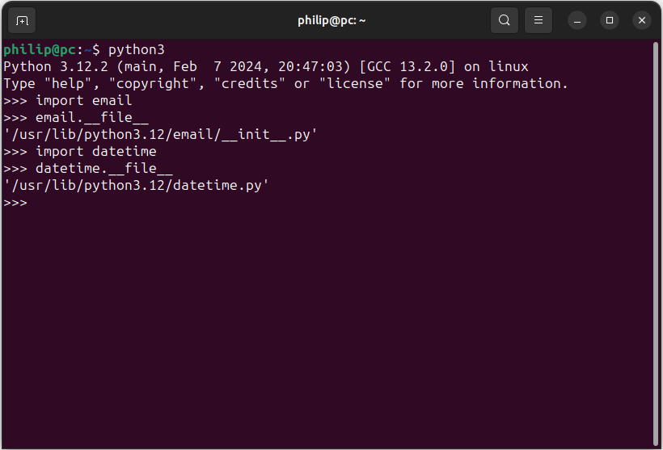
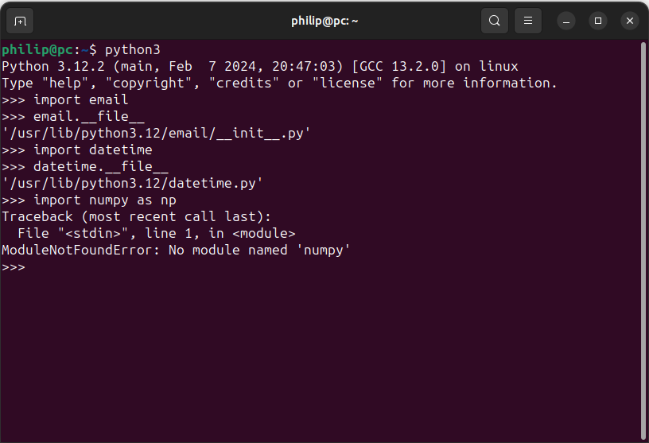
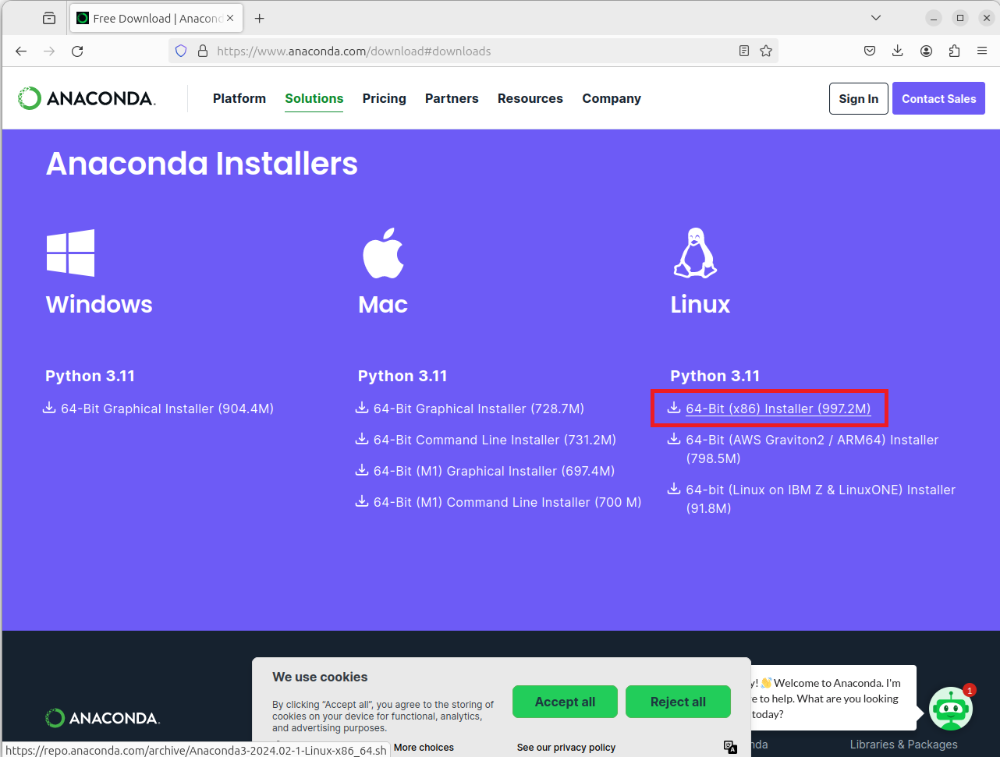
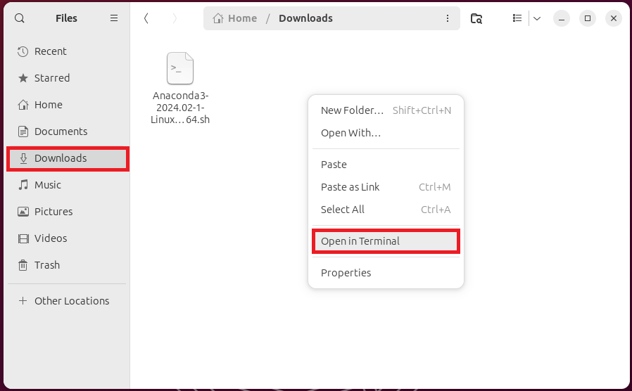
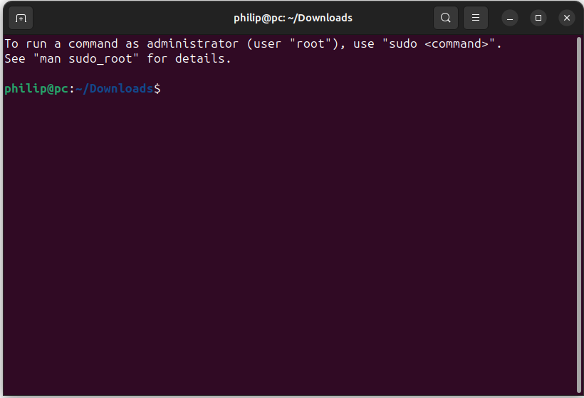
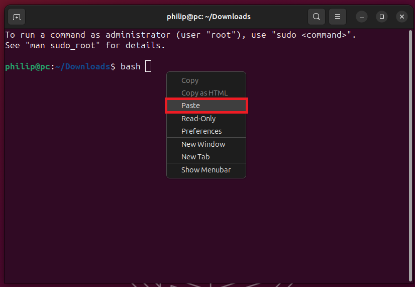

# Installing Anaconda

## Download and Install

The download link for Anaconda can be found on the [Anaconda](https://www.anaconda.com/download) home page. The Linux installer is a bash script file:


Open the Downloads folder and right click the downloaded file and select Rename:


Copy the file name, including the file extension:


Right click empty space in the folder and select Open in Terminal:


To begin executing of the shell script input:

```
bash Anaconda3-2023.09-0-Linux-x86_64.sh
```

Amending for the version if you have downloaded a later version:


Press ```↵```:


Press ```q``` to quit scrolling through the license agreement:


Input:

```
yes
```

to accept the license agreement:


Use the default install location:


Anaconda will now install.


You will be asked if you want to initialise Anaconda. Input:

```
yes
```

to initialise Anaconda3. Unfortunately the option no is preselected so if you pressed ```↵```, you will have installed Anaconda without initialisation like in this example:



There is now an anaconda3 folder:



## Initialising Anaconda

Initialisation can be checked by examining the .bashrc file. This file is hidden by default, to view it select Show Hidden Files:


The .bashrc file can be viewed in Text Editor:


If initialised there will be a conda code block:



In this case conda is not initialised and this code block is not present.

In the anaconda3 folder:


There is a bin subfolder:



This bin subfolder contains the conda script (no file extension):



Anaconda can be initialised using:

```
./anaconda3/bin/conda init
```


This adds the conda commands to the .bashrc:


The .bashrc can be seen in Text Editor:


Close any open any terminals. New terminals will look at the refreshed .bashrc file for commands. You will see a prefix (base) indicating the base Python environment is selected:


## Anaconda Navigator

On Linux, no shortcuts for Anaconda or Python IDEs installed in the Anaconda base Python environment have Start Menu shortcuts. The Anaconda Navigator can be launched from the Terminal using the command:

```
anaconda-navigator
```



The terminal will remain busy when the Anaconda Navigator is launched:


The most commonly used Python IDEs can be launched using their respective tiles in the Anaconda Navigator:


Anaconda is now installed.

## LibGL Error

There is a ```LibGL error: mesa iris driver error``` when Anaconda Navigator or any programs which use QT are launched. This error is due to the old version of ```libstdcxx-ng``` in the Anaconda base Python environment. This should be fixed when Anaconda is updated. For more details see Updating Anaconda. 

[Return to Anaconda Tutorial](./readme.md)