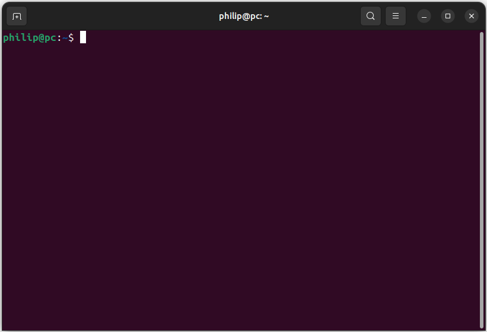
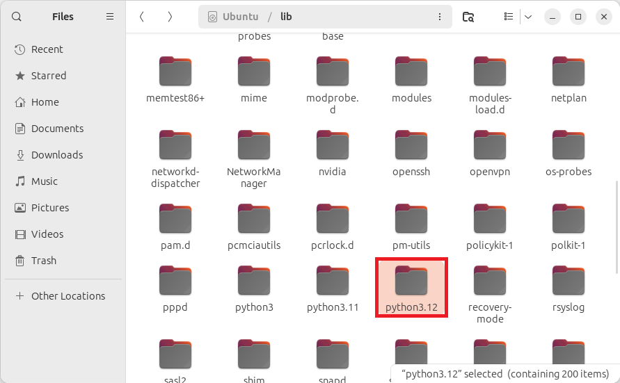
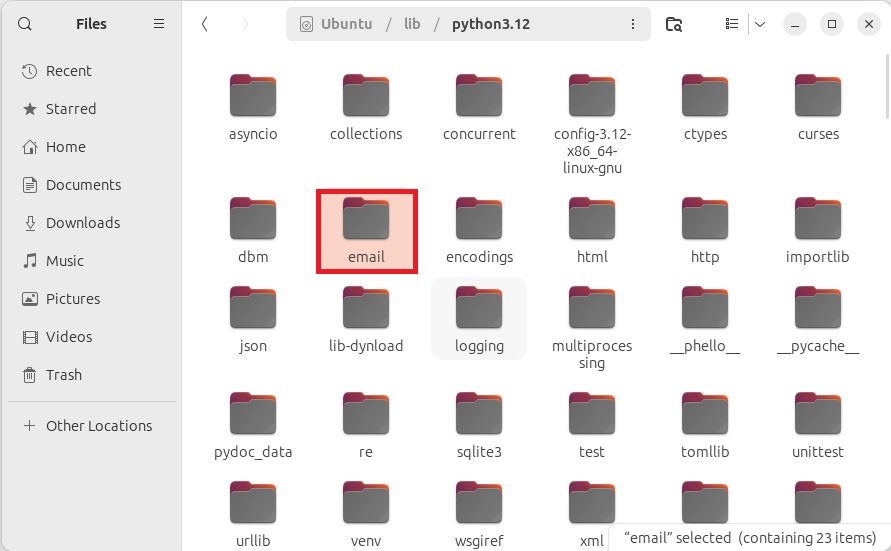
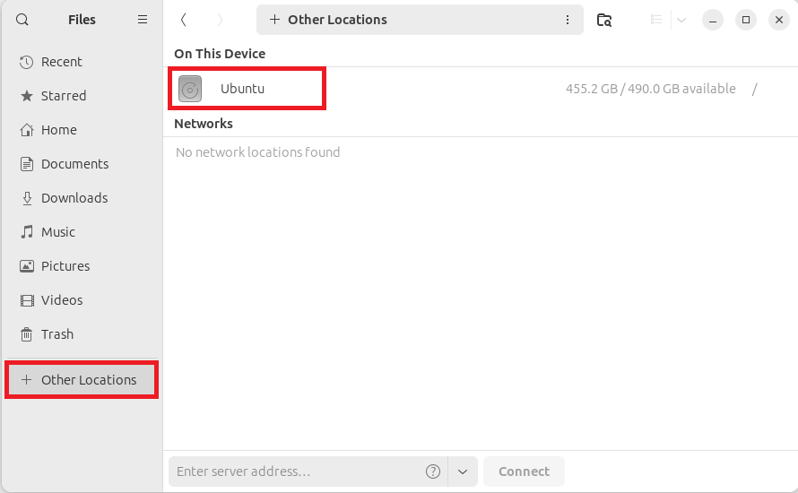
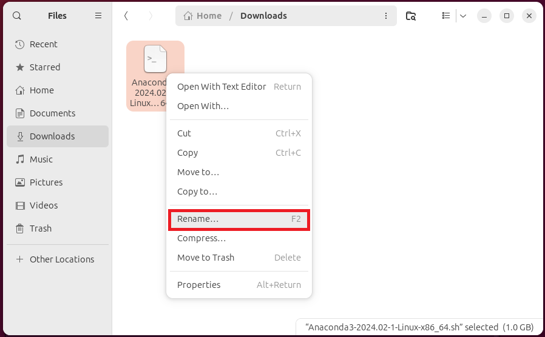
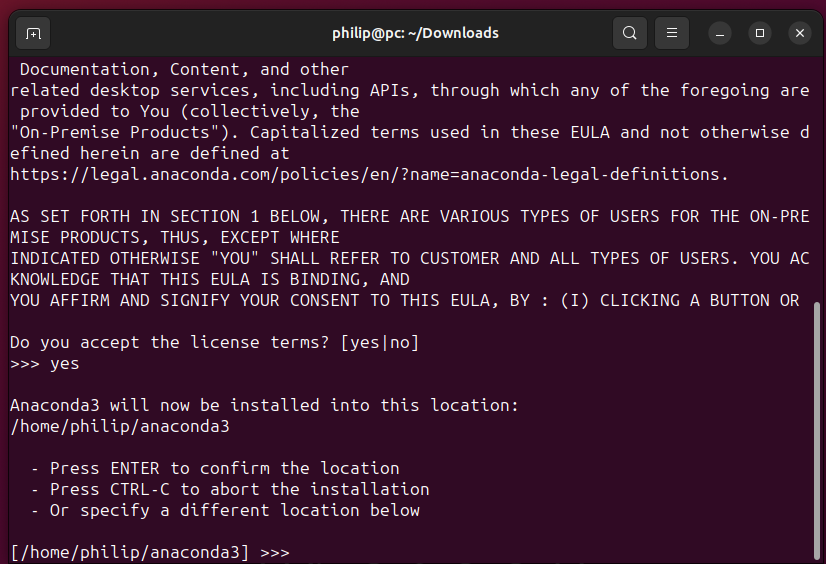
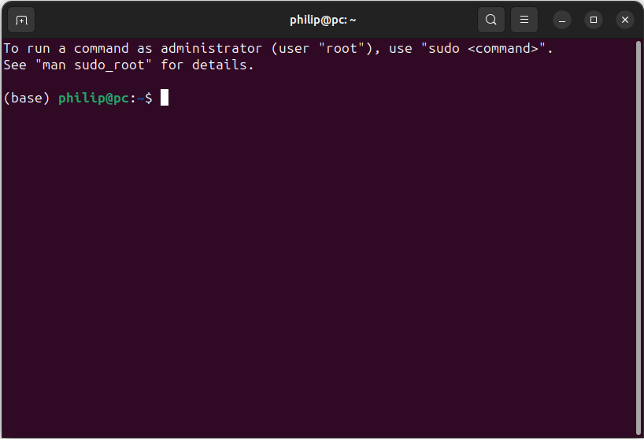
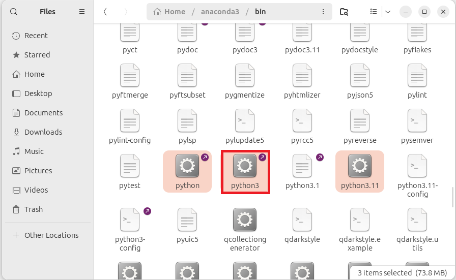
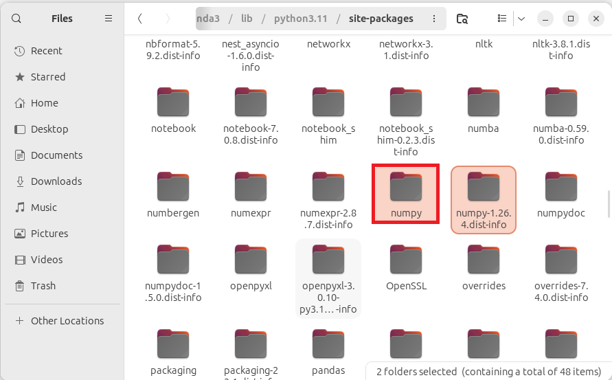

# Installing Anaconda

## System Python

Beginneers often confuse the system Python with Anaconda. The Python preinstalled in Linux is the system Python and should be considered as part of the Operating System. 

To view system files in the root folder open up File Explorer and select Other Locations:


The bin folder which contains the binaries otherwise known as command line applications:


Everytime a command is input in the Terminal it runs one of the binaries in this folder.

The binaries python3 is the system Python. There will be an alias of this binary giving the minor version:


If the folder is right clicked and Open in Terminal is selected:


The following prompt will display:

```
username@pc:/bin$ 
```

where username is the user name, pc is the PC name and /bin is the location the Terminal is open in. If the command is input:

```
python3
```

The output will display:

```
username@pc:/bin$ python3
Python 3.11.6 (main, Oct  8 2023, 05:06:43) [GCC 13.2.0] on linux
Type "help", "copyright", "credits" or "license" for more information.
>>> 
```

Python comes with a number of preinstalled modules known as standard modules. These are found in the lib subfolder on the root folder:



In a subfolder corresponding to the Python version:


Some standard modules are single Python script files:


Others are found in their own subfolder:



The subfolder contains multiple Python script files. The name of the subfolder corresponds to the module and the datanodel initialisation file ```__init__.py``` is imported when the folder is input:



This can be seen when the following imports are used:

```
username@pc:~$ python3
Python 3.11.6 (main, Oct  8 2023, 05:06:43) [GCC 13.2.0] on linux
Type "help", "copyright", "credits" or "license" for more information.
>>> import datetime
>>> datetime.__file__
'/usr/lib/python3.11/datetime.py'
>>> import email
>>> email.__file__
'/usr/lib/python3.11/email/__init__.py'
>>> 
```

The python folder has no site-packages folder meaning no third-party libraries are installed. Therefore if a popular third-party data science library is imported

```
>>> import numpy as np
Traceback (most recent call last):
  File "<stdin>", line 1, in <module>
ModuleNotFoundError: No module named 'numpy'
>>> 
```

This system Python is used by the Linux Operating System and modifying it or installing packages may result in instability. Instead it is recommended to install the Anaconda Python Distribution.

## Anaconda Python Distribution

The Anaconda Python distribution comes with its own base (otherwise known as an alternative root) Python environment that contains:

* The conda Package Manager
* Python
* Python Standard Libraries
* numpy
* pandas
* matplotlib
* seaborn
* Spyder
* JupyterLab
* Formatters such as autopep8, isort and black

Python has its own package manager Python Install Package (pip) which is strictly for Python packages. For data science projects the more powerful conda package manager is prefered as it can be used to install the Python packages used for datascience projects in addition to their non-Python dependencies. These include example codecs, LaTeX as well as dependencies for hardware acceleration. conda can also be used to install packages from other programming languages which are often user in conjunction with Python. The popular Jupyter project for example is an abbreviation for Julia Python et (Latin for and) R.

```conda install package``` should be used instead of ```pip install package``` where possible.

The ```conda``` package manager has two channels:

* main (also called conda or anaconda)
* conda-forge (community)

The main channel is maintained by the Anaconda company and the conda-forge channel is maintained directly by developers from the Python community. The Anaconda company only test a subset of the more commonly used Python packages for stability with the Anaconda Python Distribution and because these packages are further tested they may be older than the latest versions on the conda-forge channel. Therefore the base Anaconda Python distribution contains only packages from the base Python environment. The base environment can become unstable when packages from the community channel are used and it is recommended to use the conda package manager to create a Python environment for custom configurations.

### Removing Previous Installations

If an old Anaconda Installation or an Anaconda based installation such as Miniconda or Miniforge is present these should be removed. Any old configuration files from these applications should be purged otherwise they may change the default channel of the conda package manager for example leading to issues when updating the (base) Python environment:

* [Uninstalling Anaconda and Purging Old Configuration Files](./uninstall.md)

### Download

The download link for Anaconda can be found on the [Anaconda](https://www.anaconda.com/download) home page. The Linux installer is a shelll script and has a ```.sh``` file extension:


### Install

To run a shell script the command ```bash``` is used and the .sh file is supplied as a command line argument.

To get the name of the file. Open the Downloads folder and right click the downloaded file and select Rename:


Highlight the file name, including the file extension and press ```Ctrl``` + ```c``` to copy:


If the Terminal is open from All Applications. The Prompt will look like:

```
username@pc~$
```

where ```~``` is the current working directory. The Linux Terminal uses ```~``` for the Home folder found in Files. 

To change directory, the command ```cd``` can be used alongside the directory as an input argument:

```
cd ~/Downloads
```

Notice that the prompt is now:

```
username@pc:~/Downloads$
```

bash commands are input after the $ sign.

Alternatively open the Downloads folder in files and right click empty space in files and select Open in Terminal:


To begin executing the shell script input:

```bash
bash Anaconda3-2023.09-0-Linux-x86_64.sh
```

Note because the Terminals working directory is Downloads, the directory will not have to be provided as part of the command line argument to the file. Otherwise the following would have to be used:

```bash
bash ~/Downloads/Anaconda3-2023.09-0-Linux-x86_64.sh
```

Note that the Terminal uses the shortcut key ```Ctrl``` + ```c``` to cancel the current running operation. The shortcut keys for Copy and Paste are therefore ```Ctrl```, ```⇧``` + ```c``` and ```Ctrl```, ```⇧``` + ```v``` respectively.

The following output will display:

```
Welcome to Anaconda3 2023.09-0

In order to continue the installation process, please review the license
agreement.
Please, press ENTER to continue
>>> 
```

Press ```↵``` to begin scrolling through the license agreement:

```
==================================================
End User License Agreement - Anaconda Distribution
==================================================

Copyright 2015-2023, Anaconda, Inc.

All rights reserved under the 3-clause BSD License:

This End User License Agreement (the "Agreement") is a legal agreement be
tween you and Anaconda, Inc. ("Anaconda") and governs your use of Anacond
a Distribution (which was formerly known as Anaconda Individual Edition).

Subject to the terms of this Agreement, Anaconda hereby grants you a non-
exclusive, non-transferable license to:

  * Install and use the Anaconda Distribution (which was formerly known a
s Anaconda Individual Edition),
  * Modify and create derivative works of sample source code delivered in
--More--
```

To quit scrolling press ```q```. The following output will now display, prompting to accept of decline the license agreement:

```
Do you accept the license terms? [yes|no]
[no] >>>
```

Input ```yes``` to proceed. The following output will display:

```
Anaconda3 will now be installed into this location:
/home/user/anaconda3

  - Press ENTER to confirm the location
  - Press CTRL-C to abort the installation
  - Or specify a different location below

[/home/user/anaconda3] >>> 
```

It is recommended to install anaconda3 in its default location. Press ```↵``` to proceed. The files will extract and the following output will now display when the installation is successful:

```
PREFIX=/home/user/anaconda3
Unpacking payload ...

Downloading and Extracting Packages

Preparing transaction: done
Executing transaction: / 

    Installed package of scikit-learn can be accelerated using scikit-learn-intelex.
    More details are available here: https://intel.github.io/scikit-learn-intelex

    For example:

        $ conda install scikit-learn-intelex
        $ python -m sklearnex my_application.py

    

done
installation finished.
```

### Initialisation

The root Anaconda Python Environment known as base is found in the anaconda3 folder:


Notice that it has its own bin subfolder:


The python binary associated with this installation is in this:


This python3 binary has the alias python alongside an alias for the major and minor version.

The base Python environment has its own lib subfolder:


The lib subfolder has a subfolder corresponding to the Python version:


And contains the Python standard modules associated with the base Python environment. For example the datetime module available as a script file datetime.py:


Or the email module found as a subfolder:



This subfolder cotnains multiple Python script files with the ```__init__.py``` datamodel initialisation file:


Going back up a level to the standard modules, there is a site-packages folder which contains third-party modules also known as Python libraries:


There will be two subfoldes for each library, one detailing the version number and the other being the library itself. The numeric python library can be found in the numpy folder:



This folder contains multiple Python script files and subfolders which in turn contain multiple Python script files. One of these is the ```__init__.py``` datamodel file which is the file imported when:

```
import numpy as np
```

is used.


The random module of the numpy library is found in the random subfolder:


Notice that it has its own datamodel initialisation file ```__init__.py``` which is imported when the module is imported using:

```
import numpy.random as random
```


The Python and Data Analysis library is found in the pandas subfolder:


This folder contains multiple Python script files and subfolders which in turn contain multiple Python script files. One of these is the ```__init__.py``` datamodel file which is the file imported when:

```
import pandas as pd
```

is used.


The Matrix Plotting library is found in the matplotlib subfolder:


This folder contains multiple Python script files and subfolders which in turn contain multiple Python script files. One of these is the ```__init__.py``` datamodel file which is the file imported when:

```
import matplotlib
```

is used.



Normally only the ```pyplot.py``` module is imported:

```
import matplotlib.pyplot as plt
```


The Python base environment contains an empty envs subfolder which may be later used. The envs folder contains other Python environments


Initialisation essentially instructs the terminal to look in ```~/anaconda3/bin``` and then ```/bin``` for a binary when the base Python is activated instead of only the ```/bin```.

The following output will display, prompting for initialisation:

```
Do you wish to update your shell profile to automatically initialize conda?
This will activate conda on startup and change the command prompt when activated.
If you'd prefer that conda's base environment not be activated on startup,
   run the following command when conda is activated:

conda config --set auto_activate_base false

You can undo this by running `conda init --reverse $SHELL`? [yes|no]
[no] >>> 
```

Unfortunately the default option is no, meaning Anaconda is installed but not the Linux Terminal is not initialised. In this case, the use of the command ```python3``` will use the system Python by default however the python associated with the base Python environment can be selected directly using the full file path:

```
username@pc:~$ python3
Python 3.11.6 (main, Oct  8 2023, 05:06:43) [GCC 13.2.0] on linux
Type "help", "copyright", "credits" or "license" for more information.
>>> exit()
username@pc:~$ ~/anaconda3/bin/python3
Python 3.11.5 (main, Sep 11 2023, 13:54:46) [GCC 11.2.0] on linux
Type "help", "copyright", "credits" or "license" for more information.
>>> 
```

Inputting ```yes``` at the initialisation prompt will output a list of files which correspond to shell initialisation. Most will be unmodified however the .bashrc file will be modified:

```
no change     ~/anaconda3/condabin/conda
no change     ~/anaconda3/bin/conda
no change     ~/anaconda3/bin/conda-env
no change     ~/anaconda3/bin/activate
no change     ~/anaconda3/bin/deactivate
no change     ~/anaconda3/etc/profile.d/conda.sh
no change     ~/anaconda3/etc/fish/conf.d/conda.fish
no change     ~/anaconda3/shell/condabin/Conda.psm1
no change     ~/anaconda3/shell/condabin/conda-hook.ps1
no change     ~/anaconda3/lib/python3.11/site-packages/xontrib/conda.xsh
no change     ~/anaconda3/etc/profile.d/conda.csh
modified      ~/.bashrc

==> For changes to take effect, close and re-open your current shell. <==

Thank you for installing Anaconda3!
```

The .bashrc fle is found in the Home folder:


It is hidden by default:



It can be opened in Text Editor:


It has this additional conda initialisaiton block:


The end of the output states **For changes to take effect, close and re-open your current shell**. When a new Terminal instance is opened, it will look at the updated ```.bashrc``` file, run a script to activate the conda (base) environment and therefore look in additional locations for commands.

When the Terminal is open the bash prompt will display:

```
(base) username@pc~$: 
```

Instead of:

```
username@pc~$:
```

This means the conda (base) Python environment is selected.

Because the default option for initialisation is no, many new users to Anaconda install it without initialising it. If this has happened open up the Terminal and input:

```
~/anaconda3/bin/conda init bash
```

This will display the output:

```
no change     ~/anaconda3/condabin/conda
no change     ~/anaconda3/bin/conda
no change     ~/anaconda3/bin/conda-env
no change     ~/anaconda3/bin/activate
no change     ~/anaconda3/bin/deactivate
no change     ~/anaconda3/etc/profile.d/conda.sh
no change     ~/anaconda3/etc/fish/conf.d/conda.fish
no change     ~/anaconda3/shell/condabin/Conda.psm1
no change     ~/anaconda3/shell/condabin/conda-hook.ps1
no change     ~/anaconda3/lib/python3.11/site-packages/xontrib/conda.xsh
no change     ~/anaconda3/etc/profile.d/conda.csh
modified      ~/.bashrc

==> For changes to take effect, close and re-open your current shell. <==
```

When the Terminal is closed and opened the bash prompt should now display:

```
(base) username@pc~$: 
```

Initialisation can be reversed using:

```
~/anaconda3/bin/conda init bash --reverse
```

### Updating Anaconda

To update Anaconda, the (base) Python environment should be deactivated using:

```
conda deactivate
```

This displays a normal bash prompt without the (base) prefix. The conda package manager can be updated using:

```
conda update conda
```

This will look for updates to the conda package manager and in turn update the entire Anaconda Python distribution. The output will display:

```
Collecting package metadata (current_repodata.json): done
Solving environment: done

## Package Plan ##

  environment location: /home/user/anaconda3

  added / updated specs:
    - conda
```

Followed by details about the number of packages to be downloaded:

```
The following packages will be downloaded:

    package                    |            build
    ---------------------------|-----------------
    aiobotocore-2.7.0          |  py311h06a4308_0         149 KB
    aiohttp-3.9.0              |  py311h5eee18b_0         824 KB
    anaconda-cloud-auth-0.1.4  |  py311h06a4308_0          38 KB
    archspec-0.2.1             |     pyhd3eb1b0_0          39 KB
    astropy-5.3.4              |  py311hf4808d0_0         9.9 MB
    async-lru-2.0.4            |  py311h06a4308_0          20 KB
    attrs-23.1.0               |  py311h06a4308_0         161 KB
    black-23.11.0              |  py311h06a4308_0         356 KB
    bokeh-3.3.0                |  py311h92b7b1e_0         5.7 MB
    boost-cpp-1.82.0           |       hdb19cb5_2          11 KB
    botocore-1.31.64           |  py311h06a4308_0         6.9 MB
    brotli-python-1.0.9        |  py311h6a678d5_7         318 KB
    c-blosc2-2.10.5            |       h80c7b02_0         322 KB
    certifi-2023.11.17         |  py311h06a4308_0         159 KB
    cffi-1.16.0                |  py311h5eee18b_0         314 KB
    click-8.1.7                |  py311h06a4308_0         221 KB
    conda-23.11.0              |  py311h06a4308_0         1.3 MB
    conda-build-3.28.1         |  py311h06a4308_0         834 KB
    conda-libmamba-solver-23.11.1|  py311h06a4308_0         104 KB
    contourpy-1.2.0            |  py311hdb19cb5_0         263 KB
    cookiecutter-2.5.0         |  py311h06a4308_0         140 KB
    curl-8.4.0                 |       hdbd6064_1          85 KB
    cytoolz-0.12.2             |  py311h5eee18b_0         417 KB
    dal-2023.1.1               |   hdb19cb5_48680        36.9 MB
    dask-2023.11.0             |  py311h06a4308_0           5 KB
    dask-core-2023.11.0        |  py311h06a4308_0         2.9 MB
    datashader-0.16.0          |  py311h06a4308_0        17.1 MB
    distributed-2023.11.0      |  py311h06a4308_0         1.6 MB
    distro-1.8.0               |  py311h06a4308_0          37 KB
    filelock-3.13.1            |  py311h06a4308_0          24 KB
    frozenlist-1.4.0           |  py311h5eee18b_0          52 KB
    fsspec-2023.10.0           |  py311h06a4308_0         364 KB
    holoviews-1.18.1           |  py311h06a4308_0         5.1 MB
    huggingface_hub-0.17.3     |  py311h06a4308_0         451 KB
    hvplot-0.9.0               |  py311h06a4308_0         3.2 MB
    icu-73.1                   |       h6a678d5_0        25.9 MB
    imageio-2.31.4             |  py311h06a4308_0         625 KB
    imbalanced-learn-0.11.0    |  py311h06a4308_1         376 KB
    intel-openmp-2023.1.0      |   hdb19cb5_46306        17.2 MB
    jmespath-1.0.1             |  py311h06a4308_0          48 KB
    jsonschema-4.19.2          |  py311h06a4308_0         190 KB
    jsonschema-specifications-2023.7.1|  py311h06a4308_0          15 KB
    jupyter-lsp-2.2.0          |  py311h06a4308_0         107 KB
    jupyter_client-8.6.0       |  py311h06a4308_0         233 KB
    jupyter_core-5.5.0         |  py311h06a4308_0          91 KB
    jupyter_events-0.8.0       |  py311h06a4308_0          41 KB
    jupyter_server-2.10.0      |  py311h06a4308_0         577 KB
    jupyter_server_terminals-0.4.4|  py311h06a4308_1          27 KB
    jupyterlab-4.0.8           |  py311h06a4308_0         4.5 MB
    jupyterlab_server-2.25.1   |  py311h06a4308_0         113 KB
    jupyterlab_widgets-3.0.9   |  py311h06a4308_0         194 KB
    lazy_loader-0.3            |  py311h06a4308_0          20 KB
    libboost-1.82.0            |       h109eef0_2        19.5 MB
    libcurl-8.4.0              |       h251f7ec_1         411 KB
    libdeflate-1.17            |       h5eee18b_1          64 KB
    libmamba-1.5.3             |       haf1ee3a_0         1.9 MB
    libmambapy-1.5.3           |  py311h2dafd23_0         314 KB
    libnghttp2-1.57.0          |       h2d74bed_0         674 KB
    libxml2-2.10.4             |       hf1b16e4_1         753 KB
    libxslt-1.1.37             |       h5eee18b_1         266 KB
    llvmlite-0.41.0            |  py311he621ea3_0         3.6 MB
    matplotlib-3.8.0           |  py311h06a4308_0           8 KB
    matplotlib-base-3.8.0      |  py311ha02d727_0         7.7 MB
    menuinst-2.0.0             |  py311h06a4308_0         167 KB
    mistune-2.0.4              |  py311h06a4308_0         107 KB
    mkl-2023.1.0               |   h213fc3f_46344       171.5 MB
    more-itertools-10.1.0      |  py311h06a4308_0         103 KB
    multidict-6.0.4            |  py311h5eee18b_0          59 KB
    nbclient-0.8.0             |  py311h06a4308_0         120 KB
    nbconvert-7.10.0           |  py311h06a4308_0         513 KB
    notebook-7.0.6             |  py311h06a4308_0         3.1 MB
    notebook-shim-0.2.3        |  py311h06a4308_0          26 KB
    numba-0.58.1               |  py311ha02d727_0         5.8 MB
    numexpr-2.8.7              |  py311h65dcdc2_0         167 KB
    numpy-1.26.2               |  py311h08b1b3b_0          10 KB
    numpy-base-1.26.2          |  py311hf175353_0         8.2 MB
    openssl-3.0.12             |       h7f8727e_0         5.2 MB
    overrides-7.4.0            |  py311h06a4308_0          36 KB
    pandas-2.1.1               |  py311ha02d727_0        14.9 MB
    panel-1.3.1                |  py311h06a4308_0        14.7 MB
    param-2.0.1                |  py311h06a4308_0         259 KB
    partd-1.4.1                |  py311h06a4308_0          48 KB
    pillow-10.0.1              |  py311ha6cbd5a_0         896 KB
    py-cpuinfo-9.0.0           |  py311h06a4308_0          64 KB
    pycosat-0.6.6              |  py311h5eee18b_0          90 KB
    pydantic-1.10.12           |  py311h5eee18b_1         2.4 MB
    pyodbc-4.0.39              |  py311h6a678d5_0          78 KB
    pyqt-5.15.10               |  py311h6a678d5_0         5.7 MB
    pyqt5-sip-12.13.0          |  py311h5eee18b_0          95 KB
    pyqtwebengine-5.15.10      |  py311h6a678d5_0         171 KB
    pytoolconfig-1.2.6         |  py311h06a4308_0          35 KB
    pyviz_comms-3.0.0          |  py311h06a4308_0          56 KB
    pyyaml-6.0.1               |  py311h5eee18b_0         210 KB
    pyzmq-25.1.0               |  py311h6a678d5_0         538 KB
    qt-main-5.15.2             |      h53bd1ea_10        53.7 MB
    qtpy-2.4.1                 |  py311h06a4308_0         129 KB
    queuelib-1.6.2             |  py311h06a4308_0          34 KB
    referencing-0.30.2         |  py311h06a4308_0          77 KB
    regex-2023.10.3            |  py311h5eee18b_0         427 KB
    rich-13.3.5                |  py311h06a4308_0         560 KB
    rpds-py-0.10.6             |  py311hb02cf49_0        1007 KB
    s3fs-2023.10.0             |  py311h06a4308_0          78 KB
    safetensors-0.4.0          |  py311h24d97f6_0         1.1 MB
    scikit-learn-1.2.2         |  py311h6a678d5_1         8.8 MB
    scipy-1.11.4               |  py311h08b1b3b_0        22.0 MB
    semver-2.13.0              |     pyhd3eb1b0_0          16 KB
    send2trash-1.8.2           |  py311h06a4308_0          32 KB
    sip-6.7.12                 |  py311h6a678d5_0         603 KB
    soupsieve-2.5              |  py311h06a4308_0          92 KB
    sqlalchemy-2.0.21          |  py311h5eee18b_0         3.8 MB
    sympy-1.12                 |  py311h06a4308_0        14.4 MB
    tabulate-0.9.0             |  py311h06a4308_0          70 KB
    tokenizers-0.13.3          |  py311h22610ee_0         4.4 MB
    tornado-6.3.3              |  py311h5eee18b_0         852 KB
    truststore-0.8.0           |  py311h06a4308_0          43 KB
    urllib3-1.26.18            |  py311h06a4308_0         251 KB
    xz-5.4.5                   |       h5eee18b_0         646 KB
    yaml-cpp-0.8.0             |       h6a678d5_0         607 KB
    yarl-1.9.3                 |  py311h5eee18b_0         127 KB
    zict-3.0.0                 |  py311h06a4308_0         119 KB
    ------------------------------------------------------------
                                           Total:       530.6 MB
```

Followed by details about the number of packages to be installed:

```
The following NEW packages will be INSTALLED:

  archspec           pkgs/main/noarch::archspec-0.2.1-pyhd3eb1b0_0 
  async-lru          pkgs/main/linux-64::async-lru-2.0.4-py311h06a4308_0 
  brotli-python      pkgs/main/linux-64::brotli-python-1.0.9-py311h6a678d5_7 
  distro             pkgs/main/linux-64::distro-1.8.0-py311h06a4308_0 
  jsonschema-specif~ pkgs/main/linux-64::jsonschema-specifications-2023.7.1-py311h06a4308_0 
  jupyter-lsp        pkgs/main/linux-64::jupyter-lsp-2.2.0-py311h06a4308_0 
  jupyter_server_te~ pkgs/main/linux-64::jupyter_server_terminals-0.4.4-py311h06a4308_1 
  menuinst           pkgs/main/linux-64::menuinst-2.0.0-py311h06a4308_0 
  overrides          pkgs/main/linux-64::overrides-7.4.0-py311h06a4308_0 
  referencing        pkgs/main/linux-64::referencing-0.30.2-py311h06a4308_0 
  rich               pkgs/main/linux-64::rich-13.3.5-py311h06a4308_0 
  rpds-py            pkgs/main/linux-64::rpds-py-0.10.6-py311hb02cf49_0 
  semver             pkgs/main/noarch::semver-2.13.0-pyhd3eb1b0_0 
  truststore         pkgs/main/linux-64::truststore-0.8.0-py311h06a4308_0 
```


Followed by details about packages to be removed. Note that this should only be a small number of packages that have become obsolete:

```
The following packages will be REMOVED:

  aiofiles-22.1.0-py311h06a4308_0
  aiosqlite-0.18.0-py311h06a4308_0
  async-timeout-4.0.2-py311h06a4308_0
  brotlipy-0.7.0-py311h5eee18b_1002
  datashape-0.5.4-py311h06a4308_1
  glob2-0.7-pyhd3eb1b0_0
  jinja2-time-0.2.0-pyhd3eb1b0_3
  jupyter_server_fileid-0.9.0-py311h06a4308_0
  jupyter_server_ydoc-0.8.0-py311h06a4308_1
  jupyter_ydoc-0.2.4-py311h06a4308_0
  nbclassic-0.5.5-py311h06a4308_0
  poyo-0.5.0-pyhd3eb1b0_0
  pyrsistent-0.18.0-py311h5eee18b_0
  qtwebkit-5.212-h3fafdc1_5
  y-py-0.5.9-py311h52d8a92_0
  ypy-websocket-0.8.2-py311h06a4308_0
```

Followed by details about packages to be updated:

```
The following packages will be UPDATED:

  aiobotocore                         2.5.0-py311h06a4308_0 --> 2.7.0-py311h06a4308_0 
  aiohttp                             3.8.5-py311h5eee18b_0 --> 3.9.0-py311h5eee18b_0 
  anaconda-cloud-au~                  0.1.3-py311h06a4308_0 --> 0.1.4-py311h06a4308_0 
  astropy                               5.1-py311hbed6279_0 --> 5.3.4-py311hf4808d0_0 
  attrs                              22.1.0-py311h06a4308_0 --> 23.1.0-py311h06a4308_0 
  black                              23.3.0-py311h06a4308_0 --> 23.11.0-py311h06a4308_0 
  bokeh                               3.2.1-py311h92b7b1e_0 --> 3.3.0-py311h92b7b1e_0 
  boost-cpp                              1.73.0-h7f8727e_12 --> 1.82.0-hdb19cb5_2 
  botocore                          1.29.76-py311h06a4308_0 --> 1.31.64-py311h06a4308_0 
  c-blosc2                                 2.8.0-h6a678d5_0 --> 2.10.5-h80c7b02_0 
  certifi                         2023.7.22-py311h06a4308_0 --> 2023.11.17-py311h06a4308_0 
  cffi                               1.15.1-py311h5eee18b_3 --> 1.16.0-py311h5eee18b_0 
  click                               8.0.4-py311h06a4308_0 --> 8.1.7-py311h06a4308_0 
  conda                              23.7.4-py311h06a4308_0 --> 23.11.0-py311h06a4308_0 
  conda-build                        3.26.1-py311h06a4308_0 --> 3.28.1-py311h06a4308_0 
  conda-libmamba-so~                 23.7.0-py311h06a4308_0 --> 23.11.1-py311h06a4308_0 
  contourpy                           1.0.5-py311hdb19cb5_0 --> 1.2.0-py311hdb19cb5_0 
  cookiecutter       pkgs/main/noarch::cookiecutter-1.7.3-~ --> pkgs/main/linux-64::cookiecutter-2.5.0-py311h06a4308_0 
  curl                                     8.2.1-hdbd6064_0 --> 8.4.0-hdbd6064_1 
  cytoolz                            0.12.0-py311h5eee18b_0 --> 0.12.2-py311h5eee18b_0 
  dal                               2023.1.1-hdb19cb5_48679 --> 2023.1.1-hdb19cb5_48680 
  dask                             2023.6.0-py311h06a4308_0 --> 2023.11.0-py311h06a4308_0 
  dask-core                        2023.6.0-py311h06a4308_0 --> 2023.11.0-py311h06a4308_0 
  datashader                         0.15.2-py311h06a4308_0 --> 0.16.0-py311h06a4308_0 
  distributed                      2023.6.0-py311h06a4308_0 --> 2023.11.0-py311h06a4308_0 
  filelock                            3.9.0-py311h06a4308_0 --> 3.13.1-py311h06a4308_0 
  frozenlist                          1.3.3-py311h5eee18b_0 --> 1.4.0-py311h5eee18b_0 
  fsspec                           2023.4.0-py311h06a4308_0 --> 2023.10.0-py311h06a4308_0 
  holoviews                          1.17.1-py311h06a4308_0 --> 1.18.1-py311h06a4308_0 
  huggingface_hub                    0.15.1-py311h06a4308_0 --> 0.17.3-py311h06a4308_0 
  hvplot                              0.8.4-py311h06a4308_0 --> 0.9.0-py311h06a4308_0 
  icu                                       58.2-he6710b0_3 --> 73.1-h6a678d5_0 
  imageio                            2.31.1-py311h06a4308_0 --> 2.31.4-py311h06a4308_0 
  imbalanced-learn                   0.10.1-py311h06a4308_1 --> 0.11.0-py311h06a4308_1 
  intel-openmp                      2023.1.0-hdb19cb5_46305 --> 2023.1.0-hdb19cb5_46306 
  jmespath           pkgs/main/noarch::jmespath-0.10.0-pyh~ --> pkgs/main/linux-64::jmespath-1.0.1-py311h06a4308_0 
  jsonschema                         4.17.3-py311h06a4308_0 --> 4.19.2-py311h06a4308_0 
  jupyter_client                      7.4.9-py311h06a4308_0 --> 8.6.0-py311h06a4308_0 
  jupyter_core                        5.3.0-py311h06a4308_0 --> 5.5.0-py311h06a4308_0 
  jupyter_events                      0.6.3-py311h06a4308_0 --> 0.8.0-py311h06a4308_0 
  jupyter_server                     1.23.4-py311h06a4308_0 --> 2.10.0-py311h06a4308_0 
  jupyterlab                          3.6.3-py311h06a4308_0 --> 4.0.8-py311h06a4308_0 
  jupyterlab_server                  2.22.0-py311h06a4308_0 --> 2.25.1-py311h06a4308_0 
  jupyterlab_widgets                  3.0.5-py311h06a4308_0 --> 3.0.9-py311h06a4308_0 
  lazy_loader                           0.2-py311h06a4308_0 --> 0.3-py311h06a4308_0 
  libboost                               1.73.0-h28710b8_12 --> 1.82.0-h109eef0_2 
  libcurl                                  8.2.1-h251f7ec_0 --> 8.4.0-h251f7ec_1 
  libdeflate                                1.17-h5eee18b_0 --> 1.17-h5eee18b_1 
  libmamba                                 1.5.1-haf1ee3a_0 --> 1.5.3-haf1ee3a_0 
  libmambapy                          1.5.1-py311h2dafd23_0 --> 1.5.3-py311h2dafd23_0 
  libnghttp2                              1.52.0-h2d74bed_1 --> 1.57.0-h2d74bed_0 
  libxml2                                 2.10.4-hcbfbd50_0 --> 2.10.4-hf1b16e4_1 
  libxslt                                 1.1.37-h2085143_0 --> 1.1.37-h5eee18b_1 
  llvmlite                           0.40.0-py311he621ea3_0 --> 0.41.0-py311he621ea3_0 
  matplotlib                          3.7.2-py311h06a4308_0 --> 3.8.0-py311h06a4308_0 
  matplotlib-base                     3.7.2-py311ha02d727_0 --> 3.8.0-py311ha02d727_0 
  mistune                          0.8.4-py311h5eee18b_1000 --> 2.0.4-py311h06a4308_0 
  mkl                               2023.1.0-h213fc3f_46343 --> 2023.1.0-h213fc3f_46344 
  more-itertools     pkgs/main/noarch::more-itertools-8.12~ --> pkgs/main/linux-64::more-itertools-10.1.0-py311h06a4308_0 
  multidict                           6.0.2-py311h5eee18b_0 --> 6.0.4-py311h5eee18b_0 
  nbclient                           0.5.13-py311h06a4308_0 --> 0.8.0-py311h06a4308_0 
  nbconvert                           6.5.4-py311h06a4308_0 --> 7.10.0-py311h06a4308_0 
  notebook                            6.5.4-py311h06a4308_1 --> 7.0.6-py311h06a4308_0 
  notebook-shim                       0.2.2-py311h06a4308_0 --> 0.2.3-py311h06a4308_0 
  numba                              0.57.1-py311ha02d727_0 --> 0.58.1-py311ha02d727_0 
  numexpr                             2.8.4-py311h65dcdc2_1 --> 2.8.7-py311h65dcdc2_0 
  numpy                              1.24.3-py311h08b1b3b_1 --> 1.26.2-py311h08b1b3b_0 
  numpy-base                         1.24.3-py311hf175353_1 --> 1.26.2-py311hf175353_0 
  openssl                                 3.0.10-h7f8727e_2 --> 3.0.12-h7f8727e_0 
  pandas                              2.0.3-py311ha02d727_0 --> 2.1.1-py311ha02d727_0 
  panel                               1.2.3-py311h06a4308_0 --> 1.3.1-py311h06a4308_0 
  param                              1.13.0-py311h06a4308_0 --> 2.0.1-py311h06a4308_0 
  partd                               1.4.0-py311h06a4308_0 --> 1.4.1-py311h06a4308_0 
  pillow                              9.4.0-py311h6a678d5_1 --> 10.0.1-py311ha6cbd5a_0 
  py-cpuinfo         pkgs/main/noarch::py-cpuinfo-8.0.0-py~ --> pkgs/main/linux-64::py-cpuinfo-9.0.0-py311h06a4308_0 
  pycosat                             0.6.4-py311h5eee18b_0 --> 0.6.6-py311h5eee18b_0 
  pydantic                           1.10.8-py311h5eee18b_0 --> 1.10.12-py311h5eee18b_1 
  pyodbc                             4.0.34-py311h6a678d5_0 --> 4.0.39-py311h6a678d5_0 
  pyqt                               5.15.7-py311h6a678d5_0 --> 5.15.10-py311h6a678d5_0 
  pyqt5-sip                         12.11.0-py311h6a678d5_0 --> 12.13.0-py311h5eee18b_0 
  pyqtwebengine                      5.15.7-py311h6a678d5_0 --> 5.15.10-py311h6a678d5_0 
  pytoolconfig                        1.2.5-py311h06a4308_1 --> 1.2.6-py311h06a4308_0 
  pyviz_comms                         2.3.0-py311h06a4308_0 --> 3.0.0-py311h06a4308_0 
  pyyaml                                6.0-py311h5eee18b_1 --> 6.0.1-py311h5eee18b_0 
  pyzmq                              23.2.0-py311h6a678d5_0 --> 25.1.0-py311h6a678d5_0 
  qt-main                                 5.15.2-h7358343_9 --> 5.15.2-h53bd1ea_10 
  qtpy                                2.2.0-py311h06a4308_0 --> 2.4.1-py311h06a4308_0 
  queuelib                            1.5.0-py311h06a4308_0 --> 1.6.2-py311h06a4308_0 
  regex                            2022.7.9-py311h5eee18b_0 --> 2023.10.3-py311h5eee18b_0 
  s3fs                             2023.4.0-py311h06a4308_0 --> 2023.10.0-py311h06a4308_0 
  safetensors                         0.3.2-py311hb02cf49_0 --> 0.4.0-py311h24d97f6_0 
  scipy                              1.11.1-py311h08b1b3b_0 --> 1.11.4-py311h08b1b3b_0 
  send2trash         pkgs/main/noarch::send2trash-1.8.0-py~ --> pkgs/main/linux-64::send2trash-1.8.2-py311h06a4308_0 
  sip                                 6.6.2-py311h6a678d5_0 --> 6.7.12-py311h6a678d5_0 
  soupsieve                             2.4-py311h06a4308_0 --> 2.5-py311h06a4308_0 
  sqlalchemy                         1.4.39-py311h5eee18b_0 --> 2.0.21-py311h5eee18b_0 
  sympy                              1.11.1-py311h06a4308_0 --> 1.12-py311h06a4308_0 
  tabulate                           0.8.10-py311h06a4308_0 --> 0.9.0-py311h06a4308_0 
  tokenizers                         0.13.2-py311h22610ee_1 --> 0.13.3-py311h22610ee_0 
  tornado                             6.3.2-py311h5eee18b_0 --> 6.3.3-py311h5eee18b_0 
  urllib3                           1.26.16-py311h06a4308_0 --> 1.26.18-py311h06a4308_0 
  xz                                       5.4.2-h5eee18b_0 --> 5.4.5-h5eee18b_0 
  yaml-cpp                                 0.7.0-h295c915_1 --> 0.8.0-h6a678d5_0 
  yarl                                1.8.1-py311h5eee18b_0 --> 1.9.3-py311h5eee18b_0 
  zict                                2.2.0-py311h06a4308_0 --> 3.0.0-py311h06a4308_0 
```

Followed by details about packages to be downgraded. A small number of packages will be downgraded, normally to a more stable version:

```
The following packages will be DOWNGRADED:

  scikit-learn                        1.3.0-py311ha02d727_0 --> 1.2.2-py311h6a678d5_1 
```

The output will then prompt to proceed:

```
Proceed ([y]/n)? 
```

Input ```y```. The output will now display:

```
Downloading and Extracting Packages
                                                                                                                              
Preparing transaction: done                                                                                                   
Verifying transaction: done                                                                                                   
Executing transaction: -                                                                                                      
                                                                                                                              
    Installed package of scikit-learn can be accelerated using scikit-learn-intelex.                                          
    More details are available here: https://intel.github.io/scikit-learn-intelex                                             
                                                                                                                              
    For example:                                                                                                              
                                                                                                                              
        $ conda install scikit-learn-intelex                                                                                  
        $ python -m sklearnex my_application.py                                                                               
                                                                                                                              
                                                                                                                              
                                                                                                                              
done    
```

The conda package manager will now be updated alongside most of the other packages in the (base) Python environment. A new prompt will display once the update has finished.

The conda package manager can also be used to update the anaconda-navigator:

```bash
conda update anaconda-navigator
```

The following output will display:

```
Channels:
 - defaults
Platform: linux-64
Collecting package metadata (repodata.json): done
Solving environment: done

## Package Plan ##

  environment location: /home/user/anaconda3

  added / updated specs:
    - anaconda-navigator


The following packages will be downloaded:

    package                    |            build
    ---------------------------|-----------------
    anaconda-navigator-2.5.1   |  py311h06a4308_0         5.6 MB
    ------------------------------------------------------------
                                           Total:         5.6 MB

The following packages will be UPDATED:

  anaconda-navigator                  2.5.0-py311h06a4308_0 --> 2.5.1-py311h06a4308_0 


Proceed ([y]/n)?
```

To proceed input ```y```. The output will now display:

```
Downloading and Extracting Packages:
                                                                                                                              
Preparing transaction: done
Verifying transaction: done
Executing transaction: done
```

The Anaconda Python distribution is now up to date. It is recommended to periodically check for updates.

To reactivate the (base) conda Python environment use:

```
conda activate base
```

The (base) prefix should now display in the bash prompt.

### The Bin Folder

Binaries associated with the Anaconda base Python environment are found in ```~/anaconda3/bin``` folder.

If a search for python is made, notice that there is:

* python
* python3
* python3.1
* python3.11 

These are all the same application. The reason for the different version numbers is because the system Python used to have both Python 2 and Python 3 preinstalled and the version number was used to historically distinguish them. python became an alias for python3 when Python 2 became end of life and there was only one Python version.

Python can be launched using:

```bash
~/anaconda3/bin/python
```

When the base Python environment is activated, the Terminal will automatically look in ```~/anaconda3/bin``` for a binary so the command is equivalent:

```bash
python
```

The output will display details about the Python application and then display a Python prompt ```>>>``` from the Python application:

```
Python 3.11.5 (main, Sep 11 2023, 13:54:46) [GCC 11.2.0] on linux
Type "help", "copyright", "credits" or "license" for more information.
>>>
```

To ```exit``` the Python application, the Python function ```exit``` needs to be used:

```python
exit()
```

A new bash prompt will display.

There is also Interactive Python (IPython) which can be launched using:

```
ipython
```

The output shown gives details about the Python and Interactive Python version and each Python cell has a numeric index. 

```
Python 3.11.5 (main, Sep 11 2023, 13:54:46) [GCC 11.2.0]
Type 'copyright', 'credits' or 'license' for more information
IPython 8.15.0 -- An enhanced Interactive Python. Type '?' for help.

In [1]:
```

IPython is similar to Python but has enhancements such as the application of Python syntax highlighting and the addition of the ```?``` operator which can be used to examine a Python objects docstring or ```??``` which can be used to output the file of a module. 

IPython also has IPython magics which begin with ```%``` and are equivalent to commonly ```bash``` commands. 

The popular Jupyter project for example is an abbreviation for Julia Python et (Latin for and) R.


This has the programs:

* jupyter-console
* jupyter-qtconsole
* jupyter-notebook
* jupyter-lab

The jupyter-console by default uses the Python Kernel and is identical to IPython however the kernel can be changed using the option ```--kernel```:

```
(base) username@pc:~$ jupyter-console --kernel=python3
Python 3.11.5 (main, Sep 11 2023, 13:54:46) [GCC 11.2.0]
Type 'copyright', 'credits' or 'license' for more information
IPython 8.15.0 -- An enhanced Interactive Python. Type '?' for help.

In [1]: 

```

The available kernels can be viewed by using:

```
jupyter kernelspec list
```

Because Anaconda is a Python Distribution by default it only has a Python kernel:

```
(base) username@pc:~$ jupyter kernelspec list
Available kernels:
  python3    /home/username/anaconda3/share/jupyter/kernels/python3
(base) username@pc:~$ 
```

The QTConsole is essentially rewritten using the QT GUI Framework and has a number of additional enhancements for example automatically displaying a docstring as a popup balloon:



And nesting graphics:


It also has a File menu which can be used to save the file as a HTML file or a pdf.

The Jupyter Notebook and Jupyter Lab are NodeJS implementations of the Console with support for interactive Python Notebook Files. JupyterLab also has a script editor for Python scripts files and a markdown editor and markdown preview for files.

When either of the commands are run the Terminal is busy running a Jupyter server, logs will display in this server:

```
(base) pusername@pc:~$ jupyter-lab
[I 2023-12-24 17:14:06.919 ServerApp] Use Control-C to stop this server and shut down all kernels (twice to skip confirmation).
[C 2023-12-24 17:14:06.937 ServerApp] 
    
    To access the server, open this file in a browser:
        file:///home/username/.local/share/jupyter/runtime/jpserver-7745-open.html
    Or copy and paste one of these URLs:
        http://localhost:8888/lab?token=fd3b628ce3d5904b5b539da1809bd730f08449cf79f77531
        http://127.0.0.1:8888/lab?token=fd3b628ce3d5904b5b539da1809bd730f08449cf79f77531

```

The visual elements will display in a browser:


To view identifiers beginning with a prefix, input ↹ after the prefix:


To view the docstring popup, input ⇧ + ↹:


The visual elements can be closed in the browser, however the server will continue to run in the Terminal until Ctrl + c is pressed to close the current operation.

Another important binary is the Scientific Python Development Environment (spyder) which can be launched using:

```
spyder
```

The Terminal will display the following

```
(base) username@pc:~$ spyder
Warning: Ignoring XDG_SESSION_TYPE=wayland on Gnome. Use QT_QPA_PLATFORM=wayland to run on Wayland anyway.
fromIccProfile: failed minimal tag size sanity
```


The Anaconda Navigator is a program that contains shortcuts to most of Python binaries/ It can be launched using:

```
anaconda-navigator
```

There is a ```LibGL error: mesa iris driver error``` when Anaconda Navigator or any programs which use QT are launched. This error is due to the old version of ```libstdcxx-ng``` in the Anaconda base Python environment and can be ignored. This should eventually be fixed by Anaconda when they update this package.


The bin folder contains a number of Python formatters such as autopep8, isort, black and linters such as pylint and pyflakes. These can be run in the Terminal to format a Python file for example the Python script file with sloppy spacing in the code:


However are normally implemented in IDEs such as Spyder which as Autoformatters in the Source menu:


AutoPEP8 addresses the spacing making it PEP8 compliant. The opinionated fomratter black can also be used to make quotation consistent (but inconsistent with the default single quotations used by the Python kernel):



## Python Environments

The conda package manager can be used to create a Python environment that also has a R kernel:

```
conda create -n jupyterlab -c conda-forge python jupyterlab jupyter cython seaborn scikit-learn sympy openpyxl xlrd xlsxwriter lxml sqlalchemy tabulate nodejs ipywidgets plotly jupyterlab-variableinspector ipympl pyqt r-irkernel jupyter-lsp-r r-tidyverse r-ggthemes r-palmerpenguins r-writexl
```

This outputs

```
(base) username@pc:~$ conda create -n r -c conda-forge python jupyterlab jupyter cython seaborn scikit-learn sympy openpyxl xlrd xlsxwriter lxml sqlalchemy tabulate nodejs ipywidgets plotly jupyterlab-variableinspector ipympl pyqt r-irkernel jupyter-lsp-r r-tidyverse r-ggthemes r-palmerpenguins r-writexl
Channels:
 - conda-forge
 - defaults
Platform: linux-64
Collecting package metadata (repodata.json): done
Solving environment: done

## Package Plan ##

  environment location: /home/username/anaconda3/envs/r

  added / updated specs:
    - cython
    - ipympl
    - ipywidgets
    - jupyter
    - jupyter-lsp-r
    - jupyterlab
    - jupyterlab-variableinspector
    - lxml
    - nodejs
    - openpyxl
    - plotly
    - pyqt
    - python
    - r-ggthemes
    - r-irkernel
    - r-palmerpenguins
    - r-tidyverse
    - r-writexl
    - scikit-learn
    - seaborn
    - sqlalchemy
    - sympy
    - tabulate
    - xlrd
    - xlsxwriter


The following packages will be downloaded:

    package                    |            build
    ---------------------------|-----------------
    _libgcc_mutex-0.1          |      conda_forge           3 KB  conda-forge
    _openmp_mutex-4.5          |            2_gnu          23 KB  conda-forge
    _r-mutex-1.0.1             |      anacondar_1           3 KB  conda-forge
    cached-property-1.5.2      |       hd8ed1ab_1           4 KB  conda-forge
    fonts-conda-ecosystem-1    |                0           4 KB  conda-forge
    fonts-conda-forge-1        |                0           4 KB  conda-forge
    greenlet-3.0.3             |  py312h30efb56_0         228 KB  conda-forge
    gst-plugins-base-1.22.8    |       h8e1006c_0         2.6 MB  conda-forge
    gstreamer-1.22.8           |       h98fc4e7_0         1.9 MB  conda-forge
    importlib-metadata-7.0.1   |     pyha770c72_0          26 KB  conda-forge
    importlib_metadata-7.0.1   |       hd8ed1ab_0           9 KB  conda-forge
    ipython-8.19.0             |     pyh707e725_0         577 KB  conda-forge
    jsonschema-with-format-nongpl-4.20.0|     pyhd8ed1ab_0           7 KB  conda-forge
    jupyter-lsp-r-2.2.1        |     pyhd8ed1ab_0           8 KB  conda-forge
    libblas-3.9.0              |20_linux64_openblas          14 KB  conda-forge
    libcblas-3.9.0             |20_linux64_openblas          14 KB  conda-forge
    libclang-15.0.7            |default_hb11cfb5_4         130 KB  conda-forge
    libgfortran-ng-13.2.0      |       h69a702a_3          23 KB  conda-forge
    liblapack-3.9.0            |20_linux64_openblas          14 KB  conda-forge
    libsystemd0-255            |       h3516f8a_0         395 KB  conda-forge
    libxcrypt-4.4.36           |       hd590300_1          98 KB  conda-forge
    mysql-libs-8.0.33          |       hca2cd23_6         1.5 MB  conda-forge
    nbconvert-7.13.1           |     pyhd8ed1ab_0           8 KB  conda-forge
    nbconvert-core-7.13.1      |     pyhd8ed1ab_0         184 KB  conda-forge
    nbconvert-pandoc-7.13.1    |     pyhd8ed1ab_0           7 KB  conda-forge
    prompt_toolkit-3.0.42      |       hd8ed1ab_0           7 KB  conda-forge
    pthread-stubs-0.4          |    h36c2ea0_1001           5 KB  conda-forge
    python-3.12.1              |hab00c5b_1_cpython        30.8 MB  conda-forge
    python_abi-3.12            |          4_cp312           6 KB  conda-forge
    r-dbi-1.2.0                |    r43hc72bb7e_0         758 KB  conda-forge
    r-mgcv-1.9_1               |    r43h316c678_0         3.1 MB  conda-forge
    seaborn-0.13.0             |       hd8ed1ab_0           7 KB  conda-forge
    typing-extensions-4.9.0    |       hd8ed1ab_0          10 KB  conda-forge
    tzdata-2023d               |       h0c530f3_0         117 KB  conda-forge
    ------------------------------------------------------------
                                           Total:        42.5 MB

The following NEW packages will be INSTALLED:

  _libgcc_mutex      conda-forge/linux-64::_libgcc_mutex-0.1-conda_forge 
  _openmp_mutex      conda-forge/linux-64::_openmp_mutex-4.5-2_gnu 
  _r-mutex           conda-forge/noarch::_r-mutex-1.0.1-anacondar_1 
  alsa-lib           conda-forge/linux-64::alsa-lib-1.2.10-hd590300_0 
  anyio              conda-forge/noarch::anyio-4.2.0-pyhd8ed1ab_0 
  argon2-cffi        conda-forge/noarch::argon2-cffi-23.1.0-pyhd8ed1ab_0 
  argon2-cffi-bindi~ conda-forge/linux-64::argon2-cffi-bindings-21.2.0-py312h98912ed_4 
  arrow              conda-forge/noarch::arrow-1.3.0-pyhd8ed1ab_0 
  asttokens          conda-forge/noarch::asttokens-2.4.1-pyhd8ed1ab_0 
  async-lru          conda-forge/noarch::async-lru-2.0.4-pyhd8ed1ab_0 
  attr               conda-forge/linux-64::attr-2.5.1-h166bdaf_1 
  attrs              conda-forge/noarch::attrs-23.1.0-pyh71513ae_1 
  babel              conda-forge/noarch::babel-2.14.0-pyhd8ed1ab_0 
  beautifulsoup4     conda-forge/noarch::beautifulsoup4-4.12.2-pyha770c72_0 
  binutils_impl_lin~ conda-forge/linux-64::binutils_impl_linux-64-2.40-hf600244_0 
  bleach             conda-forge/noarch::bleach-6.1.0-pyhd8ed1ab_0 
  brotli             conda-forge/linux-64::brotli-1.1.0-hd590300_1 
  brotli-bin         conda-forge/linux-64::brotli-bin-1.1.0-hd590300_1 
  brotli-python      conda-forge/linux-64::brotli-python-1.1.0-py312h30efb56_1 
  bwidget            conda-forge/linux-64::bwidget-1.9.14-ha770c72_1 
  bzip2              conda-forge/linux-64::bzip2-1.0.8-hd590300_5 
  c-ares             conda-forge/linux-64::c-ares-1.24.0-hd590300_0 
  ca-certificates    conda-forge/linux-64::ca-certificates-2023.11.17-hbcca054_0 
  cached-property    conda-forge/noarch::cached-property-1.5.2-hd8ed1ab_1 
  cached_property    conda-forge/noarch::cached_property-1.5.2-pyha770c72_1 
  cairo              conda-forge/linux-64::cairo-1.18.0-h3faef2a_0 
  certifi            conda-forge/noarch::certifi-2023.11.17-pyhd8ed1ab_0 
  cffi               conda-forge/linux-64::cffi-1.16.0-py312hf06ca03_0 
  charset-normalizer conda-forge/noarch::charset-normalizer-3.3.2-pyhd8ed1ab_0 
  comm               conda-forge/noarch::comm-0.1.4-pyhd8ed1ab_0 
  contourpy          conda-forge/linux-64::contourpy-1.2.0-py312h8572e83_0 
  curl               conda-forge/linux-64::curl-8.5.0-hca28451_0 
  cycler             conda-forge/noarch::cycler-0.12.1-pyhd8ed1ab_0 
  cython             conda-forge/linux-64::cython-3.0.7-py312h30efb56_0 
  dbus               conda-forge/linux-64::dbus-1.13.6-h5008d03_3 
  debugpy            conda-forge/linux-64::debugpy-1.8.0-py312h30efb56_1 
  decorator          conda-forge/noarch::decorator-5.1.1-pyhd8ed1ab_0 
  defusedxml         conda-forge/noarch::defusedxml-0.7.1-pyhd8ed1ab_0 
  entrypoints        conda-forge/noarch::entrypoints-0.4-pyhd8ed1ab_0 
  et_xmlfile         conda-forge/noarch::et_xmlfile-1.1.0-pyhd8ed1ab_0 
  exceptiongroup     conda-forge/noarch::exceptiongroup-1.2.0-pyhd8ed1ab_0 
  executing          conda-forge/noarch::executing-2.0.1-pyhd8ed1ab_0 
  expat              conda-forge/linux-64::expat-2.5.0-hcb278e6_1 
  font-ttf-dejavu-s~ conda-forge/noarch::font-ttf-dejavu-sans-mono-2.37-hab24e00_0 
  font-ttf-inconsol~ conda-forge/noarch::font-ttf-inconsolata-3.000-h77eed37_0 
  font-ttf-source-c~ conda-forge/noarch::font-ttf-source-code-pro-2.038-h77eed37_0 
  font-ttf-ubuntu    conda-forge/noarch::font-ttf-ubuntu-0.83-h77eed37_1 
  fontconfig         conda-forge/linux-64::fontconfig-2.14.2-h14ed4e7_0 
  fonts-conda-ecosy~ conda-forge/noarch::fonts-conda-ecosystem-1-0 
  fonts-conda-forge  conda-forge/noarch::fonts-conda-forge-1-0 
  fonttools          conda-forge/linux-64::fonttools-4.47.0-py312h98912ed_0 
  fqdn               conda-forge/noarch::fqdn-1.5.1-pyhd8ed1ab_0 
  freetype           conda-forge/linux-64::freetype-2.12.1-h267a509_2 
  fribidi            conda-forge/linux-64::fribidi-1.0.10-h36c2ea0_0 
  gcc_impl_linux-64  conda-forge/linux-64::gcc_impl_linux-64-13.2.0-h338b0a0_3 
  gettext            conda-forge/linux-64::gettext-0.21.1-h27087fc_0 
  gfortran_impl_lin~ conda-forge/linux-64::gfortran_impl_linux-64-13.2.0-h76e1118_3 
  glib               conda-forge/linux-64::glib-2.78.3-hfc55251_0 
  glib-tools         conda-forge/linux-64::glib-tools-2.78.3-hfc55251_0 
  gmp                conda-forge/linux-64::gmp-6.3.0-h59595ed_0 
  graphite2          conda-forge/linux-64::graphite2-1.3.13-h58526e2_1001 
  greenlet           conda-forge/linux-64::greenlet-3.0.3-py312h30efb56_0 
  gst-plugins-base   conda-forge/linux-64::gst-plugins-base-1.22.8-h8e1006c_0 
  gstreamer          conda-forge/linux-64::gstreamer-1.22.8-h98fc4e7_0 
  gxx_impl_linux-64  conda-forge/linux-64::gxx_impl_linux-64-13.2.0-h338b0a0_3 
  harfbuzz           conda-forge/linux-64::harfbuzz-8.3.0-h3d44ed6_0 
  icu                conda-forge/linux-64::icu-73.2-h59595ed_0 
  idna               conda-forge/noarch::idna-3.6-pyhd8ed1ab_0 
  importlib-metadata conda-forge/noarch::importlib-metadata-7.0.1-pyha770c72_0 
  importlib_metadata conda-forge/noarch::importlib_metadata-7.0.1-hd8ed1ab_0 
  importlib_resourc~ conda-forge/noarch::importlib_resources-6.1.1-pyhd8ed1ab_0 
  ipykernel          conda-forge/noarch::ipykernel-6.26.0-pyhf8b6a83_0 
  ipympl             conda-forge/noarch::ipympl-0.9.3-pyhd8ed1ab_0 
  ipython            conda-forge/noarch::ipython-8.19.0-pyh707e725_0 
  ipython_genutils   conda-forge/noarch::ipython_genutils-0.2.0-py_1 
  ipywidgets         conda-forge/noarch::ipywidgets-8.1.1-pyhd8ed1ab_0 
  isoduration        conda-forge/noarch::isoduration-20.11.0-pyhd8ed1ab_0 
  jedi               conda-forge/noarch::jedi-0.19.1-pyhd8ed1ab_0 
  jinja2             conda-forge/noarch::jinja2-3.1.2-pyhd8ed1ab_1 
  joblib             conda-forge/noarch::joblib-1.3.2-pyhd8ed1ab_0 
  json5              conda-forge/noarch::json5-0.9.14-pyhd8ed1ab_0 
  jsonpointer        conda-forge/linux-64::jsonpointer-2.4-py312h7900ff3_3 
  jsonschema         conda-forge/noarch::jsonschema-4.20.0-pyhd8ed1ab_0 
  jsonschema-specif~ conda-forge/noarch::jsonschema-specifications-2023.11.2-pyhd8ed1ab_0 
  jsonschema-with-f~ conda-forge/noarch::jsonschema-with-format-nongpl-4.20.0-pyhd8ed1ab_0 
  jupyter            conda-forge/noarch::jupyter-1.0.0-pyhd8ed1ab_10 
  jupyter-lsp        conda-forge/noarch::jupyter-lsp-2.2.1-pyhd8ed1ab_0 
  jupyter-lsp-r      conda-forge/noarch::jupyter-lsp-r-2.2.1-pyhd8ed1ab_0 
  jupyter_client     conda-forge/noarch::jupyter_client-8.6.0-pyhd8ed1ab_0 
  jupyter_console    conda-forge/noarch::jupyter_console-6.6.3-pyhd8ed1ab_0 
  jupyter_core       conda-forge/linux-64::jupyter_core-5.5.1-py312h7900ff3_0 
  jupyter_events     conda-forge/noarch::jupyter_events-0.9.0-pyhd8ed1ab_0 
  jupyter_server     conda-forge/noarch::jupyter_server-2.12.1-pyhd8ed1ab_0 
  jupyter_server_te~ conda-forge/noarch::jupyter_server_terminals-0.5.0-pyhd8ed1ab_0 
  jupyterlab         conda-forge/noarch::jupyterlab-4.0.9-pyhd8ed1ab_0 
  jupyterlab-variab~ conda-forge/noarch::jupyterlab-variableinspector-3.1.0-pyhd8ed1ab_0 
  jupyterlab_pygmen~ conda-forge/noarch::jupyterlab_pygments-0.3.0-pyhd8ed1ab_0 
  jupyterlab_server  conda-forge/noarch::jupyterlab_server-2.25.2-pyhd8ed1ab_0 
  jupyterlab_widgets conda-forge/noarch::jupyterlab_widgets-3.0.9-pyhd8ed1ab_0 
  kernel-headers_li~ conda-forge/noarch::kernel-headers_linux-64-2.6.32-he073ed8_16 
  keyutils           conda-forge/linux-64::keyutils-1.6.1-h166bdaf_0 
  kiwisolver         conda-forge/linux-64::kiwisolver-1.4.5-py312h8572e83_1 
  krb5               conda-forge/linux-64::krb5-1.21.2-h659d440_0 
  lame               conda-forge/linux-64::lame-3.100-h166bdaf_1003 
  lcms2              conda-forge/linux-64::lcms2-2.16-hb7c19ff_0 
  ld_impl_linux-64   conda-forge/linux-64::ld_impl_linux-64-2.40-h41732ed_0 
  lerc               conda-forge/linux-64::lerc-4.0.0-h27087fc_0 
  libblas            conda-forge/linux-64::libblas-3.9.0-20_linux64_openblas 
  libbrotlicommon    conda-forge/linux-64::libbrotlicommon-1.1.0-hd590300_1 
  libbrotlidec       conda-forge/linux-64::libbrotlidec-1.1.0-hd590300_1 
  libbrotlienc       conda-forge/linux-64::libbrotlienc-1.1.0-hd590300_1 
  libcap             conda-forge/linux-64::libcap-2.69-h0f662aa_0 
  libcblas           conda-forge/linux-64::libcblas-3.9.0-20_linux64_openblas 
  libclang           conda-forge/linux-64::libclang-15.0.7-default_hb11cfb5_4 
  libclang13         conda-forge/linux-64::libclang13-15.0.7-default_ha2b6cf4_4 
  libcups            conda-forge/linux-64::libcups-2.3.3-h4637d8d_4 
  libcurl            conda-forge/linux-64::libcurl-8.5.0-hca28451_0 
  libdeflate         conda-forge/linux-64::libdeflate-1.19-hd590300_0 
  libedit            conda-forge/linux-64::libedit-3.1.20191231-he28a2e2_2 
  libev              conda-forge/linux-64::libev-4.33-hd590300_2 
  libevent           conda-forge/linux-64::libevent-2.1.12-hf998b51_1 
  libexpat           conda-forge/linux-64::libexpat-2.5.0-hcb278e6_1 
  libffi             conda-forge/linux-64::libffi-3.4.2-h7f98852_5 
  libflac            conda-forge/linux-64::libflac-1.4.3-h59595ed_0 
  libgcc-devel_linu~ conda-forge/noarch::libgcc-devel_linux-64-13.2.0-ha9c7c90_103 
  libgcc-ng          conda-forge/linux-64::libgcc-ng-13.2.0-h807b86a_3 
  libgcrypt          conda-forge/linux-64::libgcrypt-1.10.3-hd590300_0 
  libgfortran-ng     conda-forge/linux-64::libgfortran-ng-13.2.0-h69a702a_3 
  libgfortran5       conda-forge/linux-64::libgfortran5-13.2.0-ha4646dd_3 
  libglib            conda-forge/linux-64::libglib-2.78.3-h783c2da_0 
  libgomp            conda-forge/linux-64::libgomp-13.2.0-h807b86a_3 
  libgpg-error       conda-forge/linux-64::libgpg-error-1.47-h71f35ed_0 
  libiconv           conda-forge/linux-64::libiconv-1.17-hd590300_2 
  libjpeg-turbo      conda-forge/linux-64::libjpeg-turbo-3.0.0-hd590300_1 
  liblapack          conda-forge/linux-64::liblapack-3.9.0-20_linux64_openblas 
  libllvm15          conda-forge/linux-64::libllvm15-15.0.7-h5cf9203_3 
  libnghttp2         conda-forge/linux-64::libnghttp2-1.58.0-h47da74e_1 
  libnsl             conda-forge/linux-64::libnsl-2.0.1-hd590300_0 
  libogg             conda-forge/linux-64::libogg-1.3.4-h7f98852_1 
  libopenblas        conda-forge/linux-64::libopenblas-0.3.25-pthreads_h413a1c8_0 
  libopus            conda-forge/linux-64::libopus-1.3.1-h7f98852_1 
  libpng             conda-forge/linux-64::libpng-1.6.39-h753d276_0 
  libpq              conda-forge/linux-64::libpq-16.1-h33b98f1_7 
  libsanitizer       conda-forge/linux-64::libsanitizer-13.2.0-h7e041cc_3 
  libsndfile         conda-forge/linux-64::libsndfile-1.2.2-hc60ed4a_1 
  libsodium          conda-forge/linux-64::libsodium-1.0.18-h36c2ea0_1 
  libsqlite          conda-forge/linux-64::libsqlite-3.44.2-h2797004_0 
  libssh2            conda-forge/linux-64::libssh2-1.11.0-h0841786_0 
  libstdcxx-devel_l~ conda-forge/noarch::libstdcxx-devel_linux-64-13.2.0-ha9c7c90_103 
  libstdcxx-ng       conda-forge/linux-64::libstdcxx-ng-13.2.0-h7e041cc_3 
  libsystemd0        conda-forge/linux-64::libsystemd0-255-h3516f8a_0 
  libtiff            conda-forge/linux-64::libtiff-4.6.0-ha9c0a0a_2 
  libuuid            conda-forge/linux-64::libuuid-2.38.1-h0b41bf4_0 
  libuv              conda-forge/linux-64::libuv-1.46.0-hd590300_0 
  libvorbis          conda-forge/linux-64::libvorbis-1.3.7-h9c3ff4c_0 
  libwebp-base       conda-forge/linux-64::libwebp-base-1.3.2-hd590300_0 
  libxcb             conda-forge/linux-64::libxcb-1.15-h0b41bf4_0 
  libxcrypt          conda-forge/linux-64::libxcrypt-4.4.36-hd590300_1 
  libxkbcommon       conda-forge/linux-64::libxkbcommon-1.6.0-h5d7e998_0 
  libxml2            conda-forge/linux-64::libxml2-2.11.6-h232c23b_0 
  libxslt            conda-forge/linux-64::libxslt-1.1.37-h0054252_1 
  libzlib            conda-forge/linux-64::libzlib-1.2.13-hd590300_5 
  lxml               conda-forge/linux-64::lxml-4.9.3-py312he528aba_3 
  lz4-c              conda-forge/linux-64::lz4-c-1.9.4-hcb278e6_0 
  make               conda-forge/linux-64::make-4.3-hd18ef5c_1 
  markupsafe         conda-forge/linux-64::markupsafe-2.1.3-py312h98912ed_1 
  matplotlib-base    conda-forge/linux-64::matplotlib-base-3.8.2-py312he5832f3_0 
  matplotlib-inline  conda-forge/noarch::matplotlib-inline-0.1.6-pyhd8ed1ab_0 
  mistune            conda-forge/noarch::mistune-3.0.2-pyhd8ed1ab_0 
  mpg123             conda-forge/linux-64::mpg123-1.32.3-h59595ed_0 
  mpmath             conda-forge/noarch::mpmath-1.3.0-pyhd8ed1ab_0 
  munkres            conda-forge/noarch::munkres-1.1.4-pyh9f0ad1d_0 
  mysql-common       conda-forge/linux-64::mysql-common-8.0.33-hf1915f5_6 
  mysql-libs         conda-forge/linux-64::mysql-libs-8.0.33-hca2cd23_6 
  nbclient           conda-forge/noarch::nbclient-0.8.0-pyhd8ed1ab_0 
  nbconvert          conda-forge/noarch::nbconvert-7.13.1-pyhd8ed1ab_0 
  nbconvert-core     conda-forge/noarch::nbconvert-core-7.13.1-pyhd8ed1ab_0 
  nbconvert-pandoc   conda-forge/noarch::nbconvert-pandoc-7.13.1-pyhd8ed1ab_0 
  nbformat           conda-forge/noarch::nbformat-5.9.2-pyhd8ed1ab_0 
  ncurses            conda-forge/linux-64::ncurses-6.4-h59595ed_2 
  nest-asyncio       conda-forge/noarch::nest-asyncio-1.5.8-pyhd8ed1ab_0 
  nodejs             conda-forge/linux-64::nodejs-20.9.0-hb753e55_0 
  notebook           conda-forge/noarch::notebook-7.0.6-pyhd8ed1ab_0 
  notebook-shim      conda-forge/noarch::notebook-shim-0.2.3-pyhd8ed1ab_0 
  nspr               conda-forge/linux-64::nspr-4.35-h27087fc_0 
  nss                conda-forge/linux-64::nss-3.96-h1d7d5a4_0 
  numpy              conda-forge/linux-64::numpy-1.26.2-py312heda63a1_0 
  openjpeg           conda-forge/linux-64::openjpeg-2.5.0-h488ebb8_3 
  openpyxl           conda-forge/linux-64::openpyxl-3.1.2-py312h98912ed_1 
  openssl            conda-forge/linux-64::openssl-3.2.0-hd590300_1 
  overrides          conda-forge/noarch::overrides-7.4.0-pyhd8ed1ab_0 
  packaging          conda-forge/noarch::packaging-23.2-pyhd8ed1ab_0 
  pandas             conda-forge/linux-64::pandas-2.1.4-py312hfb8ada1_0 
  pandoc             conda-forge/linux-64::pandoc-3.1.3-h32600fe_0 
  pandocfilters      conda-forge/noarch::pandocfilters-1.5.0-pyhd8ed1ab_0 
  pango              conda-forge/linux-64::pango-1.50.14-ha41ecd1_2 
  parso              conda-forge/noarch::parso-0.8.3-pyhd8ed1ab_0 
  patsy              conda-forge/noarch::patsy-0.5.4-pyhd8ed1ab_0 
  pcre2              conda-forge/linux-64::pcre2-10.42-hcad00b1_0 
  pexpect            conda-forge/noarch::pexpect-4.8.0-pyh1a96a4e_2 
  pickleshare        conda-forge/noarch::pickleshare-0.7.5-py_1003 
  pillow             conda-forge/linux-64::pillow-10.1.0-py312hf3581a9_0 
  pip                conda-forge/noarch::pip-23.3.2-pyhd8ed1ab_0 
  pixman             conda-forge/linux-64::pixman-0.42.2-h59595ed_0 
  pkgutil-resolve-n~ conda-forge/noarch::pkgutil-resolve-name-1.3.10-pyhd8ed1ab_1 
  platformdirs       conda-forge/noarch::platformdirs-4.1.0-pyhd8ed1ab_0 
  plotly             conda-forge/noarch::plotly-5.18.0-pyhd8ed1ab_0 
  ply                conda-forge/noarch::ply-3.11-py_1 
  prometheus_client  conda-forge/noarch::prometheus_client-0.19.0-pyhd8ed1ab_0 
  prompt-toolkit     conda-forge/noarch::prompt-toolkit-3.0.42-pyha770c72_0 
  prompt_toolkit     conda-forge/noarch::prompt_toolkit-3.0.42-hd8ed1ab_0 
  psutil             conda-forge/linux-64::psutil-5.9.7-py312h98912ed_0 
  pthread-stubs      conda-forge/linux-64::pthread-stubs-0.4-h36c2ea0_1001 
  ptyprocess         conda-forge/noarch::ptyprocess-0.7.0-pyhd3deb0d_0 
  pulseaudio-client  conda-forge/linux-64::pulseaudio-client-16.1-hb77b528_5 
  pure_eval          conda-forge/noarch::pure_eval-0.2.2-pyhd8ed1ab_0 
  pycparser          conda-forge/noarch::pycparser-2.21-pyhd8ed1ab_0 
  pygments           conda-forge/noarch::pygments-2.17.2-pyhd8ed1ab_0 
  pyparsing          conda-forge/noarch::pyparsing-3.1.1-pyhd8ed1ab_0 
  pyqt               conda-forge/linux-64::pyqt-5.15.9-py312h949fe66_5 
  pyqt5-sip          conda-forge/linux-64::pyqt5-sip-12.12.2-py312h30efb56_5 
  pysocks            conda-forge/noarch::pysocks-1.7.1-pyha2e5f31_6 
  python             conda-forge/linux-64::python-3.12.1-hab00c5b_1_cpython 
  python-dateutil    conda-forge/noarch::python-dateutil-2.8.2-pyhd8ed1ab_0 
  python-fastjsonsc~ conda-forge/noarch::python-fastjsonschema-2.19.0-pyhd8ed1ab_0 
  python-json-logger conda-forge/noarch::python-json-logger-2.0.7-pyhd8ed1ab_0 
  python-tzdata      conda-forge/noarch::python-tzdata-2023.3-pyhd8ed1ab_0 
  python_abi         conda-forge/linux-64::python_abi-3.12-4_cp312 
  pytz               conda-forge/noarch::pytz-2023.3.post1-pyhd8ed1ab_0 
  pyyaml             conda-forge/linux-64::pyyaml-6.0.1-py312h98912ed_1 
  pyzmq              conda-forge/linux-64::pyzmq-25.1.2-py312h886d080_0 
  qt-main            conda-forge/linux-64::qt-main-5.15.8-h82b777d_17 
  qtconsole-base     conda-forge/noarch::qtconsole-base-5.5.1-pyha770c72_0 
  qtpy               conda-forge/noarch::qtpy-2.4.1-pyhd8ed1ab_0 
  r-askpass          conda-forge/linux-64::r-askpass-1.2.0-r43h57805ef_0 
  r-assertthat       conda-forge/noarch::r-assertthat-0.2.1-r43hc72bb7e_4 
  r-backports        conda-forge/linux-64::r-backports-1.4.1-r43h57805ef_2 
  r-base             conda-forge/linux-64::r-base-4.3.2-hb8ee39d_1 
  r-base64enc        conda-forge/linux-64::r-base64enc-0.1_3-r43h57805ef_1006 
  r-bit              conda-forge/linux-64::r-bit-4.0.5-r43h57805ef_1 
  r-bit64            conda-forge/linux-64::r-bit64-4.0.5-r43h57805ef_2 
  r-blob             conda-forge/noarch::r-blob-1.2.4-r43hc72bb7e_1 
  r-brew             conda-forge/noarch::r-brew-1.0_10-r43hc72bb7e_0 
  r-broom            conda-forge/noarch::r-broom-1.0.5-r43hc72bb7e_1 
  r-bslib            conda-forge/noarch::r-bslib-0.6.1-r43hc72bb7e_0 
  r-cachem           conda-forge/linux-64::r-cachem-1.0.8-r43h57805ef_1 
  r-callr            conda-forge/noarch::r-callr-3.7.3-r43hc72bb7e_1 
  r-cellranger       conda-forge/noarch::r-cellranger-1.1.0-r43hc72bb7e_1006 
  r-cli              conda-forge/linux-64::r-cli-3.6.2-r43ha503ecb_0 
  r-clipr            conda-forge/noarch::r-clipr-0.8.0-r43hc72bb7e_2 
  r-codetools        conda-forge/noarch::r-codetools-0.2_19-r43hc72bb7e_1 
  r-collections      conda-forge/linux-64::r-collections-0.3.7-r43h57805ef_1 
  r-colorspace       conda-forge/linux-64::r-colorspace-2.1_0-r43h57805ef_1 
  r-commonmark       conda-forge/linux-64::r-commonmark-1.9.0-r43h57805ef_1 
  r-conflicted       conda-forge/noarch::r-conflicted-1.2.0-r43h785f33e_1 
  r-cpp11            conda-forge/noarch::r-cpp11-0.4.7-r43hc72bb7e_0 
  r-crayon           conda-forge/noarch::r-crayon-1.5.2-r43hc72bb7e_2 
  r-curl             conda-forge/linux-64::r-curl-5.1.0-r43hf9611b0_0 
  r-cyclocomp        conda-forge/noarch::r-cyclocomp-1.1.1-r43hc72bb7e_0 
  r-data.table       conda-forge/linux-64::r-data.table-1.14.10-r43h029312a_0 
  r-dbi              conda-forge/noarch::r-dbi-1.2.0-r43hc72bb7e_0 
  r-dbplyr           conda-forge/noarch::r-dbplyr-2.4.0-r43hc72bb7e_0 
  r-desc             conda-forge/noarch::r-desc-1.4.3-r43hc72bb7e_0 
  r-digest           conda-forge/linux-64::r-digest-0.6.33-r43ha503ecb_0 
  r-dplyr            conda-forge/linux-64::r-dplyr-1.1.4-r43ha503ecb_0 
  r-dtplyr           conda-forge/noarch::r-dtplyr-1.3.1-r43hc72bb7e_1 
  r-ellipsis         conda-forge/linux-64::r-ellipsis-0.3.2-r43h57805ef_2 
  r-evaluate         conda-forge/noarch::r-evaluate-0.23-r43hc72bb7e_0 
  r-fansi            conda-forge/linux-64::r-fansi-1.0.6-r43h57805ef_0 
  r-farver           conda-forge/linux-64::r-farver-2.1.1-r43ha503ecb_2 
  r-fastmap          conda-forge/linux-64::r-fastmap-1.1.1-r43ha503ecb_1 
  r-fontawesome      conda-forge/noarch::r-fontawesome-0.5.2-r43hc72bb7e_0 
  r-forcats          conda-forge/noarch::r-forcats-1.0.0-r43hc72bb7e_1 
  r-fs               conda-forge/linux-64::r-fs-1.6.3-r43ha503ecb_0 
  r-gargle           conda-forge/noarch::r-gargle-1.5.2-r43h785f33e_0 
  r-generics         conda-forge/noarch::r-generics-0.1.3-r43hc72bb7e_2 
  r-ggplot2          conda-forge/noarch::r-ggplot2-3.4.4-r43hc72bb7e_0 
  r-ggthemes         conda-forge/noarch::r-ggthemes-5.0.0-r43hc72bb7e_0 
  r-glue             conda-forge/linux-64::r-glue-1.6.2-r43h57805ef_2 
  r-googledrive      conda-forge/noarch::r-googledrive-2.1.1-r43hc72bb7e_1 
  r-googlesheets4    conda-forge/noarch::r-googlesheets4-1.1.1-r43h785f33e_1 
  r-gtable           conda-forge/noarch::r-gtable-0.3.4-r43hc72bb7e_0 
  r-haven            conda-forge/linux-64::r-haven-2.5.4-r43ha503ecb_0 
  r-highr            conda-forge/noarch::r-highr-0.10-r43hc72bb7e_1 
  r-hms              conda-forge/noarch::r-hms-1.1.3-r43hc72bb7e_1 
  r-htmltools        conda-forge/linux-64::r-htmltools-0.5.7-r43ha503ecb_0 
  r-httr             conda-forge/noarch::r-httr-1.4.7-r43hc72bb7e_0 
  r-ids              conda-forge/noarch::r-ids-1.0.1-r43hc72bb7e_3 
  r-irdisplay        conda-forge/noarch::r-irdisplay-1.1-r43hd8ed1ab_2 
  r-irkernel         conda-forge/noarch::r-irkernel-1.3.2-r43h785f33e_1 
  r-isoband          conda-forge/linux-64::r-isoband-0.2.7-r43ha503ecb_2 
  r-jquerylib        conda-forge/noarch::r-jquerylib-0.1.4-r43hc72bb7e_2 
  r-jsonlite         conda-forge/linux-64::r-jsonlite-1.8.8-r43h57805ef_0 
  r-knitr            conda-forge/noarch::r-knitr-1.45-r43hc72bb7e_0 
  r-labeling         conda-forge/noarch::r-labeling-0.4.3-r43hc72bb7e_0 
  r-languageserver   conda-forge/linux-64::r-languageserver-0.3.16-r43h57805ef_0 
  r-lattice          conda-forge/linux-64::r-lattice-0.22_5-r43h57805ef_0 
  r-lazyeval         conda-forge/linux-64::r-lazyeval-0.2.2-r43h57805ef_4 
  r-lifecycle        conda-forge/noarch::r-lifecycle-1.0.4-r43hc72bb7e_0 
  r-lintr            conda-forge/noarch::r-lintr-3.1.1-r43hc72bb7e_0 
  r-lubridate        conda-forge/linux-64::r-lubridate-1.9.3-r43h57805ef_0 
  r-magrittr         conda-forge/linux-64::r-magrittr-2.0.3-r43h57805ef_2 
  r-mass             conda-forge/linux-64::r-mass-7.3_60-r43h57805ef_1 
  r-matrix           conda-forge/linux-64::r-matrix-1.6_4-r43h316c678_0 
  r-memoise          conda-forge/noarch::r-memoise-2.0.1-r43hc72bb7e_2 
  r-mgcv             conda-forge/linux-64::r-mgcv-1.9_1-r43h316c678_0 
  r-mime             conda-forge/linux-64::r-mime-0.12-r43h57805ef_2 
  r-modelr           conda-forge/noarch::r-modelr-0.1.11-r43hc72bb7e_1 
  r-munsell          conda-forge/noarch::r-munsell-0.5.0-r43hc72bb7e_1006 
  r-nlme             conda-forge/linux-64::r-nlme-3.1_164-r43h61816a4_0 
  r-openssl          conda-forge/linux-64::r-openssl-2.1.1-r43hb353fa6_0 
  r-palmerpenguins   conda-forge/noarch::r-palmerpenguins-0.1.1-r43hc72bb7e_2 
  r-pbdzmq           conda-forge/linux-64::r-pbdzmq-0.3_10-r43hc2df49b_1 
  r-pillar           conda-forge/noarch::r-pillar-1.9.0-r43hc72bb7e_1 
  r-pkgbuild         conda-forge/noarch::r-pkgbuild-1.4.2-r43hc72bb7e_0 
  r-pkgconfig        conda-forge/noarch::r-pkgconfig-2.0.3-r43hc72bb7e_3 
  r-pkgload          conda-forge/noarch::r-pkgload-1.3.3-r43hc72bb7e_0 
  r-prettyunits      conda-forge/noarch::r-prettyunits-1.2.0-r43hc72bb7e_0 
  r-processx         conda-forge/linux-64::r-processx-3.8.3-r43h57805ef_0 
  r-progress         conda-forge/noarch::r-progress-1.2.3-r43hc72bb7e_0 
  r-ps               conda-forge/linux-64::r-ps-1.7.5-r43h57805ef_1 
  r-purrr            conda-forge/linux-64::r-purrr-1.0.2-r43h57805ef_0 
  r-r.cache          conda-forge/noarch::r-r.cache-0.16.0-r43hc72bb7e_2 
  r-r.methodss3      conda-forge/noarch::r-r.methodss3-1.8.2-r43hc72bb7e_2 
  r-r.oo             conda-forge/noarch::r-r.oo-1.25.0-r43hc72bb7e_2 
  r-r.utils          conda-forge/noarch::r-r.utils-2.12.3-r43hc72bb7e_0 
  r-r6               conda-forge/noarch::r-r6-2.5.1-r43hc72bb7e_2 
  r-ragg             conda-forge/linux-64::r-ragg-1.2.7-r43h73ae6e3_0 
  r-rappdirs         conda-forge/linux-64::r-rappdirs-0.3.3-r43h57805ef_2 
  r-rcolorbrewer     conda-forge/noarch::r-rcolorbrewer-1.1_3-r43h785f33e_2 
  r-readr            conda-forge/linux-64::r-readr-2.1.4-r43ha503ecb_1 
  r-readxl           conda-forge/linux-64::r-readxl-1.4.3-r43ha5c9fba_0 
  r-rematch          conda-forge/noarch::r-rematch-2.0.0-r43hc72bb7e_0 
  r-rematch2         conda-forge/noarch::r-rematch2-2.1.2-r43hc72bb7e_3 
  r-remotes          conda-forge/noarch::r-remotes-2.4.2.1-r43hc72bb7e_0 
  r-repr             conda-forge/noarch::r-repr-1.1.6-r43h785f33e_1 
  r-reprex           conda-forge/noarch::r-reprex-2.0.2-r43hc72bb7e_2 
  r-rex              conda-forge/noarch::r-rex-1.2.1-r43hc72bb7e_2 
  r-rlang            conda-forge/linux-64::r-rlang-1.1.2-r43ha503ecb_0 
  r-rmarkdown        conda-forge/noarch::r-rmarkdown-2.25-r43hc72bb7e_0 
  r-roxygen2         conda-forge/linux-64::r-roxygen2-7.2.3-r43ha503ecb_1 
  r-rprojroot        conda-forge/noarch::r-rprojroot-2.0.4-r43hc72bb7e_0 
  r-rstudioapi       conda-forge/noarch::r-rstudioapi-0.15.0-r43hc72bb7e_0 
  r-rvest            conda-forge/noarch::r-rvest-1.0.3-r43hc72bb7e_2 
  r-sass             conda-forge/linux-64::r-sass-0.4.8-r43ha503ecb_0 
  r-scales           conda-forge/noarch::r-scales-1.3.0-r43hc72bb7e_0 
  r-selectr          conda-forge/noarch::r-selectr-0.4_2-r43hc72bb7e_3 
  r-stringi          conda-forge/linux-64::r-stringi-1.8.3-r43h9facbd6_0 
  r-stringr          conda-forge/noarch::r-stringr-1.5.1-r43h785f33e_0 
  r-styler           conda-forge/noarch::r-styler-1.10.2-r43hc72bb7e_0 
  r-sys              conda-forge/linux-64::r-sys-3.4.2-r43h57805ef_1 
  r-systemfonts      conda-forge/linux-64::r-systemfonts-1.0.5-r43haf97adc_0 
  r-textshaping      conda-forge/linux-64::r-textshaping-0.3.7-r43hd87b9d6_0 
  r-tibble           conda-forge/linux-64::r-tibble-3.2.1-r43h57805ef_2 
  r-tidyr            conda-forge/linux-64::r-tidyr-1.3.0-r43ha503ecb_1 
  r-tidyselect       conda-forge/linux-64::r-tidyselect-1.2.0-r43hc72bb7e_1 
  r-tidyverse        conda-forge/noarch::r-tidyverse-2.0.0-r43h785f33e_1 
  r-timechange       conda-forge/linux-64::r-timechange-0.2.0-r43ha503ecb_1 
  r-tinytex          conda-forge/noarch::r-tinytex-0.49-r43hc72bb7e_0 
  r-tzdb             conda-forge/linux-64::r-tzdb-0.4.0-r43ha503ecb_1 
  r-utf8             conda-forge/linux-64::r-utf8-1.2.4-r43h57805ef_0 
  r-uuid             conda-forge/linux-64::r-uuid-1.1_1-r43h57805ef_0 
  r-vctrs            conda-forge/linux-64::r-vctrs-0.6.5-r43ha503ecb_0 
  r-viridislite      conda-forge/noarch::r-viridislite-0.4.2-r43hc72bb7e_1 
  r-vroom            conda-forge/linux-64::r-vroom-1.6.5-r43ha503ecb_0 
  r-withr            conda-forge/noarch::r-withr-2.5.2-r43hc72bb7e_0 
  r-writexl          conda-forge/linux-64::r-writexl-1.4.2-r43h57805ef_1 
  r-xfun             conda-forge/linux-64::r-xfun-0.41-r43ha503ecb_0 
  r-xml2             conda-forge/linux-64::r-xml2-1.3.6-r43h1ad5fc0_0 
  r-xmlparsedata     conda-forge/noarch::r-xmlparsedata-1.0.5-r43hc72bb7e_2 
  r-yaml             conda-forge/linux-64::r-yaml-2.3.8-r43h57805ef_0 
  readline           conda-forge/linux-64::readline-8.2-h8228510_1 
  referencing        conda-forge/noarch::referencing-0.32.0-pyhd8ed1ab_0 
  requests           conda-forge/noarch::requests-2.31.0-pyhd8ed1ab_0 
  rfc3339-validator  conda-forge/noarch::rfc3339-validator-0.1.4-pyhd8ed1ab_0 
  rfc3986-validator  conda-forge/noarch::rfc3986-validator-0.1.1-pyh9f0ad1d_0 
  rpds-py            conda-forge/linux-64::rpds-py-0.15.2-py312h4b3b743_0 
  scikit-learn       conda-forge/linux-64::scikit-learn-1.3.2-py312h394d371_2 
  scipy              conda-forge/linux-64::scipy-1.11.4-py312heda63a1_0 
  seaborn            conda-forge/noarch::seaborn-0.13.0-hd8ed1ab_0 
  seaborn-base       conda-forge/noarch::seaborn-base-0.13.0-pyhd8ed1ab_0 
  sed                conda-forge/linux-64::sed-4.8-he412f7d_0 
  send2trash         conda-forge/noarch::send2trash-1.8.2-pyh41d4057_0 
  setuptools         conda-forge/noarch::setuptools-68.2.2-pyhd8ed1ab_0 
  sip                conda-forge/linux-64::sip-6.7.12-py312h30efb56_0 
  six                conda-forge/noarch::six-1.16.0-pyh6c4a22f_0 
  sniffio            conda-forge/noarch::sniffio-1.3.0-pyhd8ed1ab_0 
  soupsieve          conda-forge/noarch::soupsieve-2.5-pyhd8ed1ab_1 
  sqlalchemy         conda-forge/linux-64::sqlalchemy-2.0.23-py312h98912ed_0 
  stack_data         conda-forge/noarch::stack_data-0.6.2-pyhd8ed1ab_0 
  statsmodels        conda-forge/linux-64::statsmodels-0.14.1-py312hc7c0aa3_0 
  sympy              conda-forge/noarch::sympy-1.12-pyh04b8f61_3 
  sysroot_linux-64   conda-forge/noarch::sysroot_linux-64-2.12-he073ed8_16 
  tabulate           conda-forge/noarch::tabulate-0.9.0-pyhd8ed1ab_1 
  tenacity           conda-forge/noarch::tenacity-8.2.3-pyhd8ed1ab_0 
  terminado          conda-forge/noarch::terminado-0.18.0-pyh0d859eb_0 
  threadpoolctl      conda-forge/noarch::threadpoolctl-3.2.0-pyha21a80b_0 
  tinycss2           conda-forge/noarch::tinycss2-1.2.1-pyhd8ed1ab_0 
  tk                 conda-forge/linux-64::tk-8.6.13-noxft_h4845f30_101 
  tktable            conda-forge/linux-64::tktable-2.10-h0c5db8f_5 
  toml               conda-forge/noarch::toml-0.10.2-pyhd8ed1ab_0 
  tomli              conda-forge/noarch::tomli-2.0.1-pyhd8ed1ab_0 
  tornado            conda-forge/linux-64::tornado-6.3.3-py312h98912ed_1 
  traitlets          conda-forge/noarch::traitlets-5.14.0-pyhd8ed1ab_0 
  types-python-date~ conda-forge/noarch::types-python-dateutil-2.8.19.14-pyhd8ed1ab_0 
  typing-extensions  conda-forge/noarch::typing-extensions-4.9.0-hd8ed1ab_0 
  typing_extensions  conda-forge/noarch::typing_extensions-4.9.0-pyha770c72_0 
  typing_utils       conda-forge/noarch::typing_utils-0.1.0-pyhd8ed1ab_0 
  tzdata             conda-forge/noarch::tzdata-2023d-h0c530f3_0 
  uri-template       conda-forge/noarch::uri-template-1.3.0-pyhd8ed1ab_0 
  urllib3            conda-forge/noarch::urllib3-2.1.0-pyhd8ed1ab_0 
  wcwidth            conda-forge/noarch::wcwidth-0.2.12-pyhd8ed1ab_0 
  webcolors          conda-forge/noarch::webcolors-1.13-pyhd8ed1ab_0 
  webencodings       conda-forge/noarch::webencodings-0.5.1-pyhd8ed1ab_2 
  websocket-client   conda-forge/noarch::websocket-client-1.7.0-pyhd8ed1ab_0 
  wheel              conda-forge/noarch::wheel-0.42.0-pyhd8ed1ab_0 
  widgetsnbextension conda-forge/noarch::widgetsnbextension-4.0.9-pyhd8ed1ab_0 
  xcb-util           conda-forge/linux-64::xcb-util-0.4.0-hd590300_1 
  xcb-util-image     conda-forge/linux-64::xcb-util-image-0.4.0-h8ee46fc_1 
  xcb-util-keysyms   conda-forge/linux-64::xcb-util-keysyms-0.4.0-h8ee46fc_1 
  xcb-util-renderut~ conda-forge/linux-64::xcb-util-renderutil-0.3.9-hd590300_1 
  xcb-util-wm        conda-forge/linux-64::xcb-util-wm-0.4.1-h8ee46fc_1 
  xkeyboard-config   conda-forge/linux-64::xkeyboard-config-2.40-hd590300_0 
  xlrd               conda-forge/noarch::xlrd-2.0.1-pyhd8ed1ab_3 
  xlsxwriter         conda-forge/noarch::xlsxwriter-3.1.9-pyhd8ed1ab_0 
  xorg-kbproto       conda-forge/linux-64::xorg-kbproto-1.0.7-h7f98852_1002 
  xorg-libice        conda-forge/linux-64::xorg-libice-1.1.1-hd590300_0 
  xorg-libsm         conda-forge/linux-64::xorg-libsm-1.2.4-h7391055_0 
  xorg-libx11        conda-forge/linux-64::xorg-libx11-1.8.7-h8ee46fc_0 
  xorg-libxau        conda-forge/linux-64::xorg-libxau-1.0.11-hd590300_0 
  xorg-libxdmcp      conda-forge/linux-64::xorg-libxdmcp-1.1.3-h7f98852_0 
  xorg-libxext       conda-forge/linux-64::xorg-libxext-1.3.4-h0b41bf4_2 
  xorg-libxrender    conda-forge/linux-64::xorg-libxrender-0.9.11-hd590300_0 
  xorg-libxt         conda-forge/linux-64::xorg-libxt-1.3.0-hd590300_1 
  xorg-renderproto   conda-forge/linux-64::xorg-renderproto-0.11.1-h7f98852_1002 
  xorg-xextproto     conda-forge/linux-64::xorg-xextproto-7.3.0-h0b41bf4_1003 
  xorg-xf86vidmodep~ conda-forge/linux-64::xorg-xf86vidmodeproto-2.3.1-h7f98852_1002 
  xorg-xproto        conda-forge/linux-64::xorg-xproto-7.0.31-h7f98852_1007 
  xz                 conda-forge/linux-64::xz-5.2.6-h166bdaf_0 
  yaml               conda-forge/linux-64::yaml-0.2.5-h7f98852_2 
  zeromq             conda-forge/linux-64::zeromq-4.3.5-h59595ed_0 
  zipp               conda-forge/noarch::zipp-3.17.0-pyhd8ed1ab_0 
  zlib               conda-forge/linux-64::zlib-1.2.13-hd590300_5 
  zstd               conda-forge/linux-64::zstd-1.5.5-hfc55251_0 


Proceed ([y]/n)? 

```

To proceed input ```y```. This outputs:

```
Downloading and Extracting Packages:
                                                                                                                                                          
Preparing transaction: done                                                                                                                               
Verifying transaction: done                                                                                                                               
Executing transaction: \                                                                                                                                  
To install TinyTeX with `tinytex::install_tinytex()` the system must have a functional Perl                                                               
installation with a `File::Find` module. Most end-user systems will already satisfy this                                                                  
requirement; however, some minimal contexts (e.g., containers) may not. Perl is available                                                                 
via Conda Forge as the package `perl`. See https://github.com/rstudio/tinytex/issues/419                                                                  
                                                                                                                                                          
                                                                                                                                                          
done                                                                                                                                                      
#                                                                                                                                                         
# To activate this environment, use                                                                                                                       
#                                                                                                                                                         
#     $ conda activate r                                                                                                                                  
#                                                                                                                                                         
# To deactivate an active environment, use                                                                                                                
#                                                                                                                                                         
#     $ conda deactivate                                                                                                                                  
                                                                                                                                                          
(base) username@pc:~$                                                                                                                                       
                         
```

The Python environment can be activated using:

```
conda activate r
```

This outputs:


```
(base) username@pc:~$ conda activate r                                                                                                                      
(r) username@pc:~$     
```

Notice the prefix has changed from ```(base)``` to ```(r)```, this means that binaries will eb launched from:

```
~/anaconda3/envs/r/bin
```

Instead of the ```(base)```:

```
~/anaconda3/bin
```

The kernels for the r Python environment can be listed using:

```
jupyter kernelspec list
```

This outputs:

```
(r) username@pc:~$ jupyter kernelspec list                                                                                                  
Available kernels:                                                                                                                                        
  ir         /home/username/anaconda3/envs/r/share/jupyter/kernels/ir                                                                                       
  python3    /home/username/anaconda3/envs/r/share/jupyter/kernels/python3                                                                                  
(r) username@pc:~$  
```

A jupyter console using the R kernel can be started using:

```
(r) username@pc:~$ jupyter-console --kernel=ir
Jupyter console 6.6.3                                                                                                                                     
                                                                                                                                                          
R version 4.3.2 (2023-10-31)                                                                                                                              
In [1]: 

```

The next tutorial covers use of the conda package manager in much more detail.

[Return to Anaconda Tutorial](./readme.md)