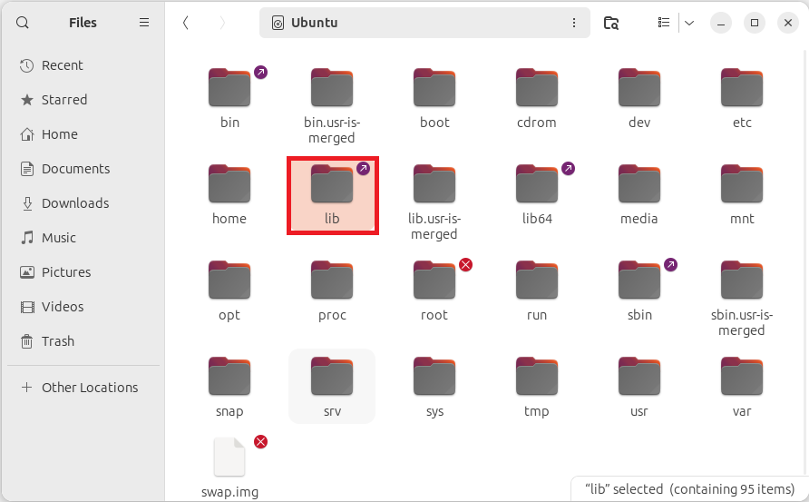
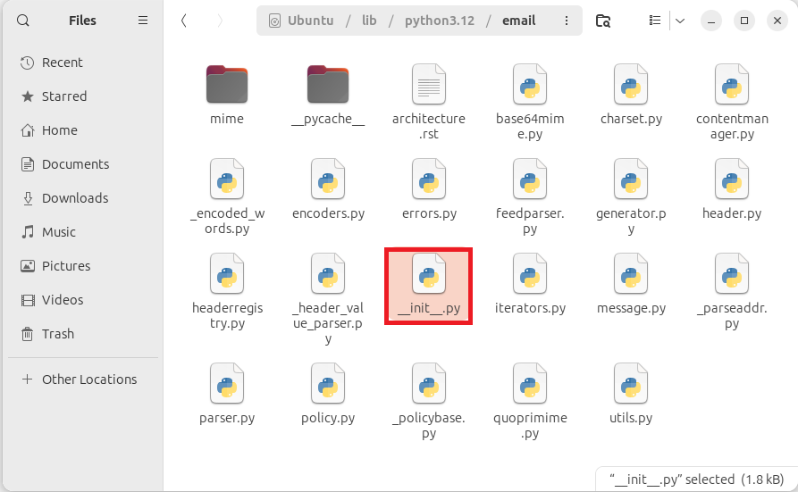
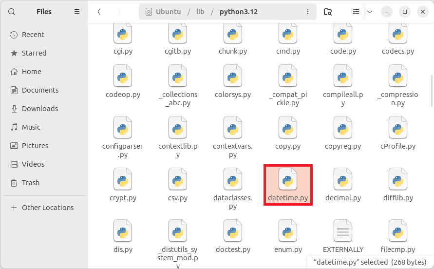
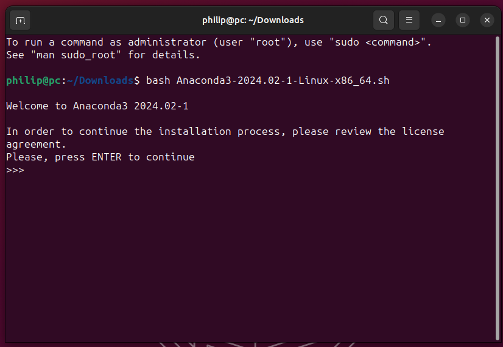
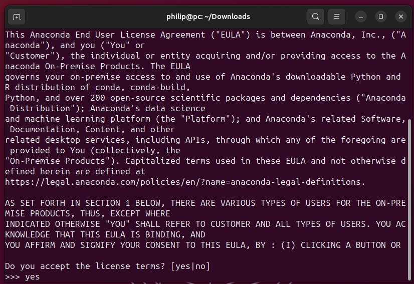
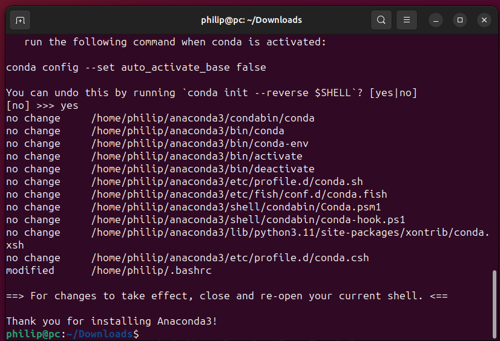
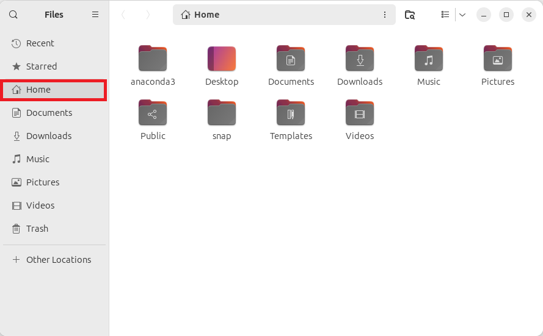

# Installing Anaconda

## Removing Previous Installations

Anaconda should be installed on a Linux PC that has no previous Python installations outwith the system Python. The system Python is preinstalled as part of the Linux Operating system and should be considered as part of the Operating System and not modified by the user.

If an old Anaconda Installation or an Anaconda based installation such as Miniconda or is present these should be removed by deleting their perspective folders. Note that deletion of these folders leaves behind a large number of configuration files and often results in problematic settings persisting after a reinstall. For best results it is recommended to delete all these configuration files. For more details see [Uninstall](./uninstall.md).

## System Python

Beginners often confuse the system Python with Anaconda, particularly when Anaconda is installed without being initialised. 

To view system files in the root folder open up File Explorer and select Other Locations:


The bin folder which contains the binaries otherwise known as command line applications:


Everytime a command is input in the Terminal it runs one of the binaries in this folder.

The binary python3 is the system Python. There will be an alias of this binary giving the minor version:


Note that the binary is called python3 instead of python. In old versions of Linux both Python 2 and Python 3 were preinstalled; python was Python 2 and python3 was Python 3. Python 2 has reached end of life and so now only Python 3 is preinstalled.

If the folder is right clicked and Open in Terminal is selected:


The following prompt will display:

```
username@pc:/bin$ 
```

where username is the user name, pc is the PC name and /bin is the location the Terminal is open in. If the command is input:

```
python3
```

The output will display:

```
username@pc:/bin$ python3
Python 3.11.6 (main, Oct  8 2023, 05:06:43) [GCC 13.2.0] on linux
Type "help", "copyright", "credits" or "license" for more information.
>>> 
```

Python comes with a number of preinstalled modules known as standard modules. These are found in the lib subfolder on the root folder:


In a subfolder corresponding to the Python version:


Some standard modules are single Python script files:



Others are found in their own subfolder:


The subfolder contains multiple Python script files. The name of the subfolder corresponds to the module and the datanodel initialisation file ```__init__.py``` is imported when the folder is input:


This can be seen when the following imports are used:

```
username@pc:~$ python3
Python 3.11.6 (main, Oct  8 2023, 05:06:43) [GCC 13.2.0] on linux
Type "help", "copyright", "credits" or "license" for more information.
>>> import datetime
>>> datetime.__file__
'/usr/lib/python3.11/datetime.py'
>>> import email
>>> email.__file__
'/usr/lib/python3.11/email/__init__.py'
>>> 
```

The python folder has no site-packages folder meaning no third-party libraries are installed. Therefore if a popular third-party data science library is imported, the following ModuleNotFoundError displays:

```
>>> import numpy as np
Traceback (most recent call last):
  File "<stdin>", line 1, in <module>
ModuleNotFoundError: No module named 'numpy'
>>> 
```

This system Python is used by the Linux Operating System and modifying it or installing packages may result in instability. Instead it is recommended to install the Anaconda Python Distribution.

## Anaconda vs Miniconda 

Anaconda is a Python distribution that has a base Python environment that is designed to be used *as is*. The base Python environment has the conda package manager that can be used to create a separate Python environment (subinstallation of Python) for a custom configuration of packages. 

Miniconda is a bootstrap version of Anaconda, that only contains the conda package manager and can likewise be used to create Python environments.

When only custom Python environments are being used, Miniconda should be used in preference to Anaconda.

### Anaconda Python Distribution

The Anaconda Python distribution comes with its own base Python environment that contains:

* Python
* Python Standard Libraries
* The conda Package Manager
* The Anaconda Navigator
* Third Party Libraries:
  * numpy
  * pandas
  * matplotlib
  * seaborn
  * plotly
  * pillow
  * scikit-learn
  * scikit-image
  * ⁝
* Third-party IDEs:
  * Spyder
  * Jupyter
    * JupyterLab
    * Jupyter Notebook
    * Jupyter QTConsole
    * Jupyter Console
* Third-party formatters:
  * autopep8
  * isort
  * black

### Miniconda

Miniconda is a stripped down version of Anaconda containing only:

* Python
* Python Standard Libraries
* The conda Package Manager

## conda

Anaconda and Miniconda have the conda package manager which should be used in preference to the native Python package manager pip. 

* conda
* ~~pip~~

pip is strictly a package manager for Python packages. However many datascience projects under the hood, use code that is written in C++ for performance gains. The conda package manager manages both the Python and non-Python dependencies. The conda package manager has also been written in C++ for increased performance and reliability. This was separately developed as mamba and the conda package manager uses the libmamba (C++) solver by default.

The conda package manager uses two channels:

* conda-forge
* anaconda

The first channel community forge is the community channel and has the largest number of packages available.

The second channel is the channel maintained by Anaconda Inc. Anaconda Inc test packages for compatibility with the Anaconda Python Distribution. 

As a consequence the latest version of a package available on the anaconda channel may be dated with respect to the package on the conda-forge channel as it takes Anaconda Inc some time to test packages. Moreover Anaconda Inc only test the most commonly used datascience libraries and therefore more niche packages will only be available on conda-forge.

In the Anaconda base environment the following commands should never be used:

* ~~pip install package~~
* ~~conda install conda-forge::package~~
* ~~conda install -c conda-forge package~~

This is because use of multiple package managers and use of multiple channels will make the Anaconda base Python environment unstable.

Only packages available from the anaconda channel should be installed in base:

* conda install anaconda::package
* conda install -c anaconda package

The base Python environment is normally used *as is* and instead a custom Python environment is used to install a subinstallation of Python and custom packages from the conda-forge community channel.

## Download Links

The latest Anaconda and Miniconda installer can be downloaded from:

* [Anaconda](https://www.anaconda.com/download)
* [Miniconda](https://docs.anaconda.com/free/miniconda/miniconda-install/)

The installer for Linux is a command line based and is a shell script with a ```.sh``` file extension:




## Install

To run a shell script the command ```bash``` is used and the .sh file is supplied as a command line argument.

To get the name of the file. Open the Downloads folder and right click the downloaded file and select Rename:



Highlight the file name, including the file extension and press ```Ctrl``` + ```c``` to copy:


If the Terminal is open from All Applications. The Prompt will look like:

```
username@pc~$
```

where ```~``` is the current working directory. The Linux Terminal uses ```~``` for the Home folder found in Files. 

To change directory, the command ```cd``` can be used alongside the directory as an input argument:

```
cd ~/Downloads
```

Notice that the prompt is now:

```
username@pc:~/Downloads$
```

bash commands are input after the $ sign.

Alternatively open the Downloads folder in files and right click empty space in files and select Open in Terminal:


To begin executing the shell script for Anaconda input:

```bash
bash Anaconda3-2024.02-1-Linux-x86_64.sh
```

Or for Miniconda input:

```bash
bash Miniconda3-latest-Linux-x86_64.sh
```


Note because the Terminals working directory is Downloads, the directory will not have to be provided as part of the command line argument to the file. Otherwise the following would have to be used:

```bash
bash ~/Downloads/Anaconda3-2024.02-1-Linux-x86_64.sh
```

Note that the Terminal uses the shortcut key ```Ctrl``` + ```c``` to cancel the current running operation. The shortcut keys for Copy and Paste are therefore ```Ctrl```, ```⇧``` + ```c``` and ```Ctrl```, ```⇧``` + ```v``` respectively.

The following output will display:

```
Welcome to Anaconda3 2024.02-1

In order to continue the installation process, please review the license
agreement.
Please, press ENTER to continue
>>> 
```

Press ```↵``` to begin scrolling through the license agreement:

```
==================================================
End User License Agreement - Anaconda Distribution
==================================================

Copyright 2015-2024, Anaconda, Inc.

All rights reserved under the 3-clause BSD License:

This End User License Agreement (the "Agreement") is a legal agreement be
tween you and Anaconda, Inc. ("Anaconda") and governs your use of Anacond
a Distribution (which was formerly known as Anaconda Individual Edition).

Subject to the terms of this Agreement, Anaconda hereby grants you a non-
exclusive, non-transferable license to:

  * Install and use the Anaconda Distribution (which was formerly known a
s Anaconda Individual Edition),
  * Modify and create derivative works of sample source code delivered in
--More--
```

To quit scrolling press ```q```. The following output will now display, prompting to accept of decline the license agreement:

```
Do you accept the license terms? [yes|no]
[no] >>>
```

Input ```yes``` to proceed. The following output will display:

```
Anaconda3 will now be installed into this location:
/home/user/anaconda3

  - Press ENTER to confirm the location
  - Press CTRL-C to abort the installation
  - Or specify a different location below

[/home/user/anaconda3] >>> 
```

It is recommended to install anaconda3 in its default location. Press ```↵``` to proceed. The files will extract and the following output will now display when the installation is successful:

```
PREFIX=/home/user/anaconda3
Unpacking payload ...

Downloading and Extracting Packages

Preparing transaction: done
Executing transaction: / 

    Installed package of scikit-learn can be accelerated using scikit-learn-intelex.
    More details are available here: https://intel.github.io/scikit-learn-intelex

    For example:

        $ conda install scikit-learn-intelex
        $ python -m sklearnex my_application.py

    

done
installation finished.
```

## Initialisation

The root Anaconda Python Environment known as base is found in the anaconda3 folder:


Notice that it has its own bin subfolder:


The python binary associated with this installation is in this:


This python3 binary has the alias python alongside an alias for the major and minor version.

The base Python environment has its own lib subfolder:


The lib subfolder has a subfolder corresponding to the Python version:


And contains the Python standard modules associated with the base Python environment. For example the datetime module available as a script file datetime.py:


Or the email module found as a subfolder:


This subfolder contains multiple Python script files with the ```__init__.py``` datamodel initialisation file:


Going back up a level to the standard modules, there is a site-packages folder which contains third-party modules also known as Python libraries:


There will be two subfolders for each library, one detailing the version number and the other being the library itself. The numeric python library can be found in the numpy folder:


Note that the site-packages for Miniconda will not have a numpy, pandas or matplotlib folder as it is a bootstrap version of Anaconda and only has the dependencies for the conda package manager.

This folder contains multiple Python script files and subfolders which in turn contain multiple Python script files. One of these is the ```__init__.py``` datamodel file which is the file imported when:

```python
import numpy as np
```

is used.


The random module of the numpy library is found in the random subfolder:


Notice that it has its own datamodel initialisation file ```__init__.py``` which is imported when the module is imported using:

```python
np.random.__file__
```


The Python and Data Analysis library is found in the pandas subfolder:



This folder contains multiple Python script files and subfolders which in turn contain multiple Python script files. One of these is the ```__init__.py``` datamodel file which is the file imported when:

```
import pandas as pd
```

is used.


The Matrix Plotting library is found in the matplotlib subfolder:



This folder contains multiple Python script files and subfolders which in turn contain multiple Python script files. One of these is the ```__init__.py``` datamodel file which is the file imported when:

```python
import matplotlib as mpl
```

is used.


Normally only the ```pyplot.py``` module is imported:

```python
import matplotlib.pyplot as plt
```


The Python base environment contains an empty envs subfolder which may be later used. The envs folder contains other Python environments



Initialisation essentially instructs the terminal to look in ```~/anaconda3/bin``` (or ```~/miniconda3/bin``` in the case of Miniconda) and then ```/bin``` for a binary when the base Python is activated instead of only the ```/bin```.

The following output will display, prompting for initialisation:

```
Do you wish to update your shell profile to automatically initialize conda?
This will activate conda on startup and change the command prompt when activated.
If you'd prefer that conda's base environment not be activated on startup,
   run the following command when conda is activated:

conda config --set auto_activate_base false

You can undo this by running `conda init --reverse $SHELL`? [yes|no]
[no] >>> 
```

Unfortunately the default option is no, meaning Anaconda is installed but not the Linux Terminal is not initialised. In this case, the use of the command ```python3``` will use the system Python by default however the python associated with the base Python environment can be selected directly using the full file path:

```
username@pc:~$ python3
Python 3.11.6 (main, Oct  8 2023, 05:06:43) [GCC 13.2.0] on linux
Type "help", "copyright", "credits" or "license" for more information.
>>> exit()
username@pc:~$ ~/anaconda3/bin/python3
Python 3.11.5 (main, Sep 11 2023, 13:54:46) [GCC 11.2.0] on linux
Type "help", "copyright", "credits" or "license" for more information.
>>> 
```

Inputting ```yes``` at the initialisation prompt will output a list of files which correspond to shell initialisation. Most will be unmodified however the .bashrc file will be modified:

```
no change     ~/anaconda3/condabin/conda
no change     ~/anaconda3/bin/conda
no change     ~/anaconda3/bin/conda-env
no change     ~/anaconda3/bin/activate
no change     ~/anaconda3/bin/deactivate
no change     ~/anaconda3/etc/profile.d/conda.sh
no change     ~/anaconda3/etc/fish/conf.d/conda.fish
no change     ~/anaconda3/shell/condabin/Conda.psm1
no change     ~/anaconda3/shell/condabin/conda-hook.ps1
no change     ~/anaconda3/lib/python3.11/site-packages/xontrib/conda.xsh
no change     ~/anaconda3/etc/profile.d/conda.csh
modified      ~/.bashrc

==> For changes to take effect, close and re-open your current shell. <==

Thank you for installing Anaconda3!
```

The .bashrc fle is found in the Home folder:


It is hidden by default:


It can be opened in Text Editor:



It has this additional conda initialisation block:


The end of the output states **For changes to take effect, close and re-open your current shell**. When a new Terminal instance is opened, it will look at the updated ```.bashrc``` file, run a script to activate the conda (base) environment and therefore look in additional locations for commands.

When the Terminal is open the bash prompt will display:

```
(base) username@pc~$: 
```

Instead of:

```
username@pc~$:
```

This means the conda (base) Python environment is selected.

Because the default option for initialisation is no, many new users to Anaconda install it without initialising it. If this has happened open up the Terminal and input:

```bash
~/anaconda3/bin/conda init bash
```

Or for Miniconda:

```bash
~/miniconda3/bin/conda init bash
```

This will display the output:

```
no change     ~/anaconda3/condabin/conda
no change     ~/anaconda3/bin/conda
no change     ~/anaconda3/bin/conda-env
no change     ~/anaconda3/bin/activate
no change     ~/anaconda3/bin/deactivate
no change     ~/anaconda3/etc/profile.d/conda.sh
no change     ~/anaconda3/etc/fish/conf.d/conda.fish
no change     ~/anaconda3/shell/condabin/Conda.psm1
no change     ~/anaconda3/shell/condabin/conda-hook.ps1
no change     ~/anaconda3/lib/python3.11/site-packages/xontrib/conda.xsh
no change     ~/anaconda3/etc/profile.d/conda.csh
modified      ~/.bashrc

==> For changes to take effect, close and re-open your current shell. <==
```

When the Terminal is closed and opened the bash prompt should now display:

```
(base) username@pc~$: 
```

Initialisation can be reversed using:

```bash
~/anaconda3/bin/conda init bash --reverse
```

```bash
~/miniconda3/bin/conda init bash --reverse
```

## Updating Anaconda

To update Anaconda or Miniconda, use:

```bash
conda update conda
```

This will look for updates to the conda package manager and for Anaconda in turn update the entire Anaconda Python distribution. In this case, conda is already up to date:

```
Channels:
 - defaults
Platform: linux-64
Collecting package metadata (repodata.json): done
Solving environment: done

# All requested packages already installed.

(base) username@pc:~$
```

If updates are listed in your case, review the changes and press ```y``` to proceed.

The conda package manager will now be updated alongside most of the other packages in the (base) Python environment. A new prompt will display once the update has finished.

The conda package manager can also be used to update the anaconda-navigator:

```bash
conda update anaconda-navigator
```

The following output will display:

```
Channels:
 - defaults
Platform: linux-64
Collecting package metadata (repodata.json): done
Solving environment: done

## Package Plan ##

  environment location: /home/philip/anaconda3

  added / updated specs:
    - anaconda-navigator


The following packages will be downloaded:

    package                    |            build
    ---------------------------|-----------------
    anaconda-navigator-2.5.3   |  py311h06a4308_0         5.6 MB
    ------------------------------------------------------------
                                           Total:         5.6 MB

The following packages will be UPDATED:

  anaconda-navigator                  2.5.2-py311h06a4308_0 --> 2.5.3-py311h06a4308_0


Proceed ([y]/n)? 
```

To proceed input ```y```. The output will now display:

```
Downloading and Extracting Packages:
                                                                                                                              
Preparing transaction: done
Verifying transaction: done
Executing transaction: done
```

The Anaconda Python distribution is now up to date. It is recommended to periodically check for updates.

## Installing TeX

A number of the datascience packages such as nbcovert and matplotlib can use TeX. On Ubuntu TeX should be installed system wide, using the Ubuntu (Debian-based) package manager apt:

```bash
sudo apt-get install texlive-xetex texlive-fonts-recommended texlive-plain-generic cm-super dvipng
```

## Binaries

Binaries associated with the Anaconda base Python environment are found in ```~/anaconda3/bin``` folder or the ```~/miniconda3/bin``` folder. 

As Miniconda is a bootstrap version of Anaconda most of the binaries are not preinstalled in the Miniconda base Python environment. Typically these only become available when they are installed, however this is usually in another custom Python environment. The conda package manager can be used to create Python environments for the latest version of Jupyter and Spyder from the community channel conda-forge or from the spyder developers release candidate channel. A custom Jupyter environment can also be equipped with R allowing use of the R kernel. Use of the conda package manager is covered in more detail in the next tutorial [conda](./conda.md).

### Python

If a search for python is made, notice that there is:

* python
* python3
* python3.1
* python3.11 

These are all the same application. 

Python can be launched using:

```bash
~/anaconda3/bin/python
```

When the base Python environment is activated, the Terminal will automatically look in ```~/anaconda3/bin``` for a binary so the command is equivalent:

```bash
python
```

The output will display details about the Python application and then display a Python prompt ```>>>``` from the Python application:

```
Python 3.11.5 (main, Sep 11 2023, 13:54:46) [GCC 11.2.0] on linux
Type "help", "copyright", "credits" or "license" for more information.
>>>
```

To ```exit``` the Python application, the Python function ```exit``` needs to be used:

```python
exit()
```

A new bash prompt will display.

### IPython

There is also Interactive Python (IPython) which can be launched using:

```
ipython
```

The output shown gives details about the Python and Interactive Python version and each Python cell has a numeric index. 

```
Python 3.11.5 (main, Sep 11 2023, 13:54:46) [GCC 11.2.0]
Type 'copyright', 'credits' or 'license' for more information
IPython 8.15.0 -- An enhanced Interactive Python. Type '?' for help.

In [1]:
```

IPython is similar to Python but has enhancements such as the application of Python syntax highlighting and the addition of the ```?``` operator which can be used to examine a Python objects docstring or ```??``` which can be used to output the file of a module. 

IPython also has IPython magics which begin with ```%``` and are equivalent to commonly ```bash``` commands. 

### Jupyter

The popular Jupyter project for example is an abbreviation for Julia Python et (Latin for and) R.


This has the programs:

* jupyter-console
* jupyter-qtconsole
* jupyter-notebook
* jupyter-lab

The jupyter-console by default uses the Python Kernel and is identical to IPython however the kernel can be changed using the option ```--kernel```:

```
(base) username@pc:~$ jupyter-console --kernel=python3
Python 3.11.5 (main, Sep 11 2023, 13:54:46) [GCC 11.2.0]
Type 'copyright', 'credits' or 'license' for more information
IPython 8.15.0 -- An enhanced Interactive Python. Type '?' for help.

In [1]: 

```

The available kernels can be viewed by using:

```
jupyter kernelspec list
```

Because Anaconda is a Python Distribution by default it only has a Python kernel:

```
(base) username@pc:~$ jupyter kernelspec list
Available kernels:
  python3    /home/username/anaconda3/share/jupyter/kernels/python3
(base) username@pc:~$ 
```

The QTConsole is essentially rewritten using the QT GUI Framework and has a number of additional enhancements for example automatically displaying a docstring as a popup balloon:


And nesting graphics:


It also has a File menu which can be used to save the file as a HTML file or a pdf.

The Jupyter Notebook and Jupyter Lab are NodeJS implementations of the Console with support for interactive Python Notebook Files. JupyterLab also has a script editor for Python scripts files and a markdown editor and markdown preview for files.

When either of the commands are run the Terminal is busy running a Jupyter server, logs will display in this server:

```
(base) username@pc:~$ jupyter-lab
[I 2023-12-24 17:14:06.919 ServerApp] Use Control-C to stop this server and shut down all kernels (twice to skip confirmation).
[C 2023-12-24 17:14:06.937 ServerApp] 
    
    To access the server, open this file in a browser:
        file:///home/username/.local/share/jupyter/runtime/jpserver-7745-open.html
    Or copy and paste one of these URLs:
        http://localhost:8888/lab?token=fd3b628ce3d5904b5b539da1809bd730f08449cf79f77531
        http://127.0.0.1:8888/lab?token=fd3b628ce3d5904b5b539da1809bd730f08449cf79f77531

```

The visual elements will display in a browser:


To view identifiers beginning with a prefix, input ↹ after the prefix:


To view the docstring popup, input ⇧ + ↹:


The visual elements can be closed in the browser, however the server will continue to run in the Terminal until Ctrl + c is pressed to close the current operation.

### Spyder

Another important binary is the Scientific Python Development Environment (spyder) which can be launched using:

```
spyder
```

The Terminal will display the following

```
(base) username@pc:~$ spyder
Warning: Ignoring XDG_SESSION_TYPE=wayland on Gnome. Use QT_QPA_PLATFORM=wayland to run on Wayland anyway.
fromIccProfile: failed minimal tag size sanity
```


The Anaconda Navigator is a program that contains shortcuts to most of Python binaries. It can be launched using:

```
anaconda-navigator
```

There is a ```LibGL error: mesa iris driver error``` when Anaconda Navigator or any programs which use QT are launched. This error is due to the old version of ```libstdcxx-ng``` in the Anaconda base Python environment and can be ignored. This should eventually be fixed by Anaconda when they update this package.


The bin folder contains a number of Python formatters such as autopep8, isort, black and linters such as pylint and pyflakes. These can be run in the Terminal to format a Python file for example the Python script file with sloppy spacing in the code:


However are normally implemented in IDEs such as Spyder which has Autoformatters in the Source menu:


AutoPEP8 addresses the spacing making it PEP8 compliant. The opinionated fomratter black can also be used to make quotation consistent (but inconsistent with the default single quotations used by the Python kernel):


[Return to Python Tutorials](../../readme.md)