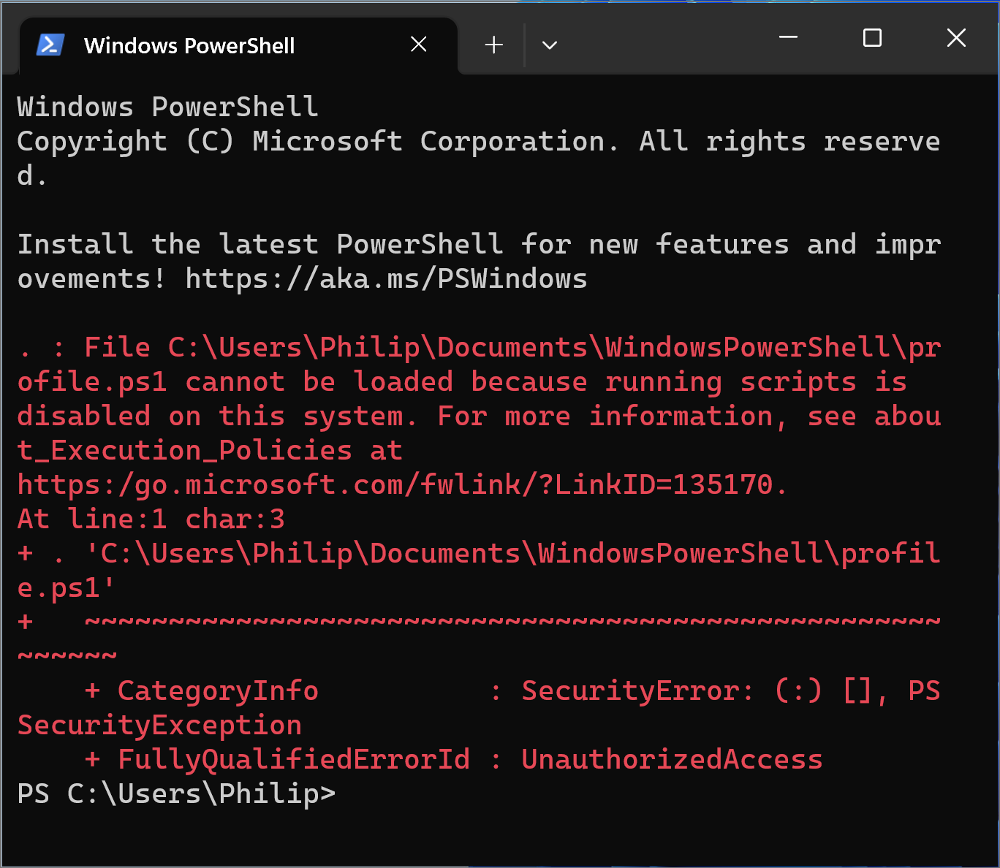
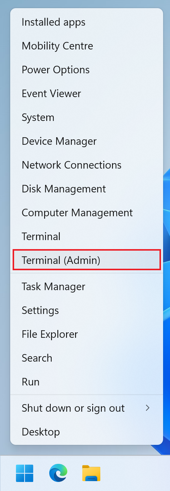
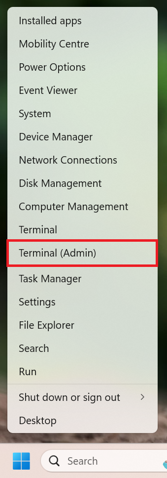
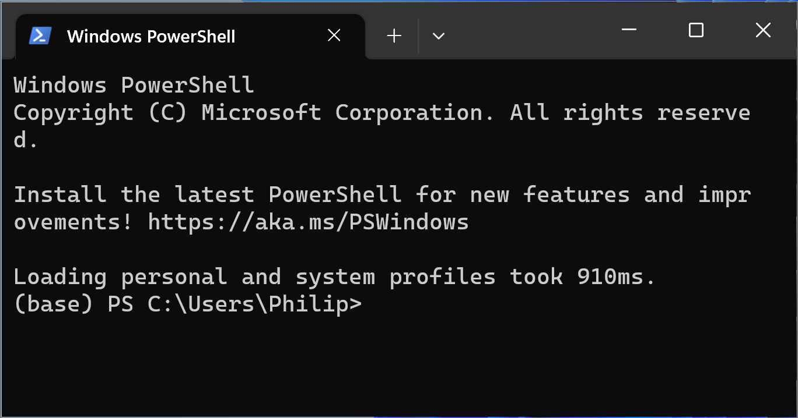
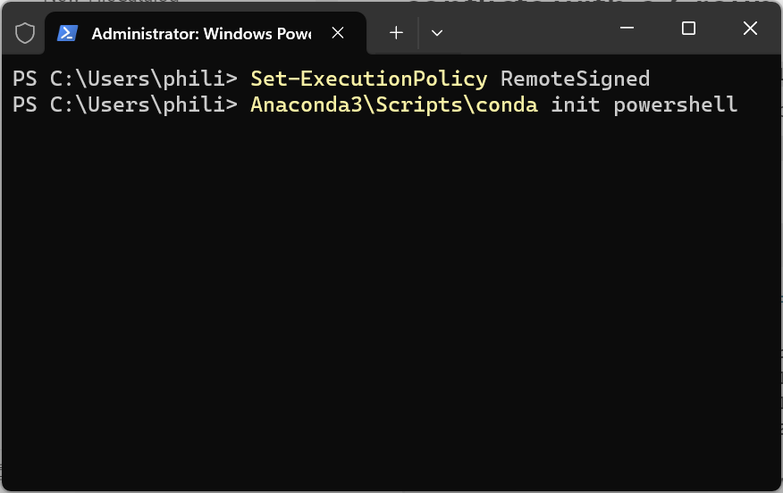
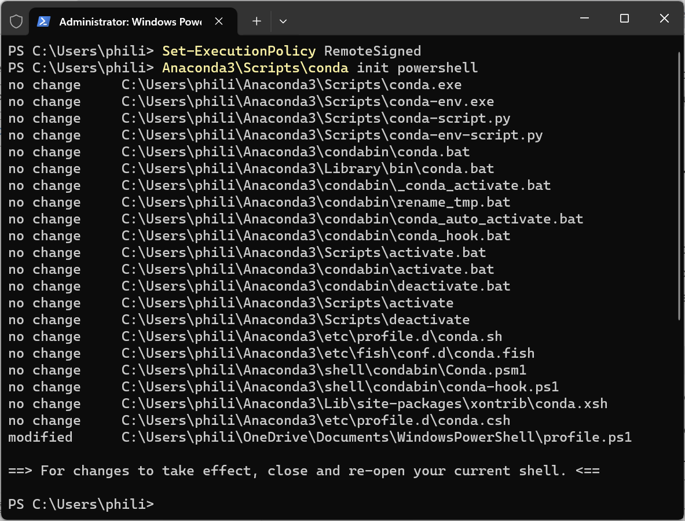

# Installing Anaconda

## Removing Old Installations

Anaconda should be installed on a Windows 11 that has no previous Python installations. If these are present they should be Uninstalled and old configuration files should be purged, see:

[Uninstall](./uninstall.md)

## WinGet

On a clean install of Windows 11, Anaconda can be installed using the Windows Package Manager WinGet. 

Before using WinGet, the Microsoft Store, App Installer and Windows Terminal should be updated. Open up the Microsoft Store, select Library and then select Get Updates:


Right click the Start Menu and select Terminal:


When WinGet is used with Terminal (User) it will install a Program for the Current User. When WinGet is used with Terminal (Admin) it will install a Program for All Users:


```
WinGet install Anaconda.Anaconda3
```


The default install location will be in:

```
%USERPROFILE%\Anaconda3
```


The environmental variable %USERPROFILE% maps to the location of your User Profile, in this case C:\\Users\\Phili
Other Windows Environmental Variables include:

|Environmental Variable|Location
|---|---|
|%USERPROFILE%|C:\\Users\\Phili|
|%ONEDRIVE%|C:\\Users\\Phili\\OneDrive|
|%APPDATA%|C:\\Users\\Phili\\AppData\\Roaming|
|%LOCALAPPDATA%|C:\\Users\\Phili\\AppData\\Local|
|%TMP%|C:\\Users\\Phili\\AppData\\Local\\Temp|
|%PROGRAMDATA%|C:\\ProgramData|
|%PROGRAMFILES%|C:\\Program Files|
|%PROGRAMFILES(X86)%|C:\\Program Files (x86)|
|%WINDIR%|C:\\Windows|
|%SYSTEMDRIVE%|C:|

## Windows Environmental Variable Path

When Anaconda is installed using WinGet, it becomes the users default Python and is added to the Windows Environmental Variables Path.

The Windows Environmental Variables Path can be checked by right clicking the Start Button and selecting System:


Then Advanced System Settings:


Then selecting the Advanced tab and Environmental Variables:


Select Path and then Edit:


The following 5 entries are automatically added:

```
%USERPROFILE%\Anaconda3
%USERPROFILE%\Anaconda3\Library\mingw-w64\bin
%USERPROFILE%\Anaconda3\Libraryusr\bin
%USERPROFILE%\Anaconda3\Library\bin
%USERPROFILE%\Anaconda3\Scripts
```

The Windows Terminal is configured to look at the entries in the Windows Environmental Variables path when looking for a command.

For example if the command

```
python
```

Then the following application is run, i.e. the base python:

```
C:\Users\Phili\Anaconda3\python.exe
```


In Windows Explorer, this is:

```
%USERPROFILE%\Anaconda3\python.exe
```


Note because the Windows Terminal opens in ```%USERPROFILE%``` by default. The application can also be accessed from the relative path:

```
Anaconda3\python.exe
```

In the Windows Terminal the ```%USERPROFILE%``` environmental variable can be accessed using ```~``` and therefore the application can also be accessed from the full path:

```
~\Anaconda3\python.exe
```


The Scripts subfolder:


Contains a number of additional applications:


This includes the Anaconda Navigator:

* anaconda-navigator

This can be launched using:

```
anaconda-navigator
```


The Anaconda Navigator contains a number of shortcut to Python IDEs:


Package Managers:

* conda
* pip3

The ```conda``` package manager should be preferentially used over ```pip3``` for Anaconda. An overview of the package manager displays when the following is input:

```
conda
```


Python IDEs:

* ipython
* idle
* jupyter-qtconsole
* jupyter-notebook
* jupyter-lab
* spyder

For example Spyder can be launched using:

```
spyder
```





JupyterLab can be launched using:

```
jupyter-lab
```



The Terminal will run a server:



Which displays the visual element in the default browser:



Python formatters:

* autopep8
* isort
* yapf
* black
* flake8

These can be executed on a Python script file using the Terminal but are typically incorporated into an IDE and executed via the IDE:



## Anaconda PowerShell Prompt

The Anaconda3 folder on the Start Menu has two Terminal Based Entries:

* Anaconda PowerShell Prompt
* Anaconda (CMD Shell) Prompt

In general you should preference the Anaconda PowerShell Prompt over the Anaconda Prompt as CMD is effectively depreciated.


Notice that the Anaconda PowerShell Prompt and Windows Terminal look almost identical:


The subtle difference is the ```(base)``` prefix in the Anaconda PowerShell Prompt which is an indicator meaning the base Python environment is selected. At present as there is only a single Python environment (no Python subinstallations), both the Anaconda PowerShell Prompt and Windows Terminal will behave similarly.

When there are multiple Python environments, the Anaconda Powershell Prompt can be used to switch between Python environments using the ```conda activate``` command. In contrast the Python environment accessible by the Windows Terminal is the one specified in the Windows Environmental Variables Path.

Under the hood the Anaconda PowerShell Prompt essentially launches the Windows Terminal with a conda activation script. Note in order to run the script it bypasses a PowerShell Execution Policy:

```
%windir%\System32\WindowsPowerShell\v1.0\powershell.exe -ExecutionPolicy ByPass -NoExit -Command "& 'C:\Users\Phili\anaconda3\shell\condabin\conda-hook.ps1' ; conda activate 'C:\Users\Phili\anaconda3' "
```

Generally the Anaconda PowerShell Prompt is preferred over the Windows Terminal when working with Python environments.

## Updating Anaconda

Open the Anaconda PowerShell Prompt or Windows Terminal. If using the Anaconda PowerShell Prompt input:

```
conda deactivate
```

This will deactivate the ```base``` Python environment:


Then update the ```conda``` package manager using:

```
conda update conda
```

Updating the ```conda``` package manager will update the Anaconda Python distribution:


A small number of packages will be removed, a small number of packages will be added and a large number of packages will be updated. Input:

```
y
```

in order to proceed:


The Anaconda Navigagtor can be checked for an update using:

```
conda update anaconda-navigator
```

Anaconda should now be updated:


[Return to Anaconda Tutorial](./readme.md)
