# Installing Anaconda

## About Anaconda

The Anaconda Python distribution comes with its own base (otherwise known as an alternative root) Python environment that contains:

* The conda Package Manager
* Python
* Python Standard Libraries
* numpy
* pandas
* matplotlib
* seaborn
* Spyder
* JupyterLab
* Formatters such as autopep8, isort and black

Python has its own package manager Python Install Package (pip) which is strictly for Python packages. For datascience projects the more powerful conda package manager is prefered as it can be used to install the Python packages used for datascience projects in addition to their non-Python dependencies. These include example codecs, LaTeX as well as dependencies for hardware acceleration. conda can also be used to install packages from other programming languages which are often user in conjunction with Python. The popular Jupyter project for example is an abbreviation for Julia Python et (Latin for and) R.

```conda install package``` should be used instead of ```pip install package``` where possible.

The ```conda``` package manager has two channels:

* main (also called conda or anaconda)
* conda-forge (community)

The main channel is maintained by the Anaconda company and the conda-forge channel is maintained directly by developers from the Python community. The Anaconda company only test a subset of the more commonly used Python packages for stability with the Anaconda Python Distribution and because these packages are further tested they may be older than the latest versions on the conda-forge channel. Therefore the base Anaconda Python distribution contains only packages from the base Python environment. The base environment can become unstable when packages from the community channel are used and it is recommended to use the conda package manager to create a Python environment for custom configurations.

Miniconda is a stripped down version of Anaconda which has an empty base Python environment with only the dependencies required for the conda package manager.

Note WinGet and conda should not be confused with one another. Both are package managers however WinGet is a general purpose Windows Package Manager that is Windows only. conda is a cross-platform package manager specialised for datascience packages.

## Removing Old Installations

Anaconda should be installed on a Windows 11 PC that has no previous Python installations. 

If Python installations are present they should be uninstalled. Note that uninstallation leaves behind a large number of configuration files that often results in problematic setting persisting after a reinstall. For best results it is recommended to purge these configuration files. For more details see [Uninstall](./uninstall.md).

## WinGet

On a clean install of Windows 11, Anaconda can be installed using the Windows Package Manager WinGet. 

Before using WinGet, the Microsoft Store, App Installer and Windows Terminal should be updated. Open up the Microsoft Store, select Library and then select Get Updates:

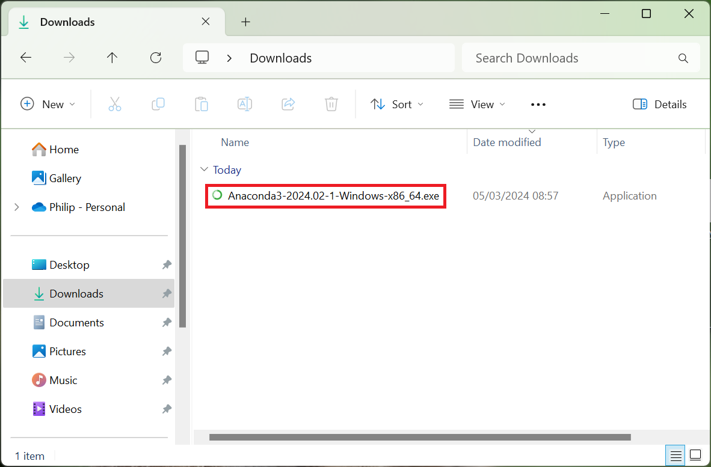

Note: When WinGet is used with Terminal (Non-Admin) it will install a Program for the Current User. When WinGet is used with Terminal (Admin) it will install a Program for All Users.

Unfortunately the version of Miniconda3 available from WinGet is old and the latest installer should be downloaded. 

Right click the Start Menu and select Terminal (Non-Admin):

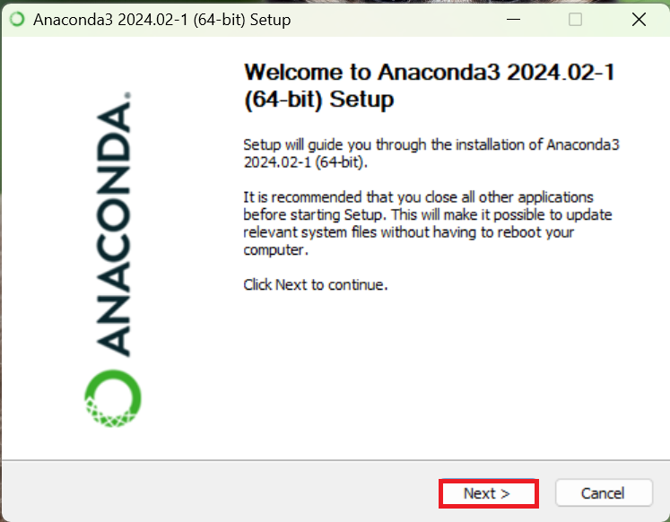

The Terminal uses the PowerShell programming language by default.

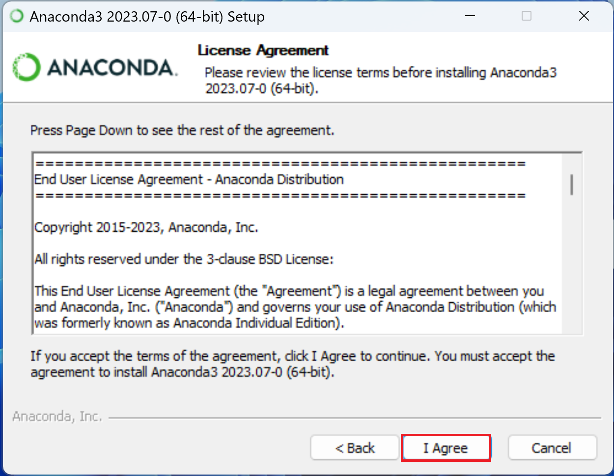

```
WinGet install Anaconda.Anaconda3
```

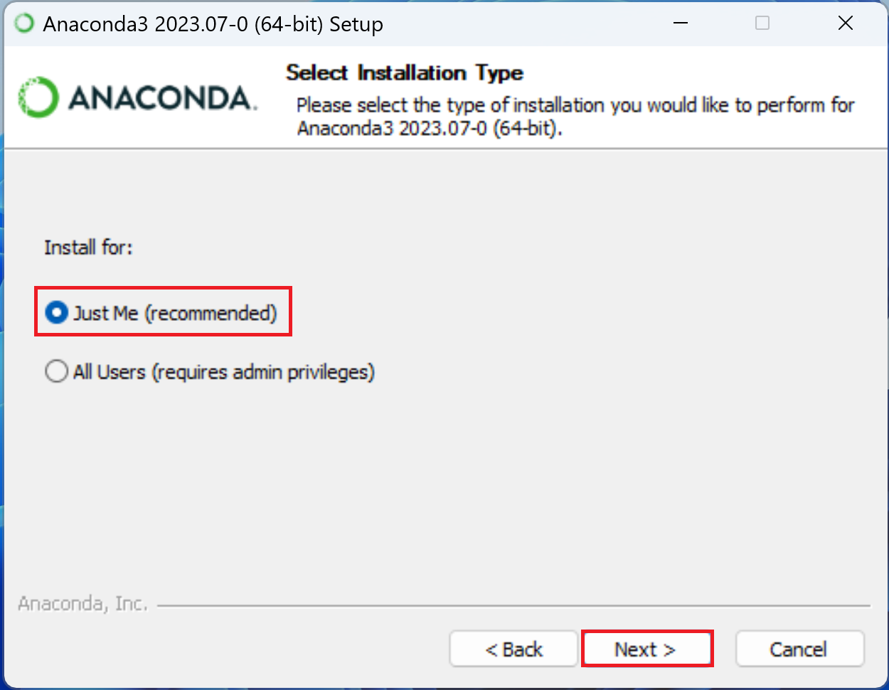

The default install location will be in:

```
%USERPROFILE%\Anaconda3
```

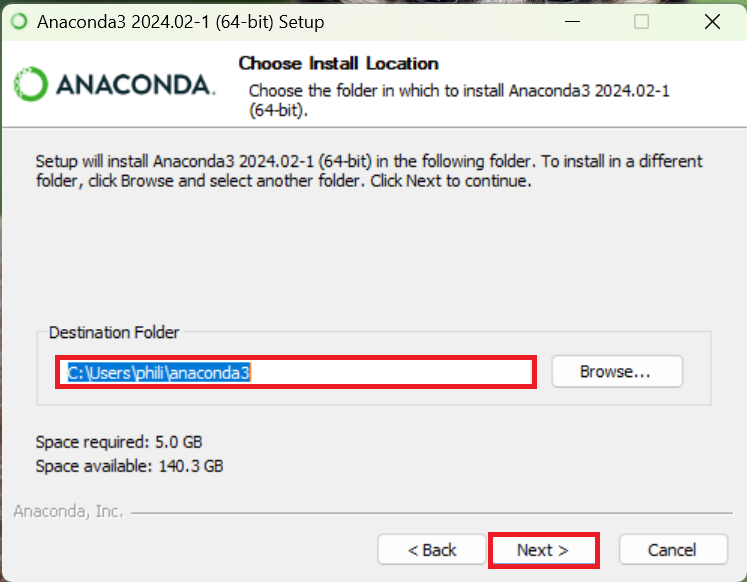

The environmental variable %USERPROFILE% maps to the location of your User Profile, in this case C:\\Users\\Phili
Other Windows Environmental Variables include:

|Environmental Variable|Location
|---|---|
|%USERPROFILE%|C:\\Users\\Phili|
|%ONEDRIVE%|C:\\Users\\Phili\\OneDrive|
|%APPDATA%|C:\\Users\\Phili\\AppData\\Roaming|
|%LOCALAPPDATA%|C:\\Users\\Phili\\AppData\\Local|
|%TMP%|C:\\Users\\Phili\\AppData\\Local\\Temp|
|%PROGRAMDATA%|C:\\ProgramData|
|%PROGRAMFILES%|C:\\Program Files|
|%PROGRAMFILES(X86)%|C:\\Program Files (x86)|
|%WINDIR%|C:\\Windows|
|%SYSTEMDRIVE%|C:|

## Windows Environmental Variable Path

When Anaconda is installed using WinGet, it becomes the users default Python and is added to the Windows Environmental Variables Path. When Anaconda or Miniconda are installed using the standalone installer, the Windows Environmental Path is often not modified.

The Windows Environmental Variables Path can be checked by right clicking the Start Button and selecting System:

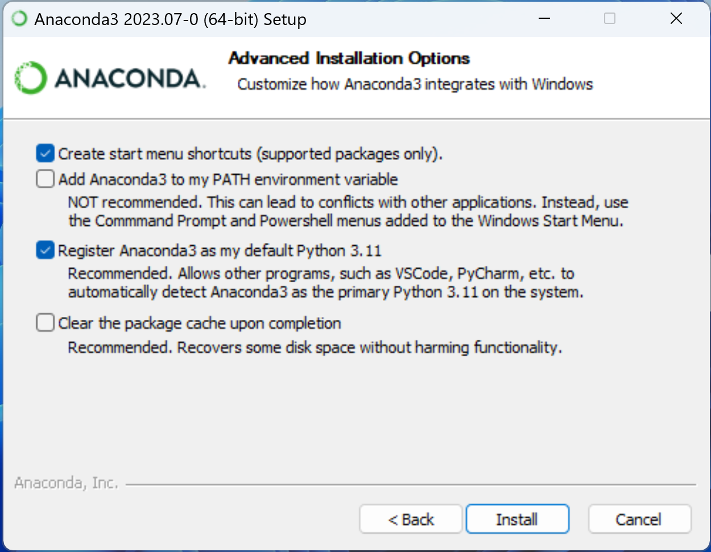

Then Advanced System Settings:

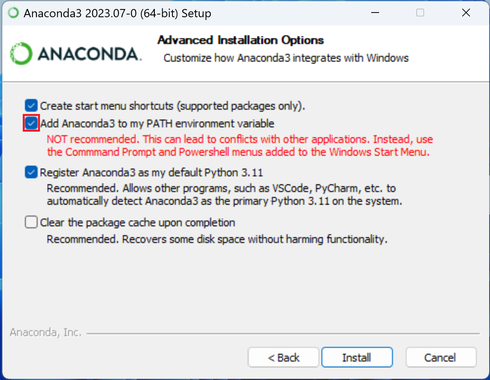

Then selecting the Advanced tab and Environmental Variables:


Select Path and then Edit:

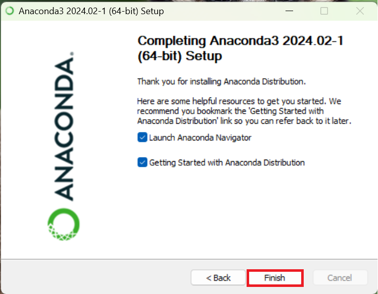

For Anaconda installed using WinGet the following 5 entries are automatically added. These can optionally be manually added if not present, although a better option is to initialise the Windows Terminal (see below):

```
%USERPROFILE%\Anaconda3
%USERPROFILE%\Anaconda3\Library\mingw-w64\bin
%USERPROFILE%\Anaconda3\Libraryusr\bin
%USERPROFILE%\Anaconda3\Library\bin
%USERPROFILE%\Anaconda3\Scripts
```

For Miniconda:

```
%USERPROFILE%\Miniconda3
%USERPROFILE%\Miniconda3\Library\mingw-w64\bin
%USERPROFILE%\Miniconda3\Libraryusr\bin
%USERPROFILE%\Miniconda3\Library\bin
%USERPROFILE%\Miniconda3\Scripts
```

## Anaconda PowerShell Prompt

The Anaconda3 folder on the Start Menu has two Terminal Based Entries:

* Anaconda PowerShell Prompt
* Anaconda (CMD Shell) Prompt

In general the PowerShell Prompt should be preferenced over the Legacy CMD Prompt:

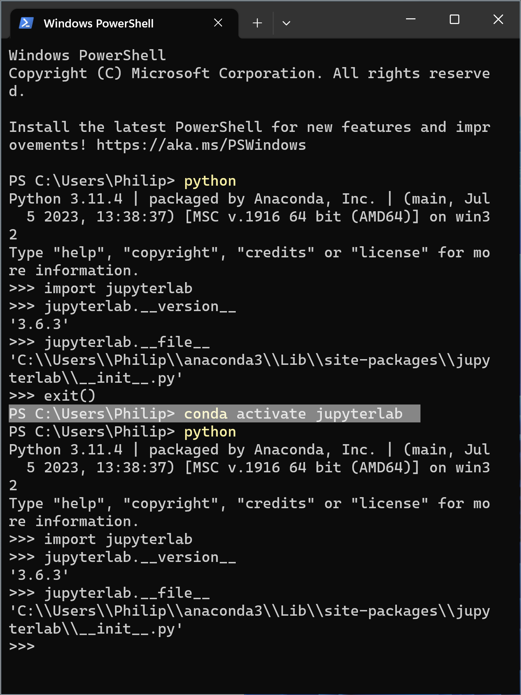

Notice that the Anaconda PowerShell Prompt and Windows Terminal look almost identical:

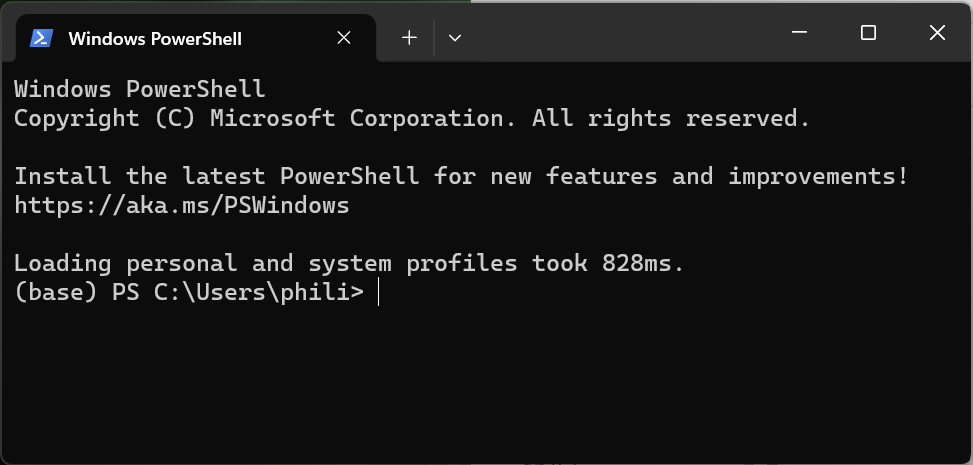

The subtle difference is the ```(base)``` prefix in the Anaconda PowerShell Prompt which is an indicator meaning the base Python environment is selected. 

Under the hood the Anaconda PowerShell Prompt essentially launches the Windows Terminal with a conda activation script. Note in order to run the script it bypasses a PowerShell Execution Policy:

```
%windir%\System32\WindowsPowerShell\v1.0\powershell.exe -ExecutionPolicy ByPass -NoExit -Command "& '~\anaconda3\shell\condabin\conda-hook.ps1' ; conda activate '~\anaconda3' "
```

## Initialising the Windows Terminal

Initialisation is often required for some IDEs that use the Windows Terminal to work correctly for example VSCode.

The Windows Terminal can be initialised directly by using a modified PowerShell Profile that runs the conda activation script. To use this modified profile, the PowerShell Script Execution Policy needs to be set to RemoteSigned which require use of the Anaconda PowerShell Prompt.

To initialise Anaconda in PowerShell open up the Windows Terminal (Admin) and change the execution policy:

```
Set-ExecutionPolicy -ExecutionPolicy RemoteSigned
```

Then initialise Anaconda:

```
Anaconda3\Scripts\conda init powershell
```

This will output:

```
(base) PS ~> Set-ExecutionPolicy -ExecutionPolicy RemoteSigned
(base) PS ~> Anaconda3\Scripts\conda init powershell
no change     ~\Anaconda3\Scripts\conda.exe
no change     ~\Anaconda3\Scripts\conda-env.exe
no change     ~\Anaconda3\Scripts\conda-script.py
no change     ~\Anaconda3\Scripts\conda-env-script.py
no change     ~\Anaconda3\condabin\conda.bat
no change     ~\Anaconda3\Library\bin\conda.bat
no change     ~\Anaconda3\condabin\_conda_activate.bat
no change     ~\Anaconda3\condabin\rename_tmp.bat
no change     ~\Anaconda3\condabin\conda_auto_activate.bat
no change     ~\Anaconda3\condabin\conda_hook.bat
no change     ~\Anaconda3\Scripts\activate.bat
no change     ~\Anaconda3\condabin\activate.bat
no change     ~\Anaconda3\condabin\deactivate.bat
modified      ~\Anaconda3\Scripts\activate
modified      ~\Anaconda3\Scripts\deactivate
modified      ~\Anaconda3\etc\profile.d\conda.sh
modified      ~\Anaconda3\etc\fish\conf.d\conda.fish
no change     ~\Anaconda3\shell\condabin\Conda.psm1
modified      ~\Anaconda3\shell\condabin\conda-hook.ps1
modified      ~\Anaconda3\Lib\site-packages\xontrib\conda.xsh
modified      ~\Anaconda3\etc\profile.d\conda.csh
modified      ~\OneDrive\Documents\WindowsPowerShell\profile.ps1

==> For changes to take effect, close and re-open your current shell. <==
```

Close the Windows Terminal (Admin) and open up a new Windows Terminal (Non-Admin). The Windows Terminal will now use the new PowerShell profile profile.ps1 found in Documents. It will show the prefix (base) indicating that the (base) Python environment is selected and use of the Windows Terminal and Anaconda PowerShell Prompt will be equivalent. 

### The (base) Python Environment

The Windows Terminal is configured to look at the entries in the Windows Environmental Variables path (an initialised Windows Terminal defaults to base and also uses these locations) when looking for a command.

For example if the command

```
python
```

Then the following application is run, i.e. the base python:

```
~\Anaconda3\python.exe
```

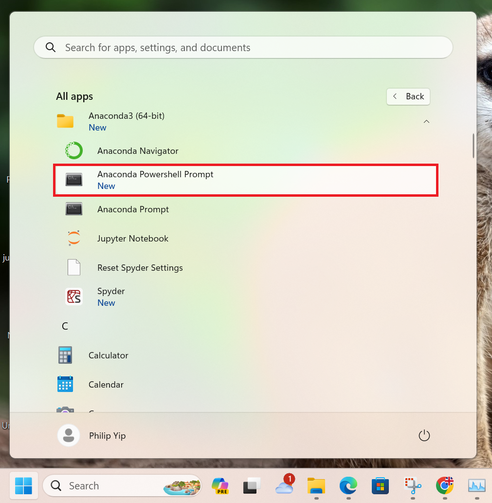

In Windows Explorer, this is:

```
%USERPROFILE%\Anaconda3\python.exe
```

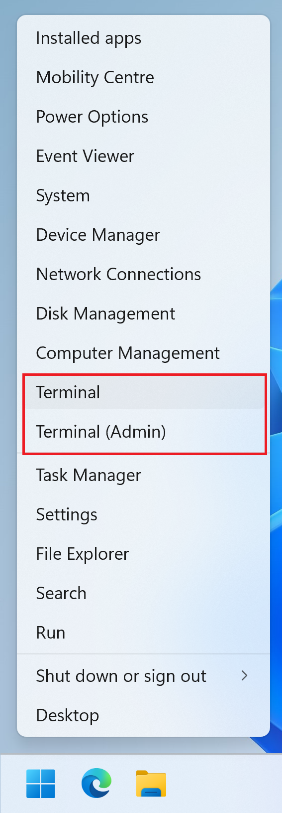

Note because the Windows Terminal opens in ```%USERPROFILE%``` by default. The application can also be accessed from the relative path:

```
Anaconda3\python.exe
```

In the Windows Terminal the ```%USERPROFILE%``` environmental variable can be accessed using ```~``` and therefore the application can also be accessed from the full path:

```
~\Anaconda3\python.exe
```

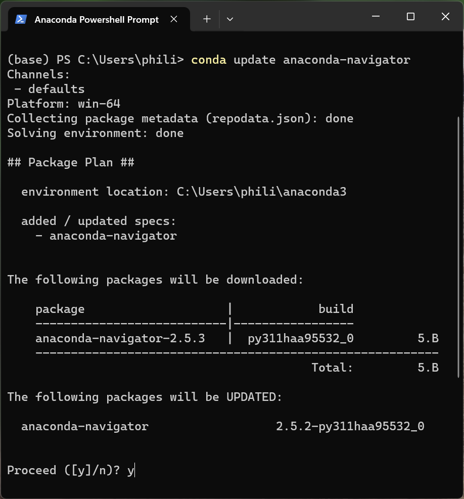

The Scripts subfolder:

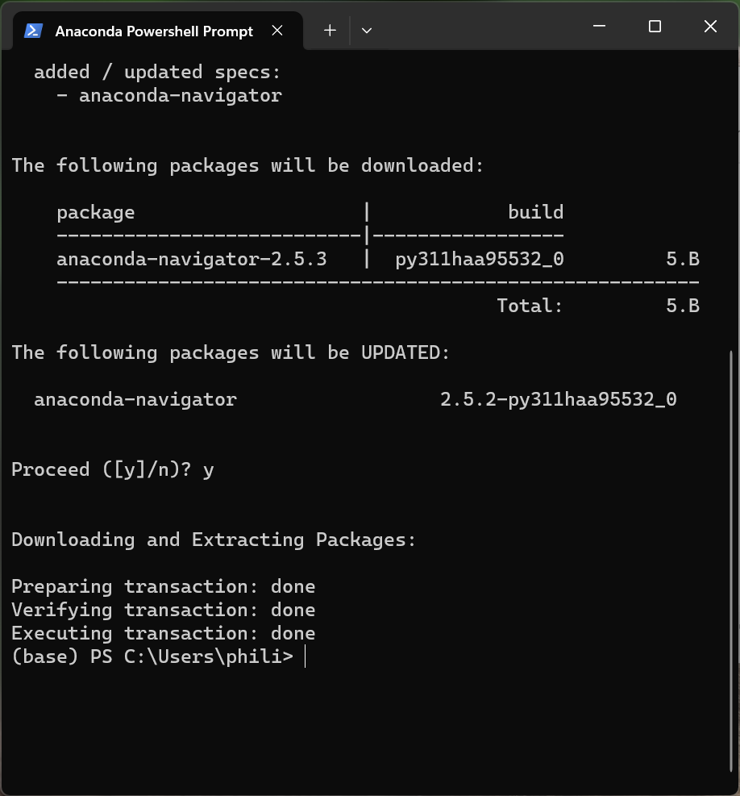

Contains a number of additional applications:

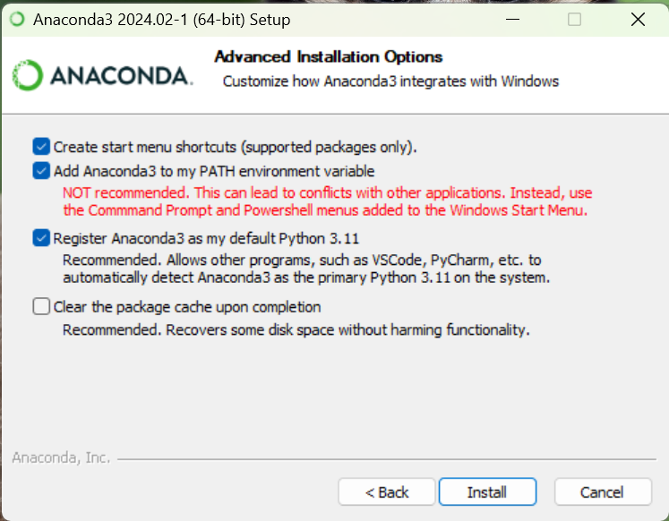

As Miniconda is a bootstrap version of Anaconda most of the applications are not preinstalled in the Miniconda base Python environment. Typically these only become available when they are installed, however this is usually in another custom Python environment (see next section).

There is also Interactive Python (IPython) which can be launched using:

```
ipython
```

The output shown gives details about the Python and Interactive Python version and each Python cell has a numeric index. 

```
(base) PS ~> ipython
Python 3.11.5 | packaged by Anaconda, Inc. | (main, Sep 11 2023, 13:26:23) [MSC v.1916 64 bit (AMD64)]
Type 'copyright', 'credits' or 'license' for more information
IPython 8.15.0 -- An enhanced Interactive Python. Type '?' for help.

In [1]:
```

IPython is similar to Python but has enhancements such as the application of Python syntax highlighting and the addition of the ```?``` operator which can be used to examine a Python objects docstring or ```??``` which can be used to output the file of a module. 

IPython also has IPython magics which begin with ```%``` and are equivalent to commonly ```bash``` commands. 

The popular Jupyter project for example is an abbreviation for Julia Python et (Latin for and) R.

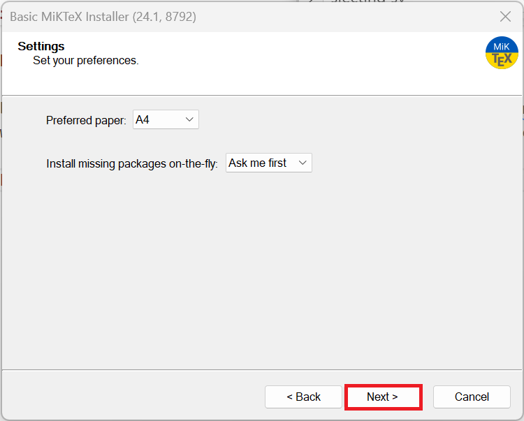

This has the programs:

* jupyter-console
* jupyter-qtconsole
* jupyter-notebook
* jupyter-lab

The jupyter-console by default uses the Python Kernel and is identical to IPython however the kernel can be changed using the option ```--kernel```:

```
PS ~> jupyter-console --kernel=python3

Python 3.11.5 | packaged by Anaconda, Inc. | (main, Sep 11 2023, 13:26:23) [MSC v.1916 64 bit (AMD64)]
Type 'copyright', 'credits' or 'license' for more information
IPython 8.15.0 -- An enhanced Interactive Python. Type '?' for help.

In [1]:
```

The available kernels can be viewed by using:

```
jupyter kernelspec list
```

Because Anaconda is a Python Distribution by default it only has a Python kernel:

```
PS ~> jupyter kernelspec list
Available kernels:
  python3    ~\anaconda3\share\jupyter\kernels\python3
PS ~>
```

The QTConsole is essentially rewritten using the QT GUI Framework and has a number of additional enhancements for example automatically displaying a docstring as a popup balloon:

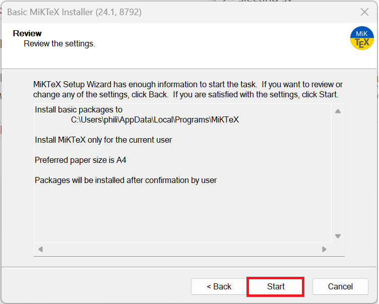

And nesting graphics:

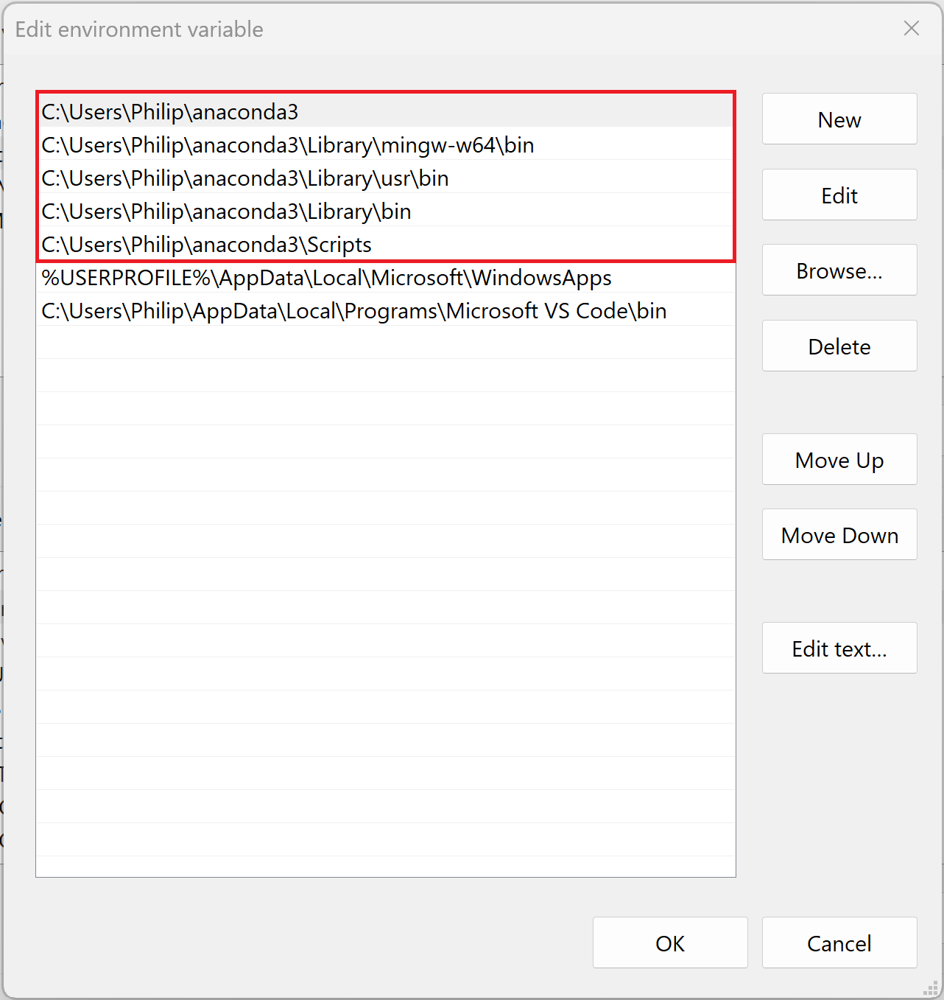

It also has a File menu which can be used to save the file as a HTML file or a pdf.

The Jupyter Notebook and Jupyter Lab are NodeJS implementations of the Console with support for interactive Python Notebook Files. JupyterLab also has a script editor for Python scripts files and a markdown editor and markdown preview for files.

When either of the commands are run the Terminal is busy running a Jupyter server, logs will display in this server:

```
PS ~> jupyter-lab
[I 2023-12-25 09:09:43.024 ServerApp] Use Control-C to stop this server and shut down all kernels (twice to skip confirmation).
[C 2023-12-25 09:09:43.060 ServerApp]

    To access the server, open this file in a browser:
        file:///C:/Users/phili/AppData/Roaming/jupyter/runtime/jpserver-13048-open.html
    Or copy and paste one of these URLs:
        http://localhost:8888/lab?token=6976ddcb2ac75fedf2b4ee684e8dc1b52011341ec7eef3a2
        http://127.0.0.1:8888/lab?token=6976ddcb2ac75fedf2b4ee684e8dc1b52011341ec7eef3a2
```

The visual elements will display in a browser:

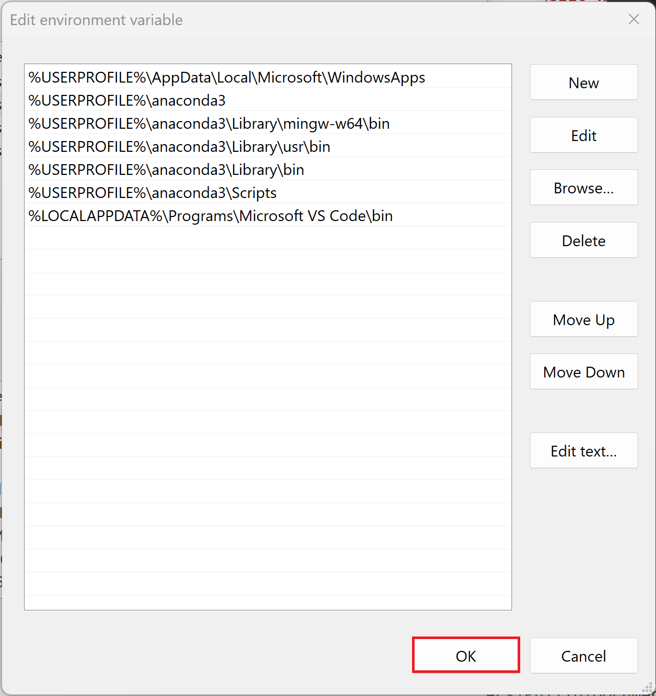

To view identifiers beginning with a prefix, input ↹ after the prefix:

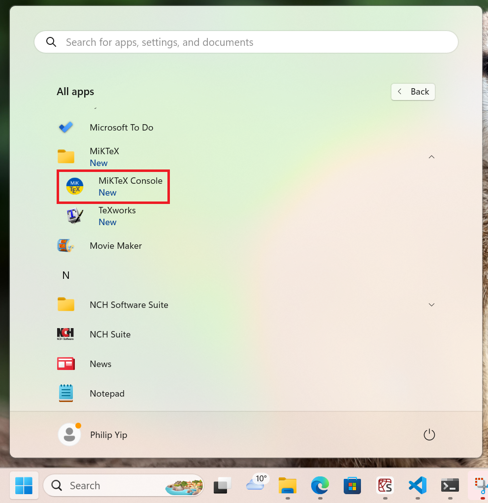

To view the docstring popup, input ⇧ + ↹:

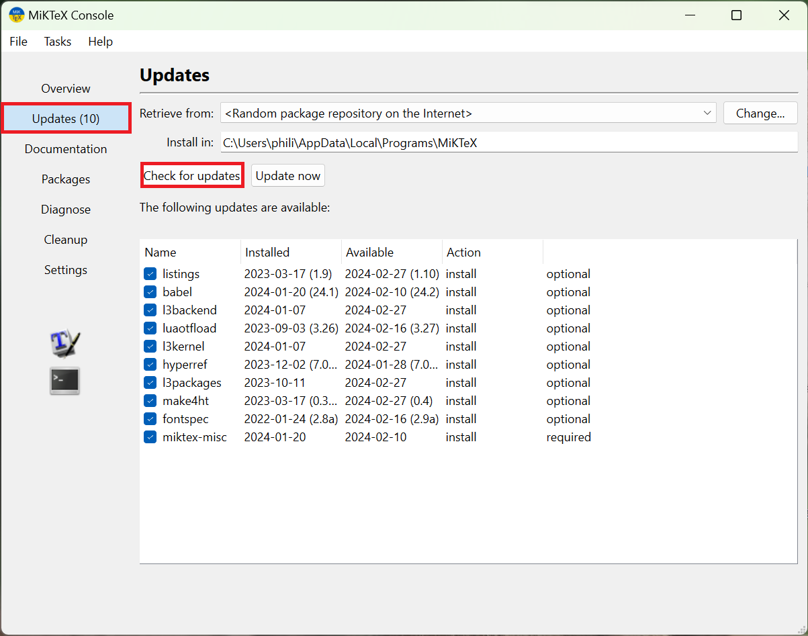

The visual elements can be closed in the browser, however the server will continue to run in the Terminal until Ctrl + c is pressed to close the current operation.

Another important binary is the Scientific Python Development Environment (spyder) which can be launched using:

```
spyder
```

The Terminal will display the following

```
PS ~> spyder
fromIccProfile: failed minimal tag size sanity
~\anaconda3\Lib\site-packages\paramiko\transport.py:219: CryptographyDeprecationWarning: Blowfish has been deprecated
  "class": algorithms.Blowfish,
```

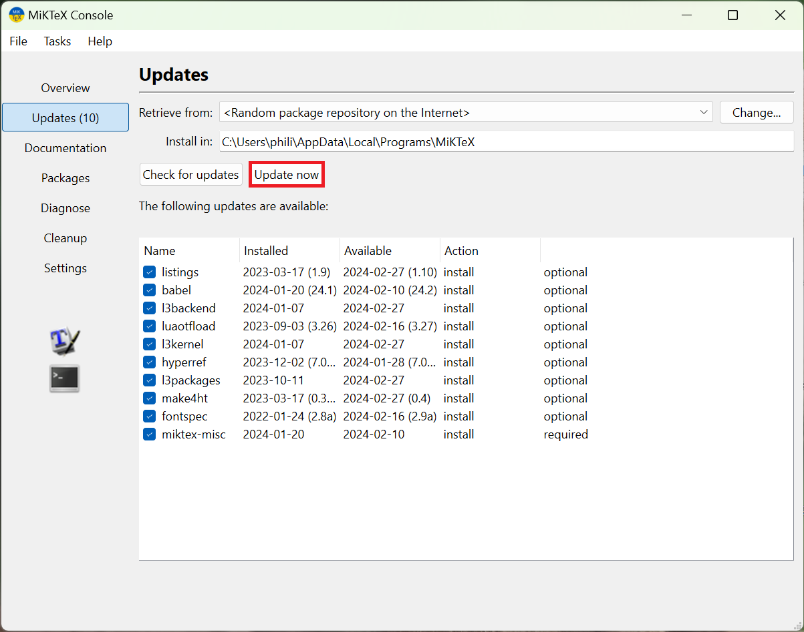

The Anaconda Navigator is a program that contains shortcuts to most of Python applications. It can be launched using:

```
anaconda-navigator
```

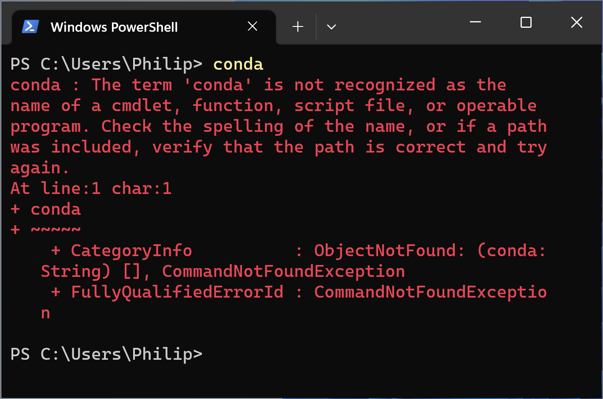

The Anaconda Navigator contains a number of shortcut to Python IDEs:

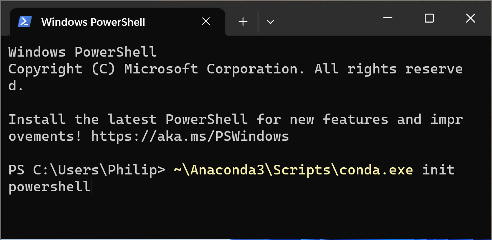

The scripts folder contains a number of Python formatters such as autopep8, isort, black, yapf and linters such as pylint and pyflakes. These can be run in the Terminal to format a Python file for example the Python script file with sloppy spacing in the code:

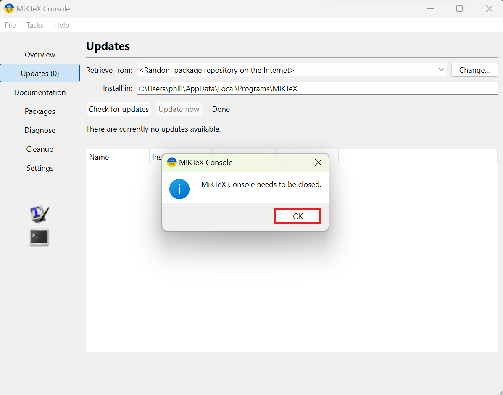

However are normally implemented in IDEs such as Spyder which has Autoformatters in the Source menu:


AutoPEP8 addresses the spacing making it PEP8 compliant. The opinionated fomratter black can also be used to make quotation consistent (but inconsistent with the default single quotations used by the Python kernel):

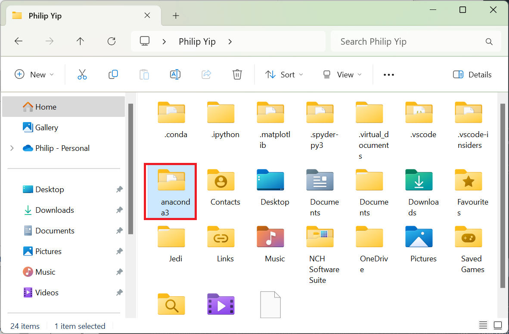

## Updating Anaconda

Open the Anaconda PowerShell Prompt or Windows Terminal. If using the Anaconda PowerShell Prompt input:

```
conda deactivate
```

This will deactivate the ```base``` Python environment:


Then update the ```conda``` package manager using:

```
conda update conda
```

For Anaconda updating the ```conda``` package manager will update the entire Anaconda Python distribution:

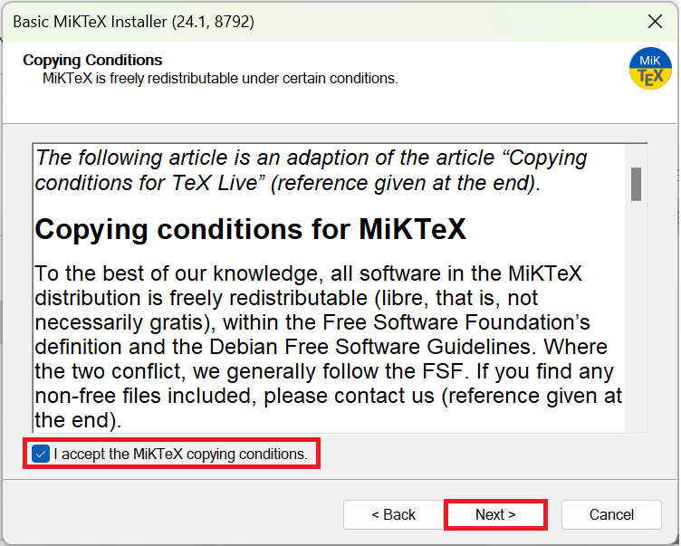

A small number of packages will be removed, a small number of packages will be added and a large number of packages will be updated. Input:

```
y
```

in order to proceed:

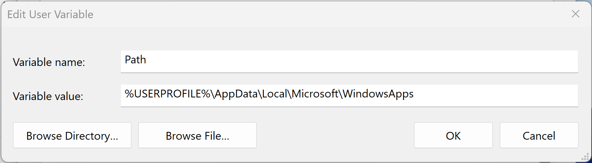

The Anaconda Navigator can be checked for an update using:

```
conda update anaconda-navigator
```

Anaconda should now be updated:

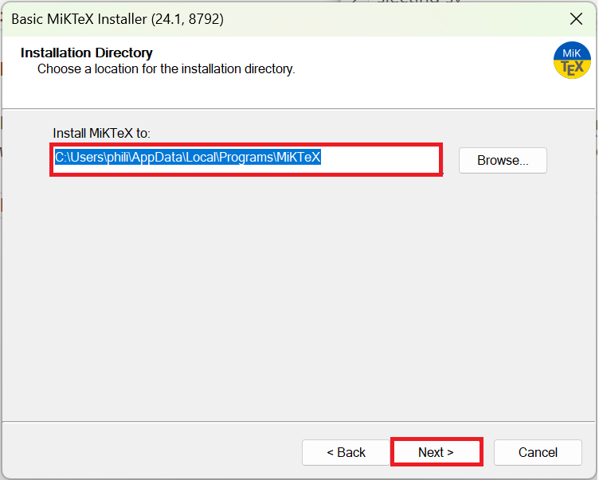

The (base) Python environment can be reactivated using:

```
conda activate base
```

## MikTeX Installation

A number of the datascience packages such as nbcovert and matplotlib can use TeX. Unfortunately the installation of TeX differs significantly for Windows and Linux and therefore the installation of TeX isn't included with Anaconda. On Windows the MikTeX distribution contains the MikTeX console which is essentially the TeX package manager. The installer for it can be found on its home page [MikTeX](https://miktex.org/). Default installation will add it to th Windows Environmental Variables path so it can be found in the base Python environment. After installation, the MikTeX console should be used to check for and install updates.

MikTeX is available as a third-party package on the community channel conda-forge. If it is installed this way in a separate Python environment, the MikTeX console from the specific Python environment should be updated.

## Python Environments

The conda package manager can be used to create Python environments for the latest version of Jupyter and Spyder from the community channel conda-forge or from the spyder developers release candidate channel. A custom Jupyter environment can also be equipped with R allowing use of the R kernel.

Use of the conda package manager is covered in more detail in the following [conda](./conda.md) tutorial.

[Return to Anaconda Tutorial](./readme.md)
