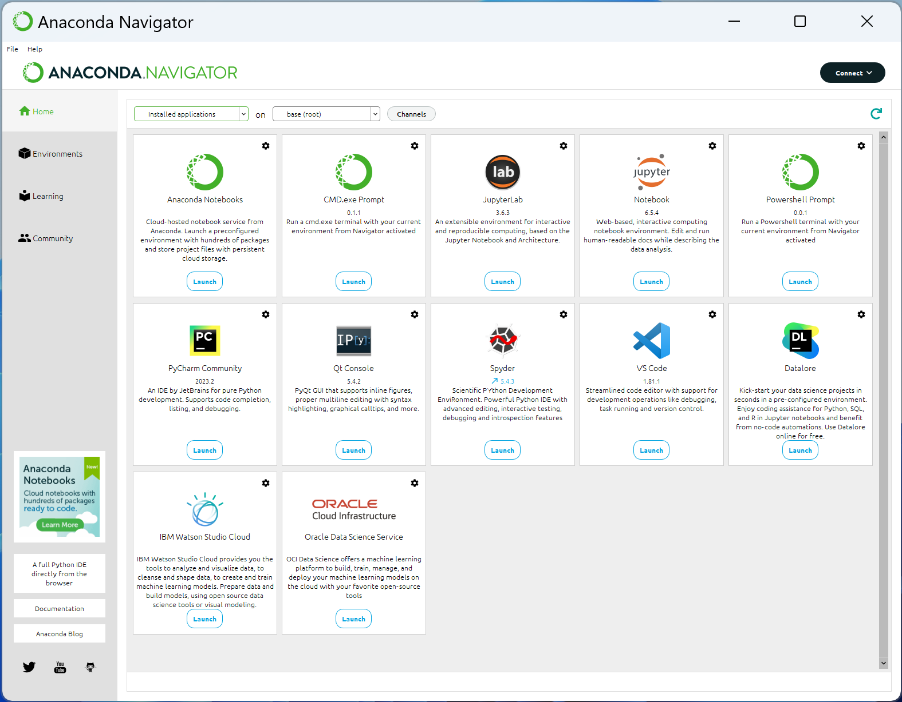
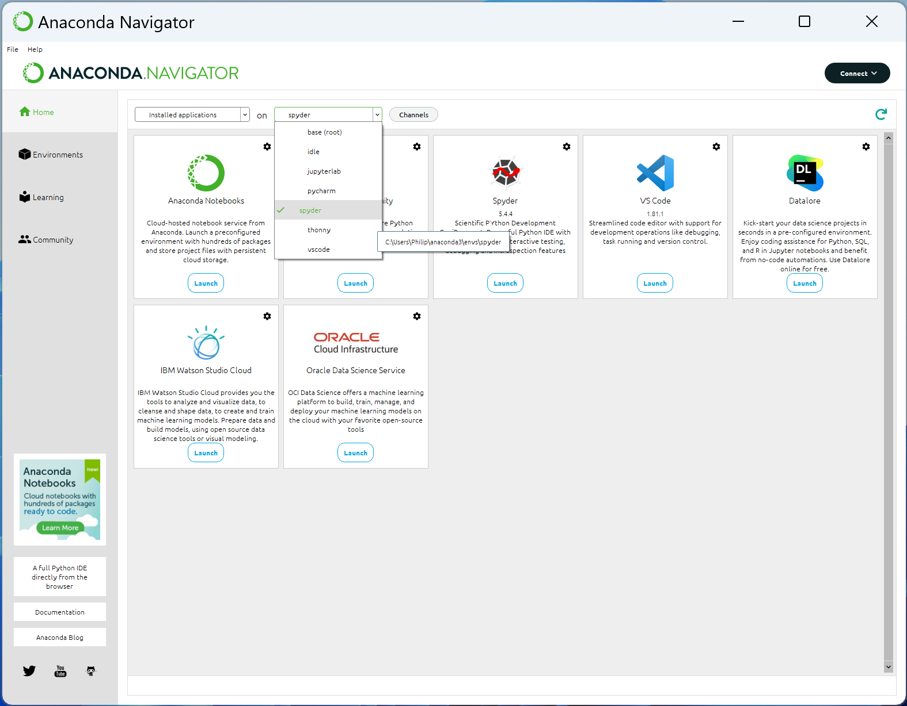
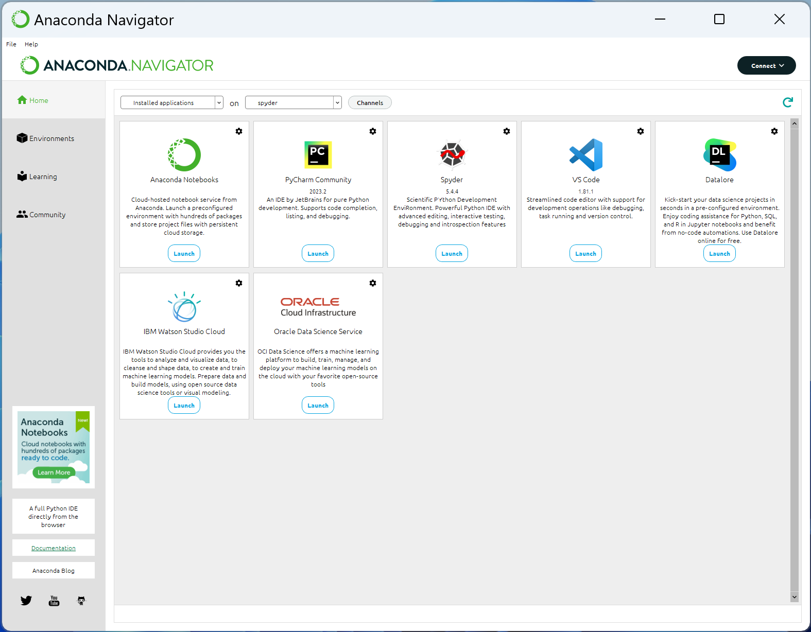
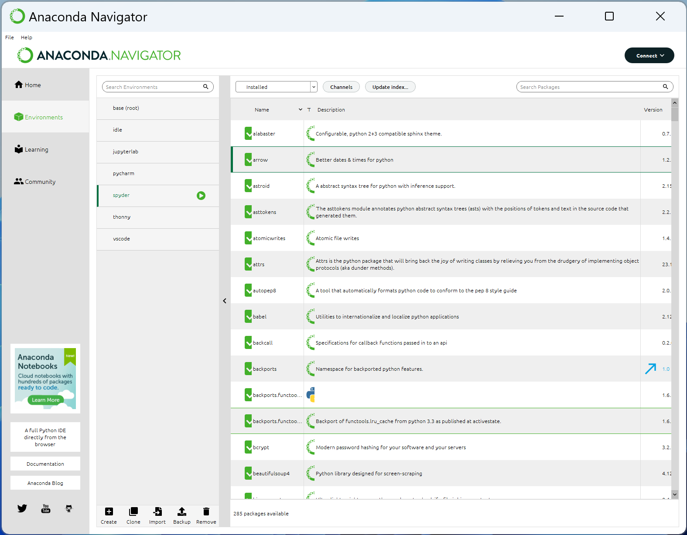
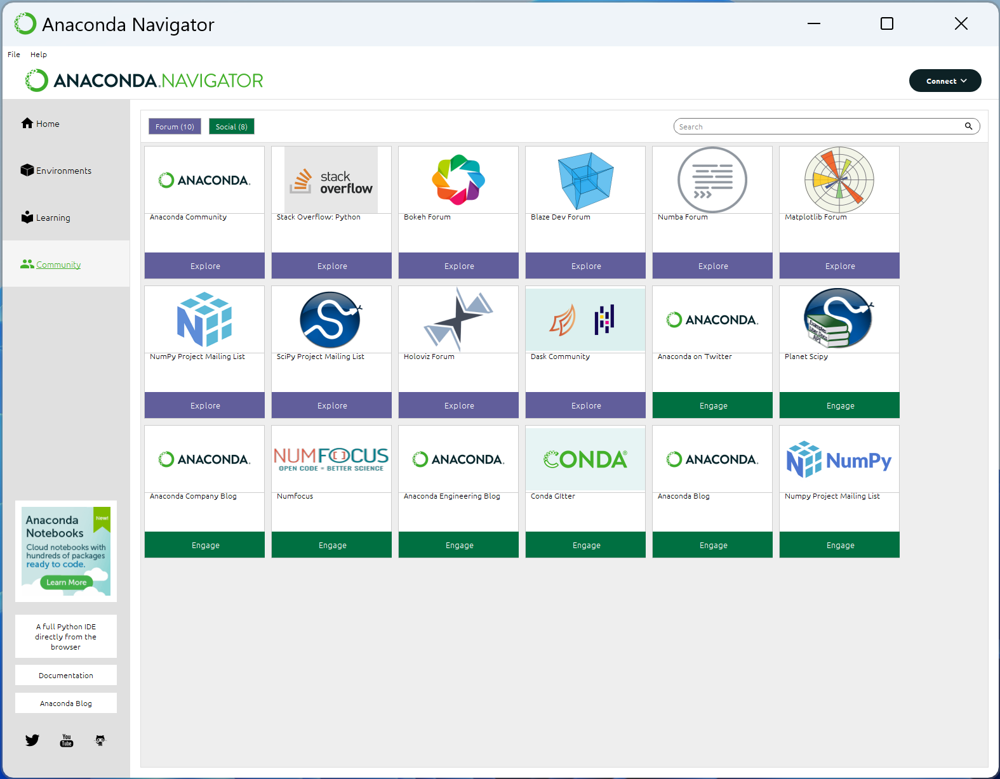

# Anaconda Navigator

The Anaconda Navigator is a GUI version of the conda package manager. It can be opened using the Start Menu Shortcut.

By default it will display the installed applicaitons on (base) and the tiles can be used to launch these other applicaitons:

If other Python environemnts are created these can be selected:

This will allow launching of the IDEs from these Python environments:

The Environments tab is a GUI alternative to managing the Python environments, essentially a GUI version of conda list. In general using the command line conda package manager in the Anaconda PowerShell Prompt is more reliable and some of the GUI elements in my case do not display properly:

The learning tab brings you to the official documentation for Python, the commonly used data science libraries numpy, pandas, matplolib and the IDEs Spyder, JupyterLab, VSCode and PyCharm:

the Community tab takes you to the projects forums although many of these are obsolete and have since moved to GitHub:

[Return to Anaconda Tutorial](./readme.md)