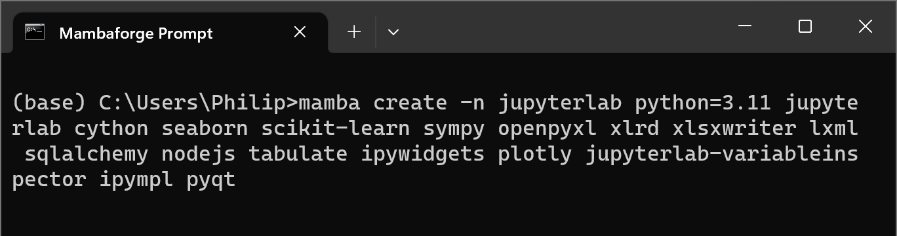

# JupyterLab

Jupyter is an acronym for three popular programming languages particularly in the field of data science:

**Ju**pyter: Julia

Ju**py**ter: Python

Jupyte**r**: R

Despite the name it is most commonly used with Python and is essentially a browser implementation of ipython. When JupyterLab is ran in the Mambaforge prompt a local server is created that runs a browser based:

* file explorer
* terminal
* ipython terminal
* text file editor
* markdown file editor
* python file editor
* interactive python notebook file

## Creating a Python Environment

A Python environment for JupyterLab can be created using:

```
mamba create -n jupyterlab python=3.11 jupyterlab cython seaborn scikit-learn sympy openpyxl xlrd xlsxwriter lxml sqlalchemy nodejs tabulate ipywidgets plotly jupyterlab-variableinspector ipympl pyqt
```


