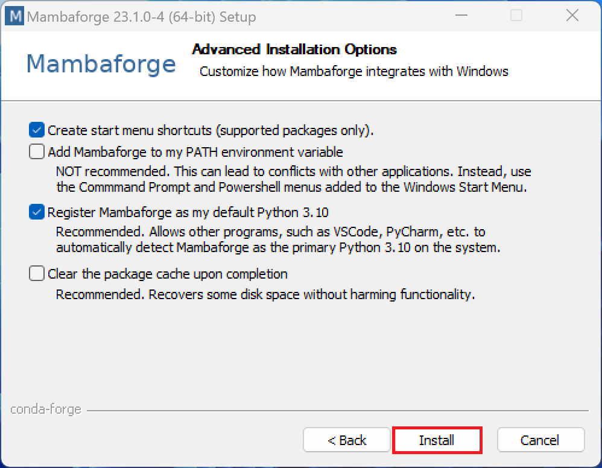
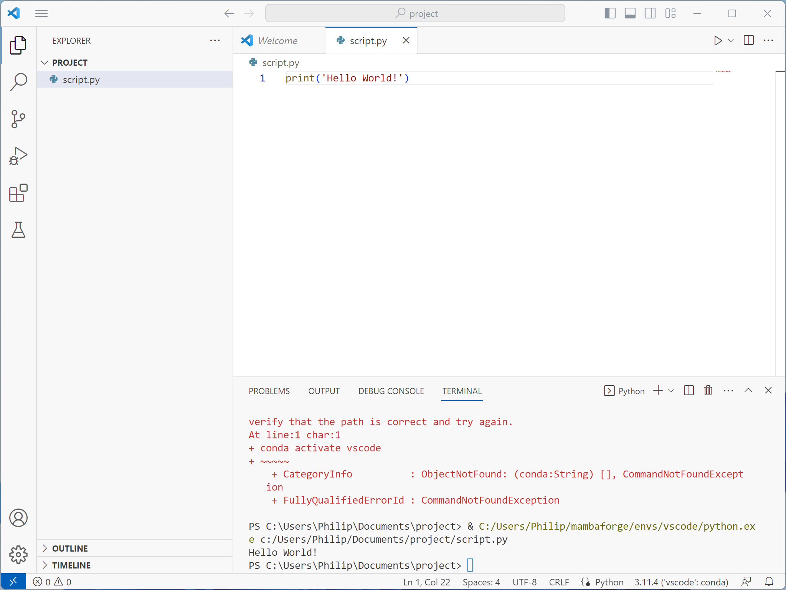
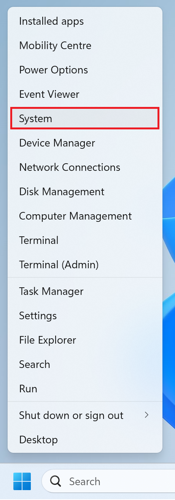
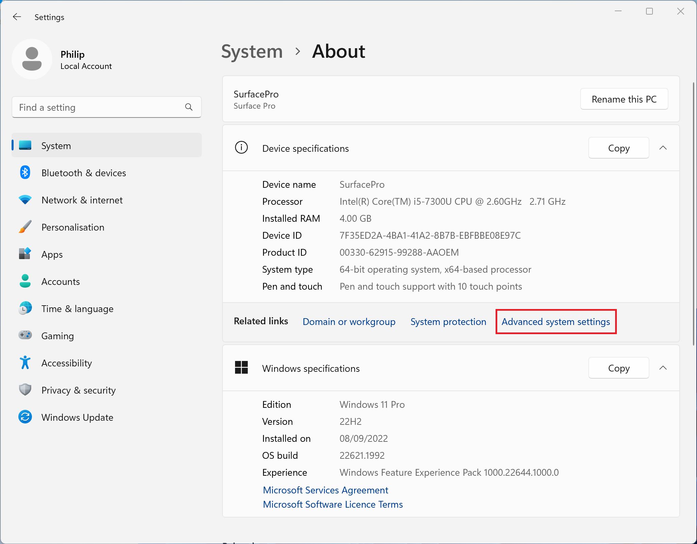
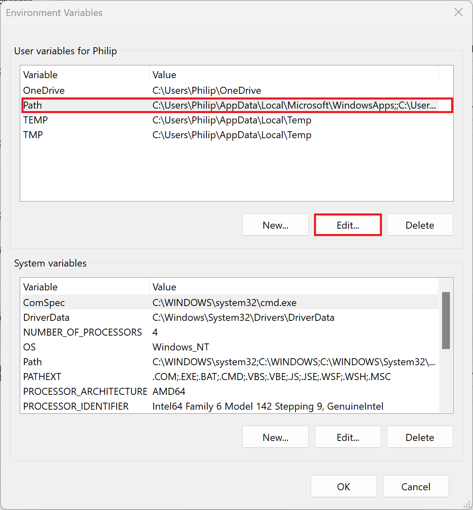
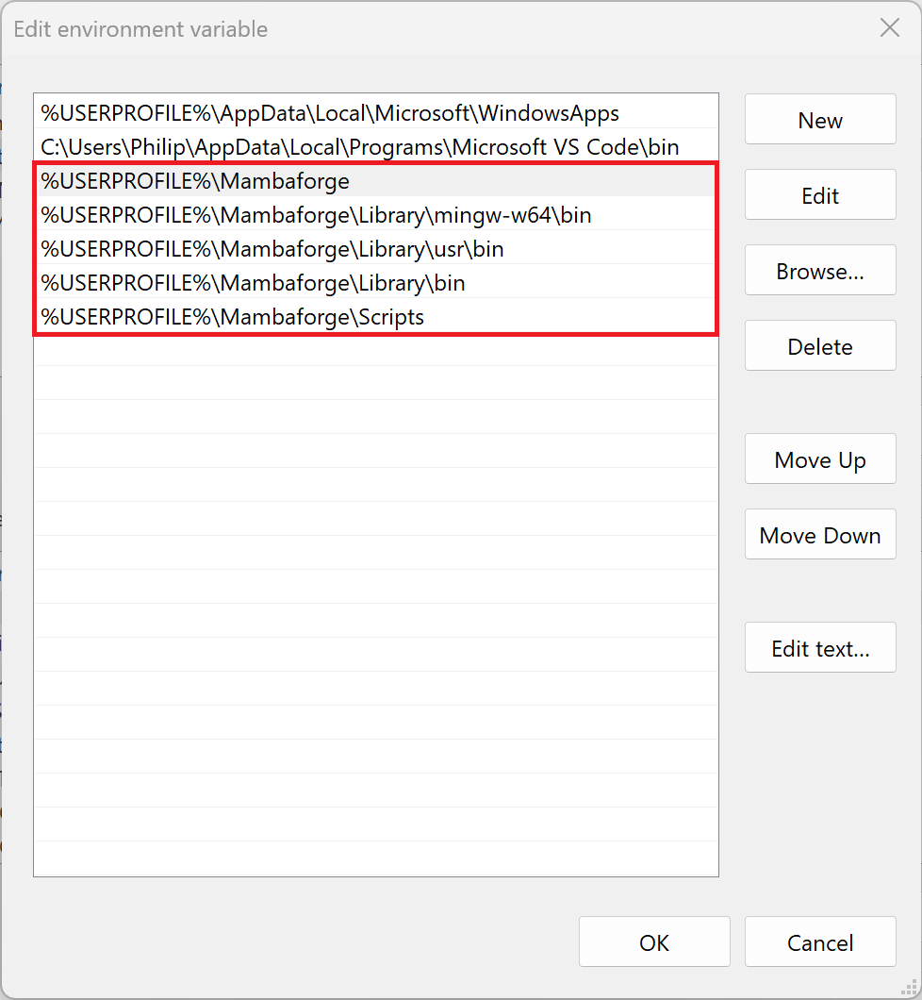
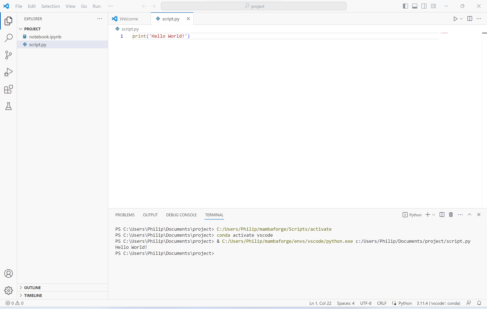

# Windows Environmental Variable Path

During installation of Mambaforge or Anaconda you will be asked whether or not you want to add the Python (base) environment to the Windows Environmental Variables path. 

The Windows Environmental Variables Path is the Python installation accessed by the Windows Terminal.

Adding to the path is not recommended as it can cause conflicts when multiple Python distributions are installed:



However some IDEs like Visual Studio Code that use the Windows Terminal will display an error message such as:

```
conda : The term 'conda' is not recognized as the name of a cmdlet, function, script 
file, or operable program. Check the spelling of the name, or if a path was included, 
verify that the path is correct and try again.
At line:1 char:1
+ conda activate vscode
+ ~~~~~
    + CategoryInfo          : ObjectNotFound: (conda:String) [], CommandNotFoundExceptio 
   n
    + FullyQualifiedErrorId : CommandNotFoundException
```



## Modifying the Windows Environmental Variable Path

Right click the start button and select System:



Select Environmental Variables:


Then Advanced System Settings:



Then select the Path and select Edit:



Add the five entries if they are not present:

```
%USERPROFILE%\Mambaforge
%USERPROFILE%\Mambaforge\Library\mingw-w64\bin
%USERPROFILE%\Mambaforge\Libraryusr\bin
%USERPROFILE%\Mambaforge\Library\bin
%USERPROFILE%\Mambaforge\Scripts
```



Select OK. Any Terminals or IDEs will need to be closed and reopened to use the updated path. Notice that there is no error in VSCode:



[Return to Mambaforge Installation](./readme.md)