# Uninstall

## Anaconda Based Installers

Mambaforge is an Anaconda based installer. Other Anaconda based installers include:

|Distribution|base|default channel|
|---|---|---|
|Anaconda|python conda numpy pandas matplotlib seaborn jupyterlab spyder|conda|
|Miniconda|python conda|conda|
|Miniforge|python conda|conda-forge|
|Mambaforge|python mamba|conda-forge|

Where ```conda``` is the channel maintained by the Anaconda company and ```conda-forge``` is the community channel. The community conda-forge channel is larger and more up to date than the Anaconda conda channel.

Having multiple Anaconda based installers on your machine can result in conflicts as configuration files may alter some default properties such as the default channel. Moreover these files are typically left behind after an uninstall and not overwritten after a reinstall.

When Anaconda and Mambaforge are installed for a User (default), the installation files are in:

```
%USERPROFILE%
```

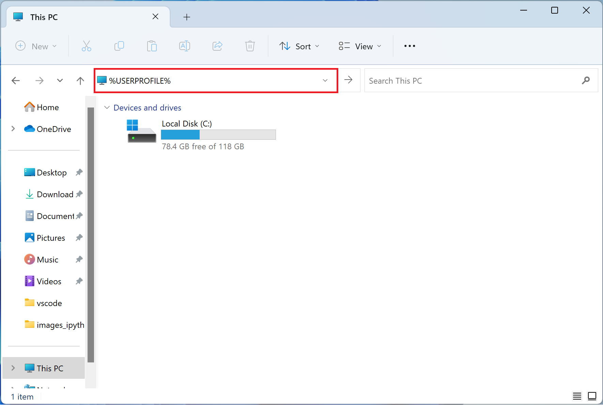

Notice that the Anaconda installation has added a ```.condarc``` file:

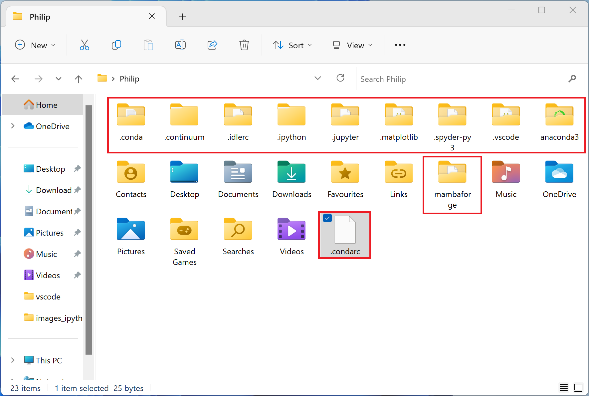

This sets the channel to defaults which is ```conda```. Having this file will make the mamba package manager use the ```conda``` channel opposed to the ```conda-forge``` channel resulting in unstable python environments that have mixed channels:

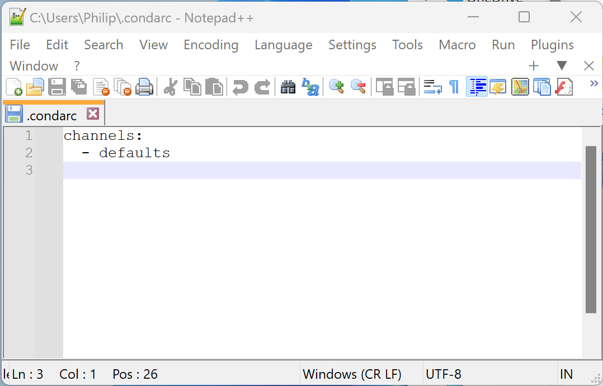

The .condarc file created by the Anaconda installer which uses ```conda``` channel by default:

```
channels:
  - defaults
```

A .condarc file modified to use the ```conda-forge``` channel:

```
channel_priority: strict
channels:
  - conda-forge
  - defaults
```

## Uninstall

To Uninstall, right click the Start Button and select Installed Apps:

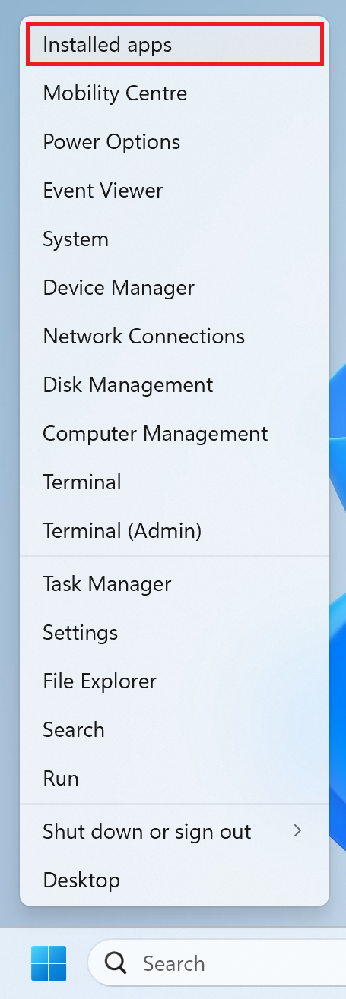

Uninstall Anaconda, Miniconda, Miniforge or Mambaconda if present. Also uninstall Python if present. You may also want to uninstall any standalone Python IDEs.

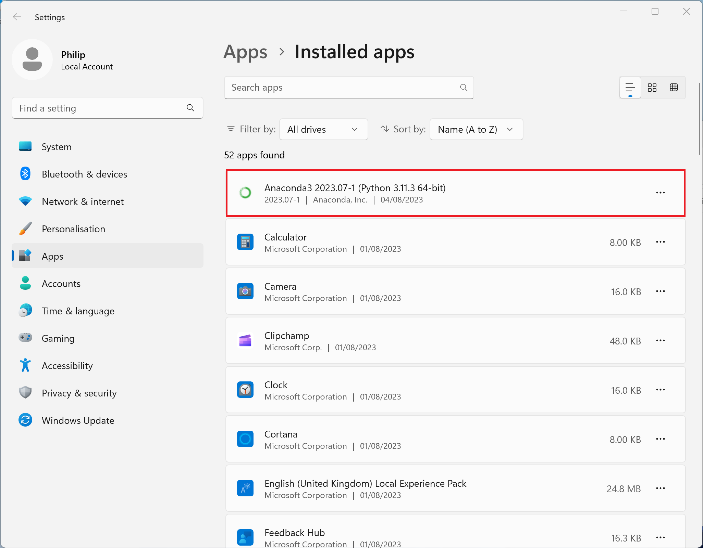

To uninstall Mambaforge double click on Mambaforge:


Select next:

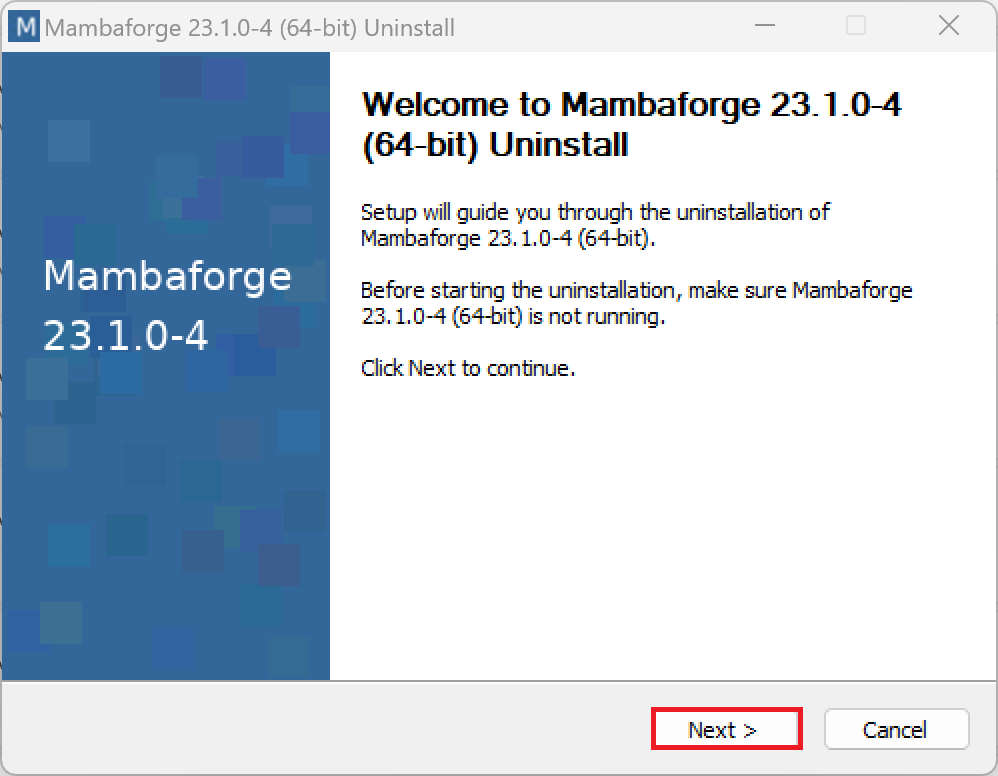

Select yes:

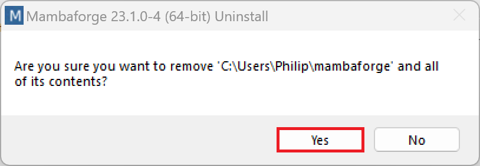

Select next:

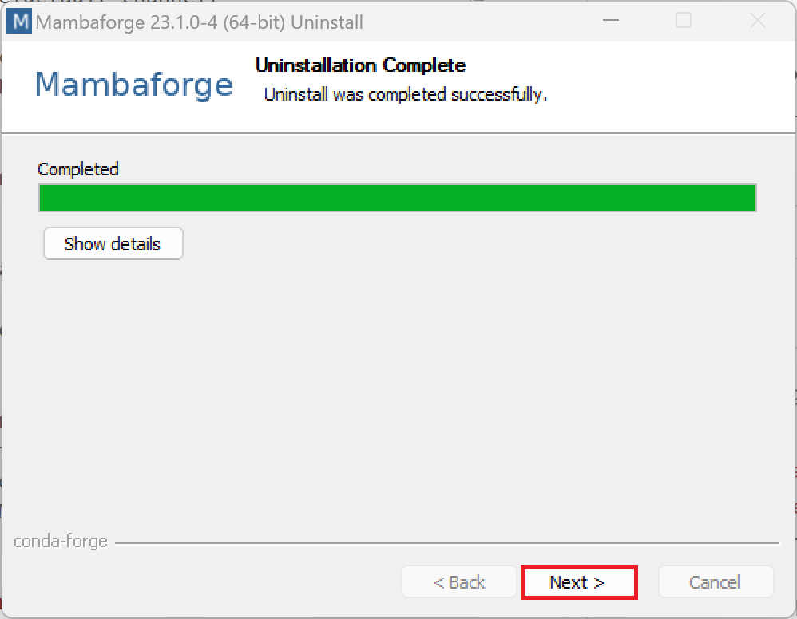

Select Finish:

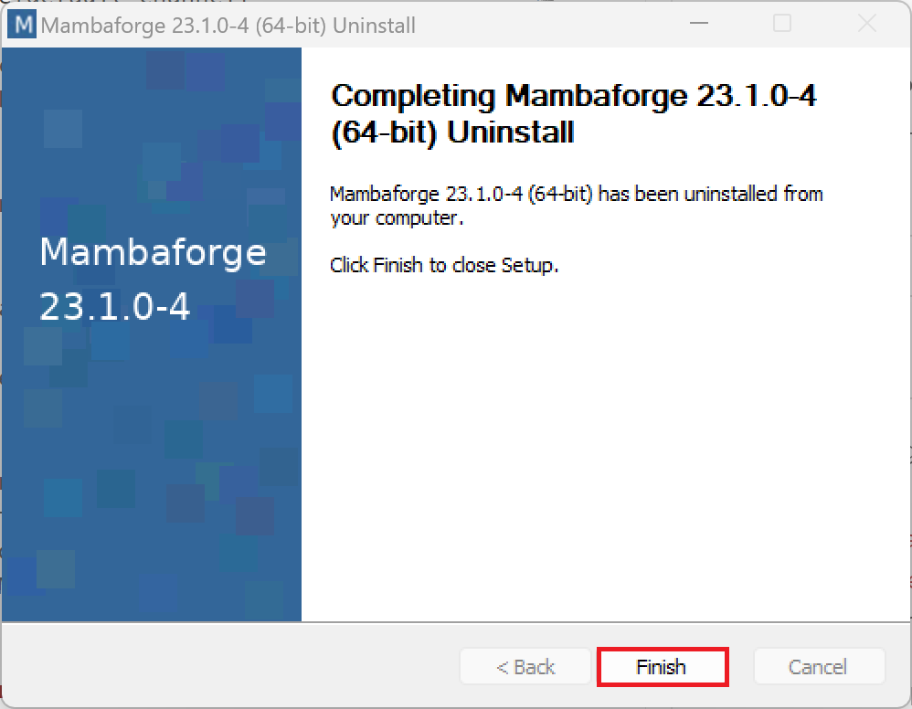

## Windows Environmental Variables Path

Right click the Start button and select System:

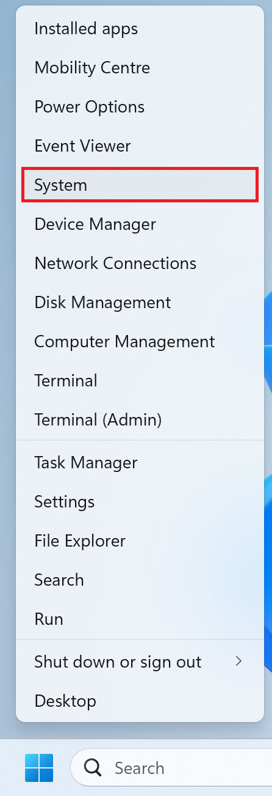

Select Advanced system Settings:

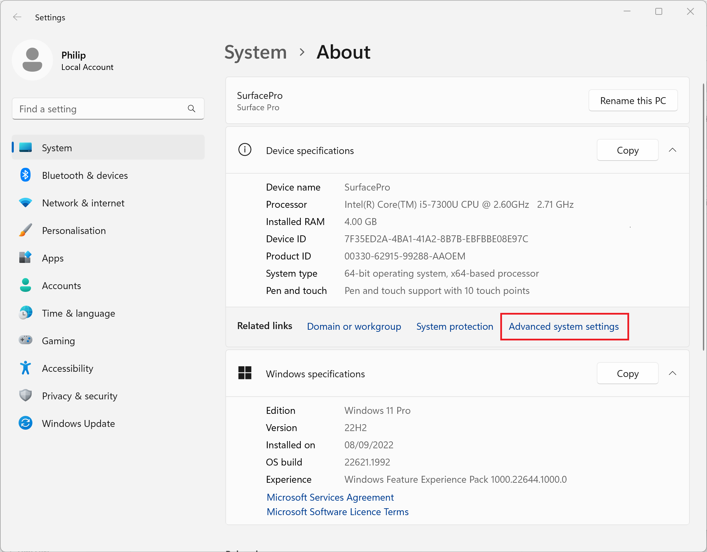

Select Environmental Variables:

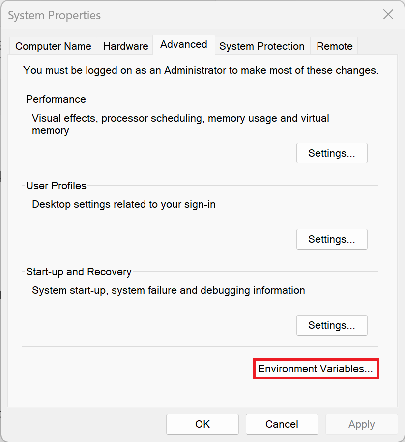

Then select Path:

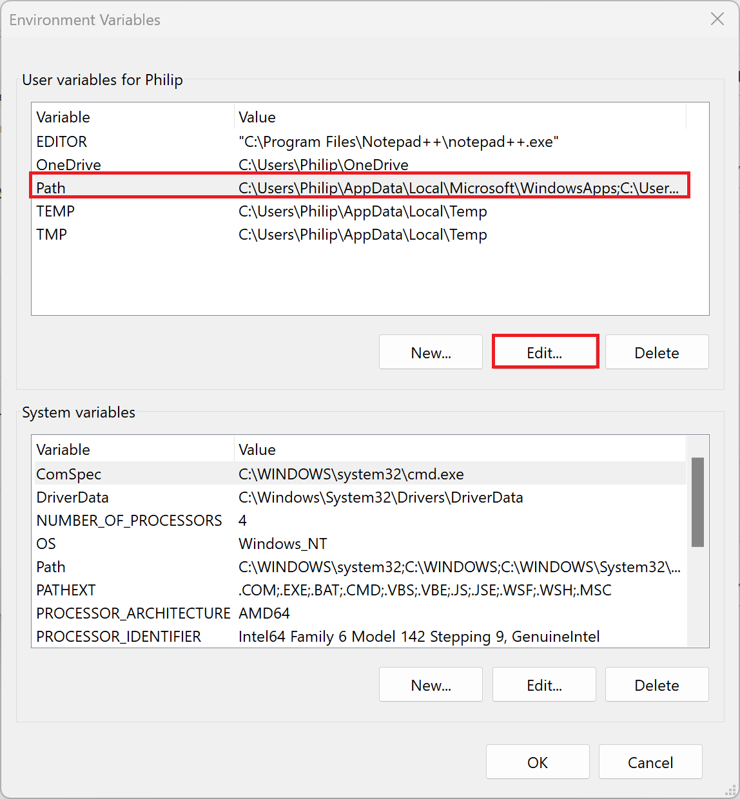

Remove any entries that contain Anaconda, Miniconda, Miniforge, Mambaforge or Python:

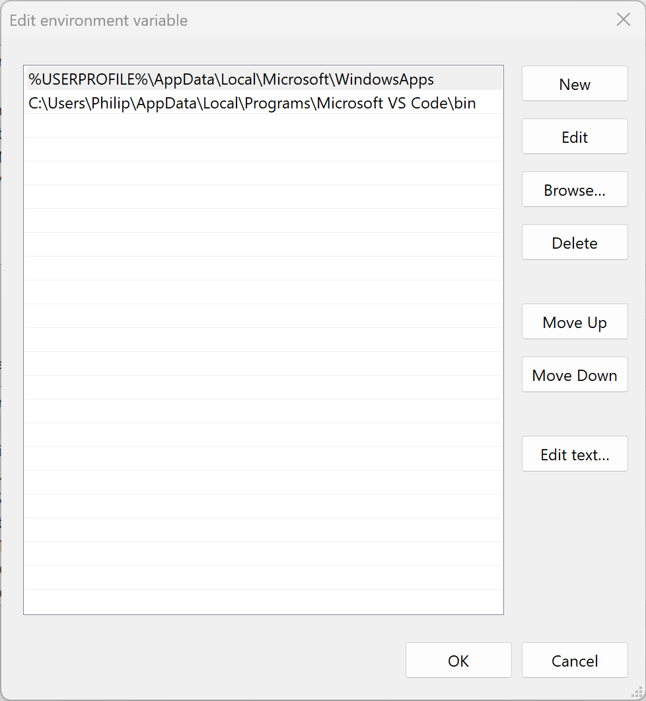

## Purging Configuration Files

The default locations for Anaconda installers are in ```%USERPROFILE%``` if installed as a single user (default) or ```%PROGRAMDATA%``` if installed for all users.

Open up File Explorer. In the addressbar type in:

```
%USERPROFILE%
```

```
%PROGRAMDATA%
```


In either location delete the folders:

* .conda
* .continuum
* .idlerc
* .ipython
* .jupyter
* .matplotlib
* .spyder-py3
* .vscode
* anaconda3
* miniconda3
* miniforge
* mambaforge

And the file:

* .condarc

Open up File Explorer. In the addressbar type in:

```
%APPDATA%
```

Delete the folders:

* .anaconda
* Code
* jupyter
* Thonny

Open up File Explorer. In the addressbar type in:

```
%LOCALAPPDATA%
```

Delete the folders:

* conda
* Jedi
* pip
* scikit-image
* Spyder
* thonny

Delete any left over shortcuts from the two locations:

```
%APPDATA%\Microsoft\Windows\Start Menu\Programs
```

```
%PROGRAMDATA%\Microsoft\Windows\Start Menu\Programs
```

[Return to Mambaforge Installation](./readme.md)