# Managing Python Environments

The main purpose of Miniconda is to create and maintain a Python Environment. 

## base Python Environment

[Miniconda Installation](./Miniconda.md) covered installation of Miniconda and the creation of a .condarc configuration file to select conda-forge as the default channel with a strict channel priority and the libconda solver. This also covered the concept of the (base) Python environment.

The location of the (base) Python environment is in:

```
%UserProfile%/Miniconda
```

While it is possible to install packages in the (base) Python environment, it is not recommended to do so. For best performance this Python environment should be kept as basic as possible being used mainly by the package manager.

It is recommended to instead create a seperate Python, in essence a subinstallation of Python for each IDE and for advanced users for each project.

In the (base) Python environment is an envs subfolder:

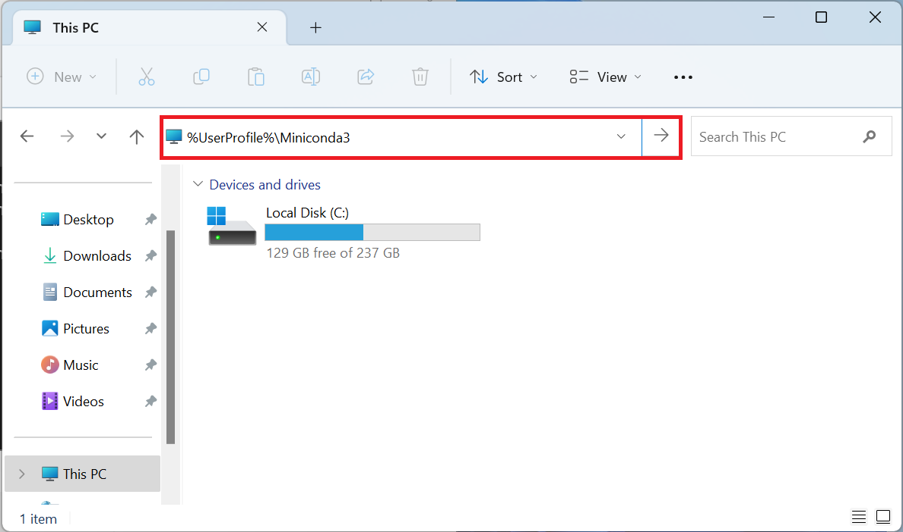

This is empty by default:

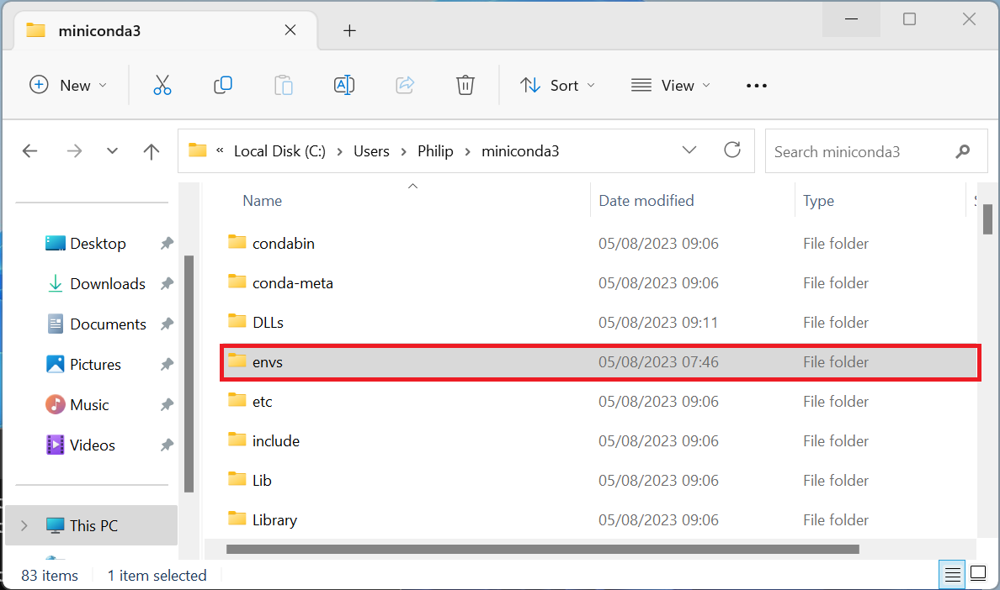

## conda Package Manager Overview

An overview of the conda package manager can be seen by inputting:

```
conda
```

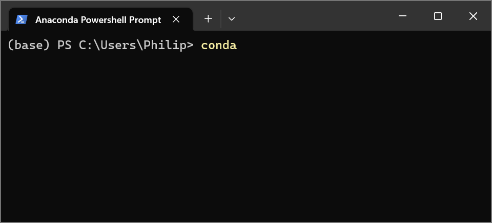

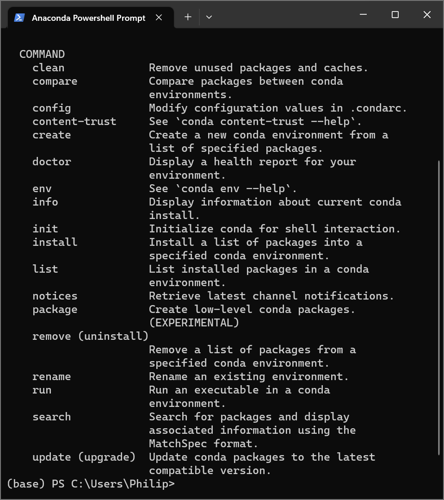

A Python environment can be created using the syntax:

```
conda create -n ENVNAME
```

where ENVNAME is a placeholder for the environment name which is in lower case.

Once the Python environment is created it can be activated using:

```
conda activate ENVNAME
```

Packages can be listed in the Python environment using:

```
conda list
```

The conda-forge community channel can be searched for a package using:

```
conda search PACKAGENAME1
```

Packages can be installed using:

```
conda install PACKAGENAME1 PACKAGENAME2 ...
```

A package can be removed using:

```
conda remove PACKAGENAME1 PACKAGENAME2 ...
```

Version numbers can be specified:

```
conda install PACKAGENAME1=X.Y.Z
```

Where X is the major number, Y is the minor version number and Z is the patch number.

A package can be updated using:

```
conda update PACKAGENAME
```

All packages can be updated using:

```
conda update --all
```

A backup of all previously downloaded versions is available which can occupy a large amount of disk space. These can be cleaned using:

```
conda clean --all
```

The create and install commands can be combined using:

```
conda create -n ENVNAME PACKAGENAME1 PACKAGENAME2 ...
```

To list Python environments use:

```
conda env list
conda env list
```

This includes exporting the Environment to a yml file: 

```
conda env export > Documents\ENVNAME.yml
```

A Python environment can be created from this yml file using:

```
conda env create -n ENVNAME -f environment.yml
```

A Python environment can be removed using:

```
conda env remove -n ENVNAME 
```

## Example Python Environment

The following Python Environment can be created for the VSCode IDE.

```
conda create -n vscode python=3.11 notebook cython seaborn scikit-learn sympy openpyxl xlrd xlsxwriter lxml sqlalchemy tabulate nodejs ipywidgets plotly ipympl pyqt
```

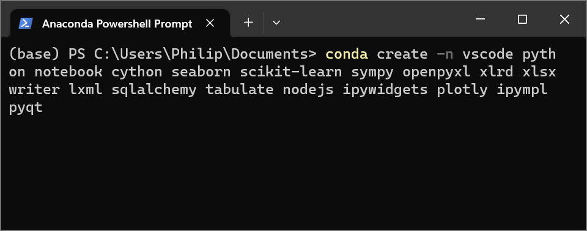

In this case:

ENVNAME is vscode

The packages to be installed are:

python

notebook, nodejs and ipywidgets are used for interactive Python notebooks. plotly is an interactive plotting library which is commonly used with interactive Python notebooks.

Installing the data visualisation library seaborn will also install the numeric Python library numpy, the Python data and analysis library pandas and the math plotting library matplotlib. sci-kit learn is a popular entry machine learning library.

openpyxl, xlrd, xlsxwriter, lxml, sqlalchemy and tabulate are prequisite libraries for reading and exporting data using pandas. pyqt and ipympl are used for the pyqt or ipympl backends of matplotlib plots.

The conda package manager will search for all of these packages and their dependencies. Input ```y``` in order to proceed:

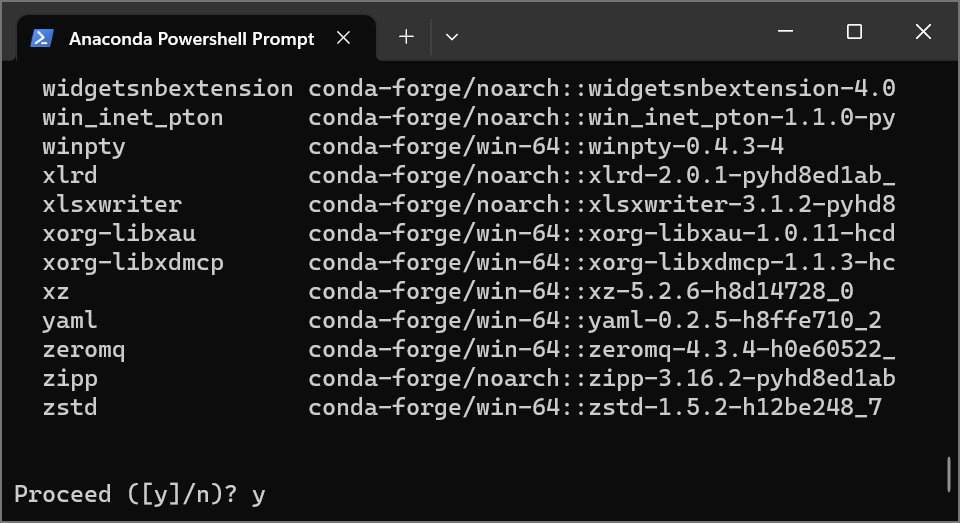

The packages will be downloaded and installed:

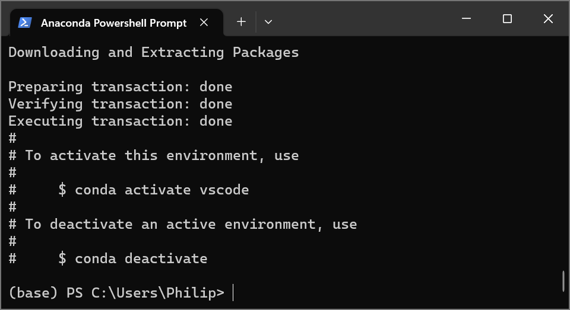

In Windows Explorer, there is now a vscode folder in the envs subfolder:

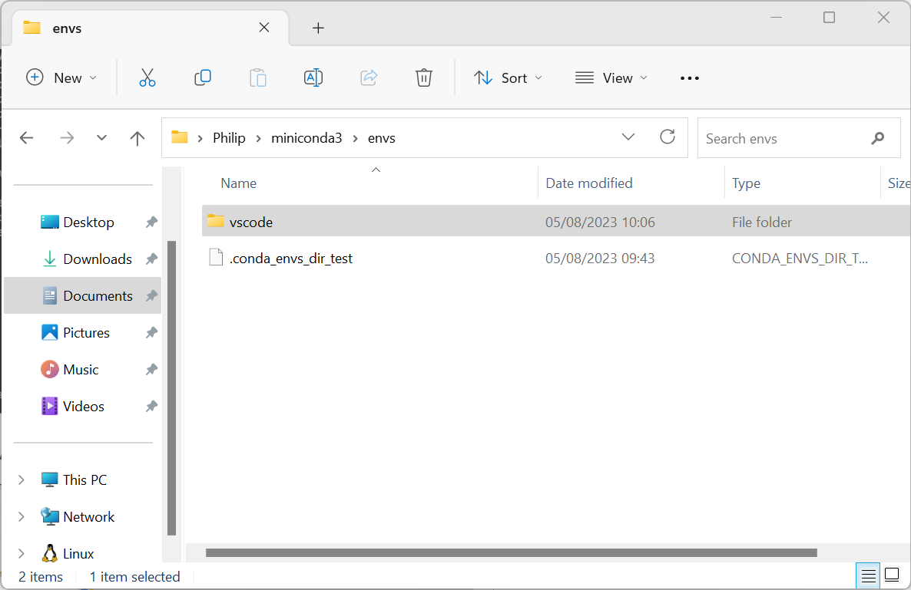

Notice it has its own python.exe:

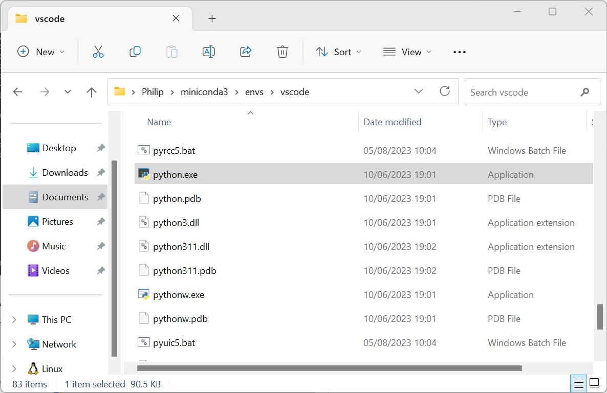

Lib subfolder:

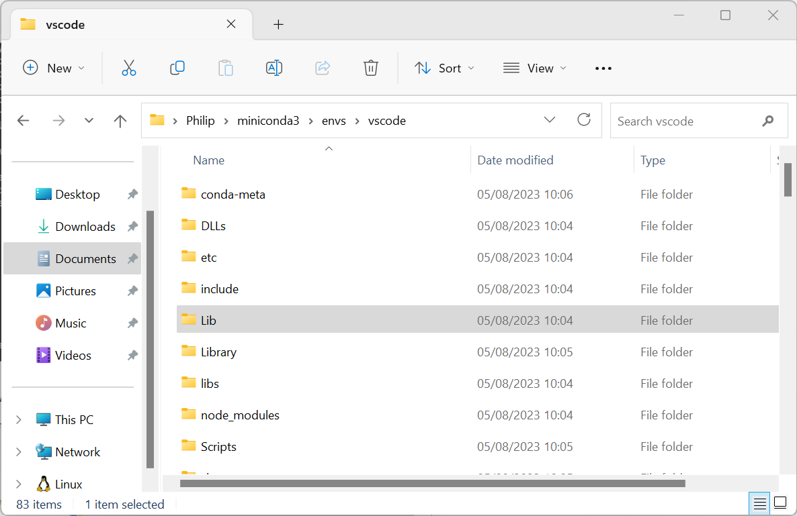

## Activating Python Environments

To select the Python environment, it needs to be activated:

```
conda activate vscode
```


Notice the (base) changes to (vscode) indicating a different Python environment is selected. **Pay attention to this as it indicates what Python environment is activated and is being changed**.

python can be launched from the Python environment using:

```
python
```

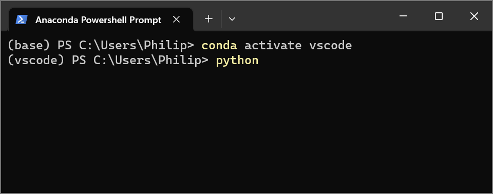

```
import email
email.__file__
import datetime
datetime.__file__
import numpy as np
np.__file__
import matplotlib.pyplot as plt
plt.__file__
```

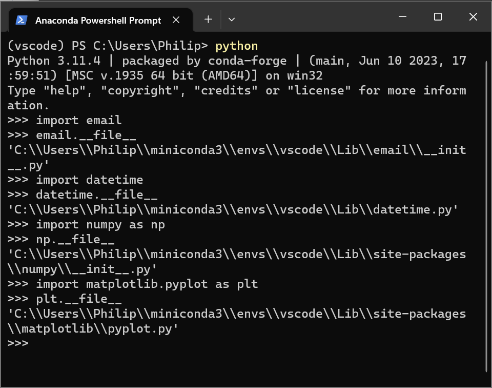

When a new instance of the Miniconda Prompt is opened the base Python environment is selected by default and this can be seen by checking:

```
import email
email.__file__
import datetime
datetime.__file__
```

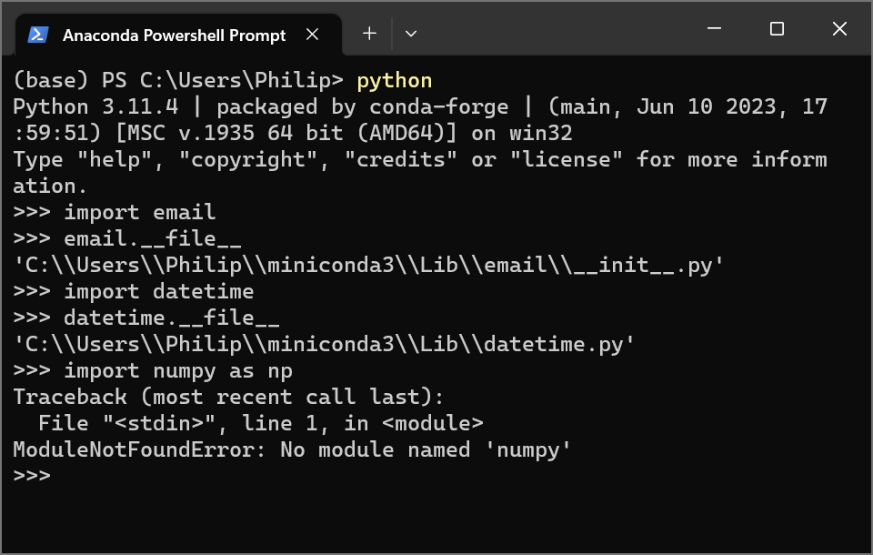

there is a ModuleNotFoundError because there is no numpy folder in the (base) Python environment.

In other words packages are being searched for in:

```
%USERPROFILE%/Miniconda/Lib
```

And not:

```
%USERPROFILE%/Miniconda/envs/vscode/Lib
```

Recall that this can be changed using:

```
conda activate vscode
```

And this Python environment can be updated using:

```
conda update --all
```

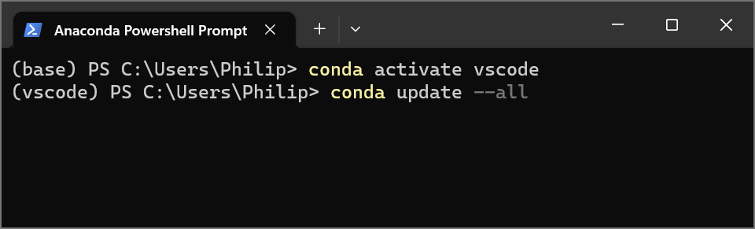

Input ```y``` to proceed if there are updates:

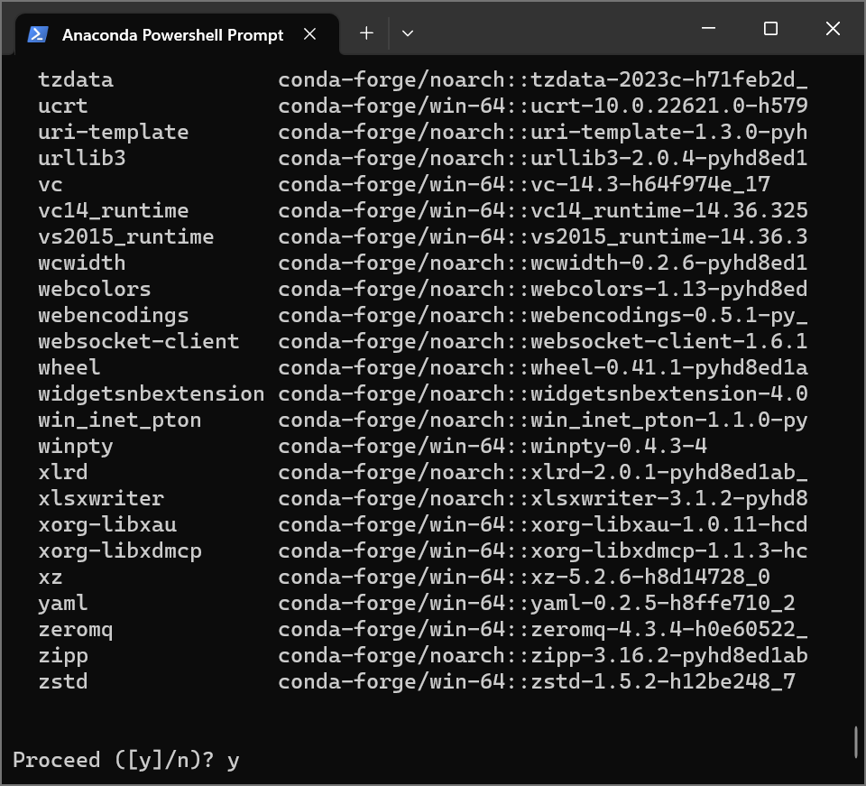

## Exporting Python Environments

This Python environment can be exported to a file in Documents:

```
conda env export -n vscode > Documents\vscode.yml
```

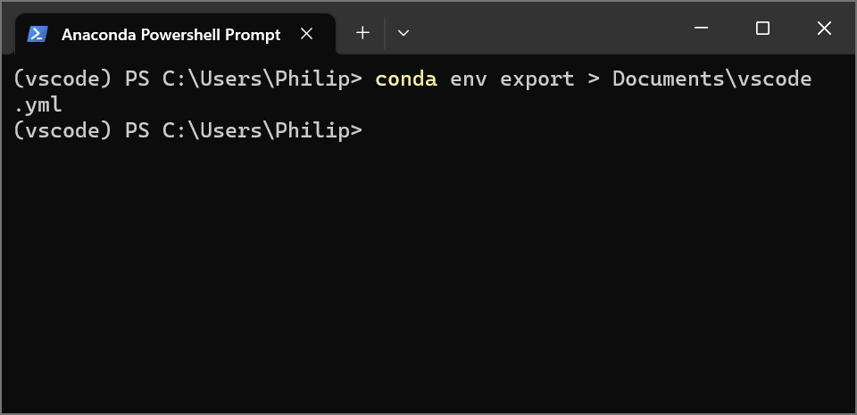

Once exported a new prompt displays and the yml file can be viewed in File Explorer:

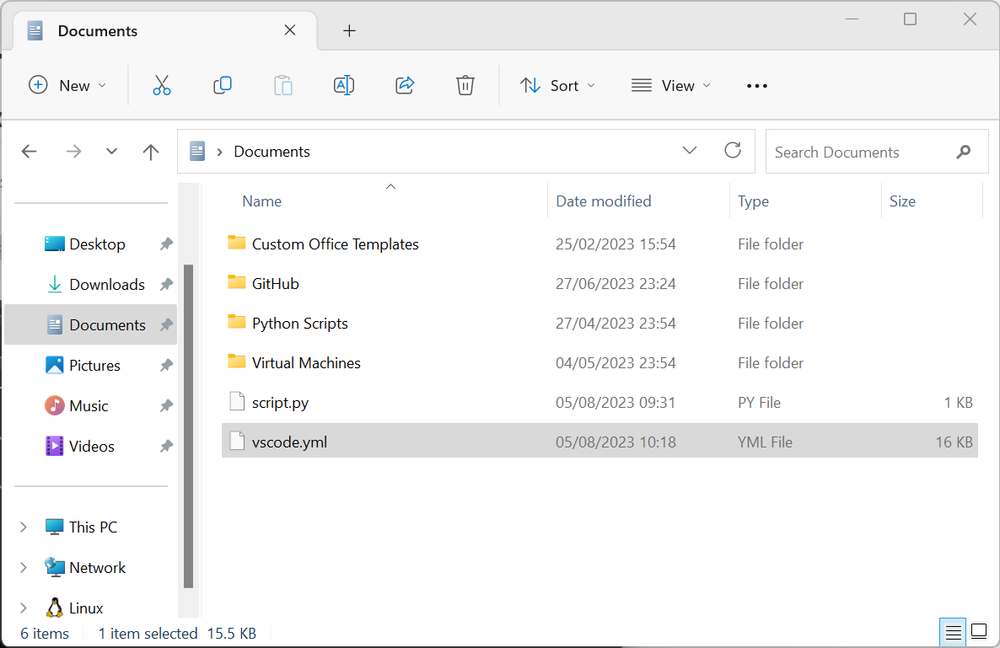

And opened in Notepad:


## Deleting a Python Environment

The vscode Python environment can be removed using:

```
conda env remove -n vscode
```

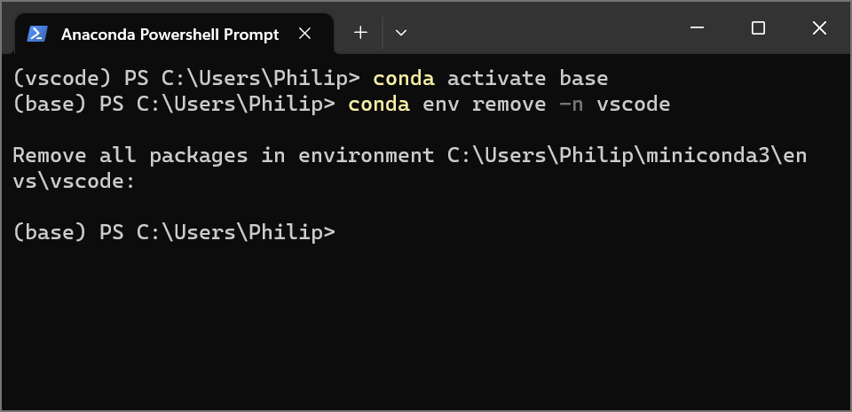

This effectively deleted the folder in envs.

## Creating a Python Environment from a File

It can be recreated from the yml file using:

```
conda env create -n vscode -f Documents\vscode.yml
```

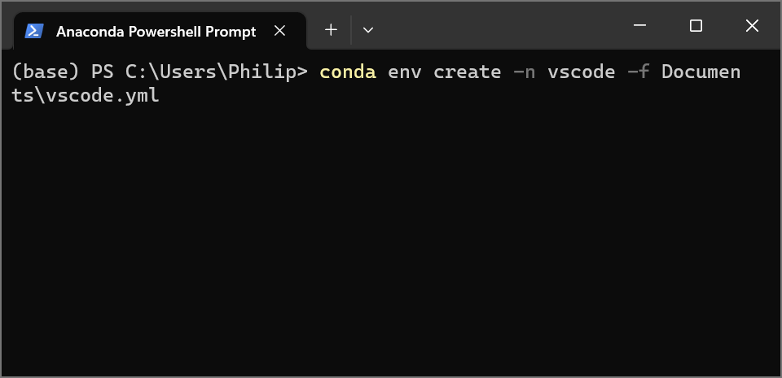

This will download all the specified packages and their versions from the vscode.yml file creating a new Python environment:


## Cleaning

To remove old versions of downloaded packages and free up some disk space use:

```
conda clean --all
```


Select y to proceed with removing the old tarballs and other packages:

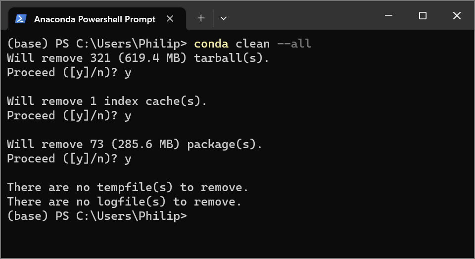

To continue setting up VSCode see:

[VSCode Setup](./vscode.md)

Otherwise for other IDEs:

[Return to Miniconda Installation](./readme.md)
