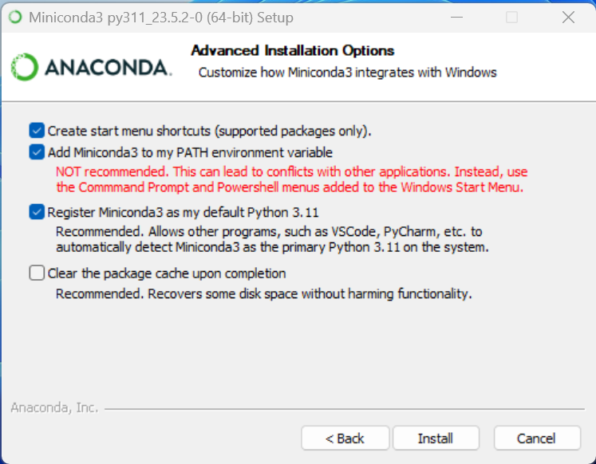
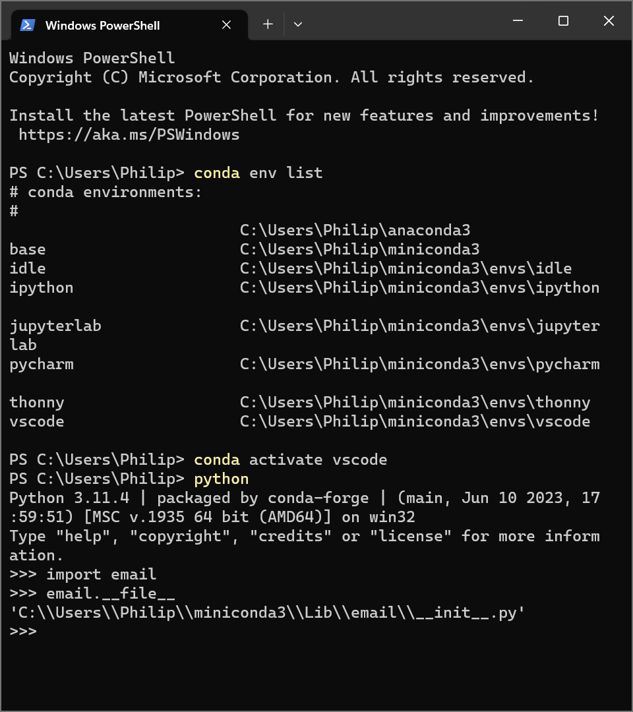
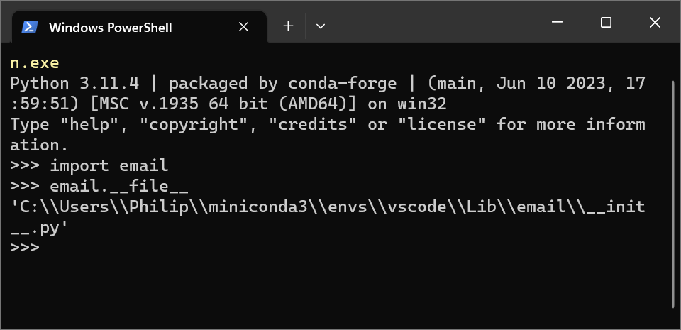
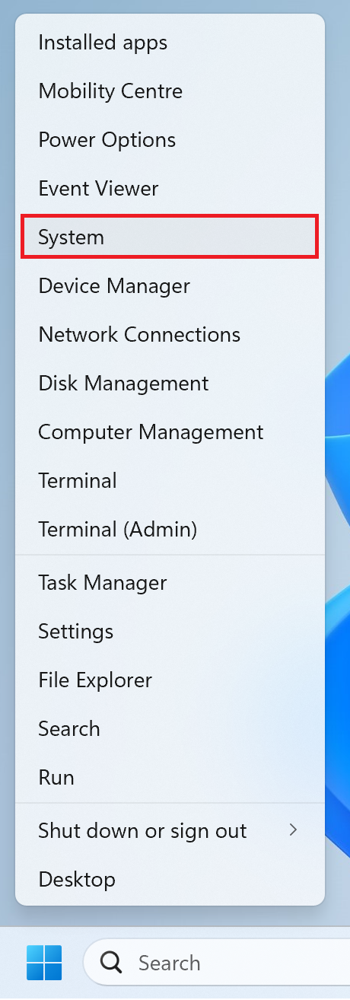
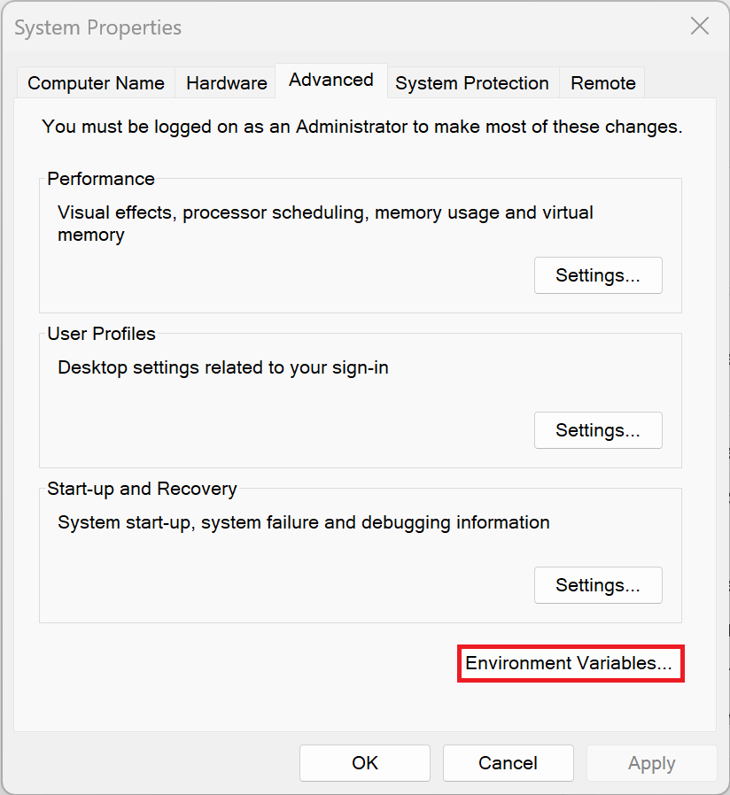
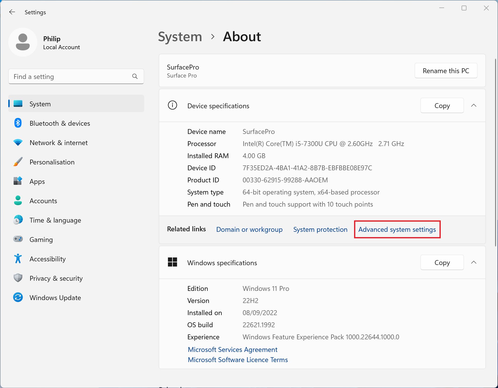
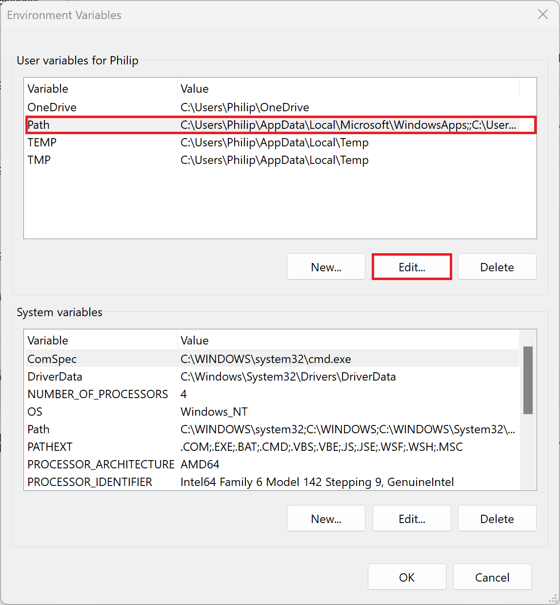
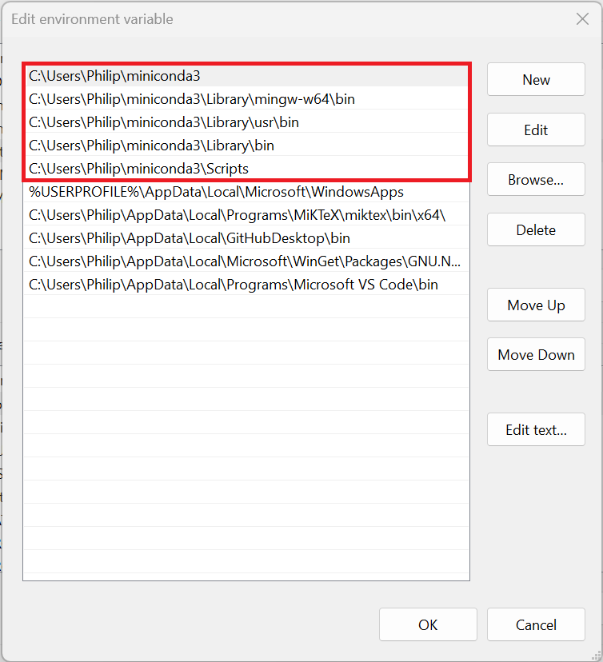
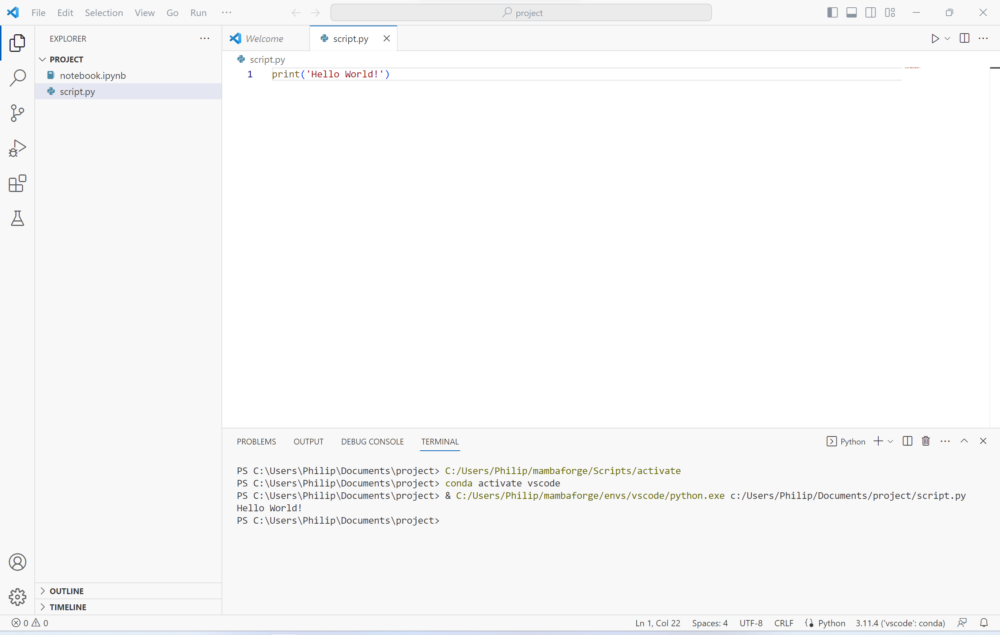

# Windows Environmental Variable Path

## Windows Environmental Variables

The Windows Environmental Variables include:

|Environmental Variable|Location
|---|---|
|%USERPROFILE%|C:\\Users\\Philip|
|%APPDATA%|C:\\Users\\Philip\\AppData\\Roaming|
|%LOCALAPPDATA%|C:\\Users\\Philip\\AppData\\Local|
|%TMP%|C:\\Users\\Philip\\AppData\\Local\\Temp|
|%PROGRAMDATA%|C:\\ProgramData|
|%PROGRAMFILES%|C:\\Program Files|
|%PROGRAMFILES(X86)%|C:\\Program Files (x86)|
|%WINDIR%|C:\\Windows|
|%SYSTEMDRIVE%|C:|

These environmental variables are used by the Windows Terminal to access the specified locations that correspond to your particular Windows Setup and User Profile.

## Adding Miniconda to Path

The Miniconda installer has an option to add Python (base) environment to the Windows Environmental Variables path:



This adds the environmental variables to the path so the Windows Terminal can access the Python base environment by default:



Although using the Windows Terminal looks like the Miniconda PowerShell Prompt. The command conda activate will not change Python environment that the Windows Terminal is currently using. 

To change the Python environment in the Windows Terminal, the full path needs to be specified:



Note that the option to add Miniconda to the path is not enabled by default and when selected says "Not recommended". Despite being not recommended by the Miniconda installer, some IDEs like Visual Studio Code that use their own version of the Windows Terminal will display an error message such as:

```
conda : The term 'conda' is not recognized as the name of a cmdlet, function, script 
file, or operable program. Check the spelling of the name, or if a path was included, 
verify that the path is correct and try again.
At line:1 char:1
+ conda activate vscode
+ ~~~~~
    + CategoryInfo          : ObjectNotFound: (conda:String) [], CommandNotFoundExceptio 
   n
    + FullyQualifiedErrorId : CommandNotFoundException
```


## Modifying the Windows Environmental Variable Path

Right click the start button and select System:



Select Environmental Variables:



Then Advanced System Settings:



Then select the Path and select Edit:



Add the five entries for Miniconda3 if they are not present:

```
%USERPROFILE%\Miniconda3
%USERPROFILE%\Miniconda3\Library\mingw-w64\bin
%USERPROFILE%\Miniconda3\Libraryusr\bin
%USERPROFILE%\Miniconda3\Library\bin
%USERPROFILE%\Miniconda3\Scripts
```

For Anaconda3:

```
%USERPROFILE%\Anaconda3
%USERPROFILE%\Anaconda3\Library\mingw-w64\bin
%USERPROFILE%\Anaconda3\Libraryusr\bin
%USERPROFILE%\Anaconda3\Library\bin
%USERPROFILE%\Anaconda3\Scripts
```



Select OK. Any Terminals or IDEs will need to be closed and reopened to use the updated path. Notice that there is no error in VSCode:



[Return to Miniconda Installation](./readme.md)