# Spyder

Spyder is an abbreviation for the **S**cientific **Py**thon **D**evelopment **E**nvi**r**onment and is a Python IDE similar to MATLAB or R-Studio.

Spyder is used for editing Python script files (.py file extension) and sadly does not have native support for notebook files (.ipynb file estension). There is a pluggin spyder-notebook in early development for this purpose however it is not completely stable yet.

## Python Environment

Miniconda will be used to create a Python environment. To install Miniconda and set it up to use the conda-forge channel and libmamba solver see [Miniconda: Install](./Miniconda.md)

The following Python Environment can be created for the Spyder IDE:
```
conda create -n spyder python spyder cython seaborn scikit-learn sympy openpyxl xlrd xlsxwriter lxml sqlalchemy nodejs tabulate pyqt
```

This is covered in more detail in [Miniforge: Python Environments Overview](./environments.md)

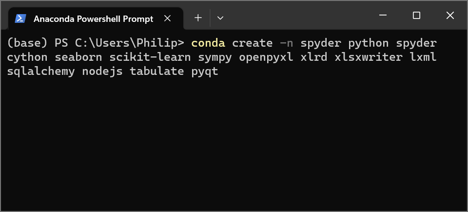

The conda package manager will search for all of these packages and their dependencies. Input ```y``` in order to proceed:

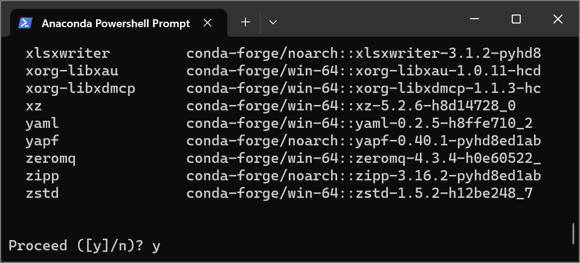

The packages will be downloaded and installed:

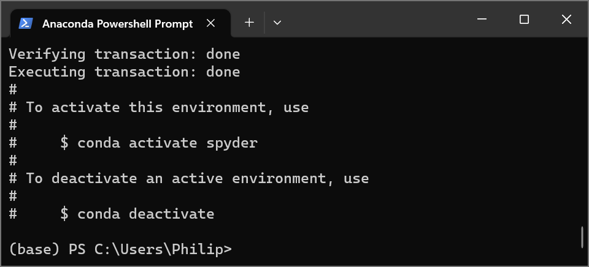

## Launching Spyder

Spyder can be launched by activating the spyder Python environment using the PowerShell command:

```
conda activate spyder
```

And using the PowerShell command:

```
spyder
```

Alternatively it can be launched from its start menu shortcut.


## Customisation

The Spyder IDE displays using the Spyder Dark Theme by default. The is can be changed in Tools → Preferences:

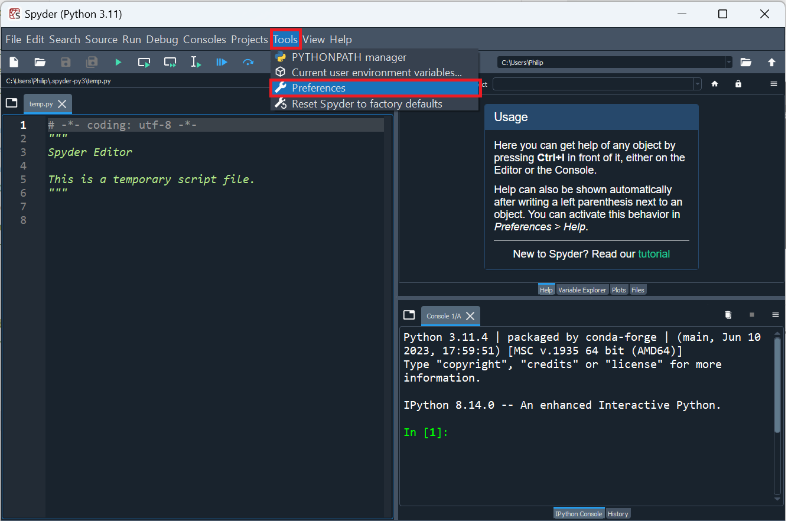

Select Appearance and the Spyder:

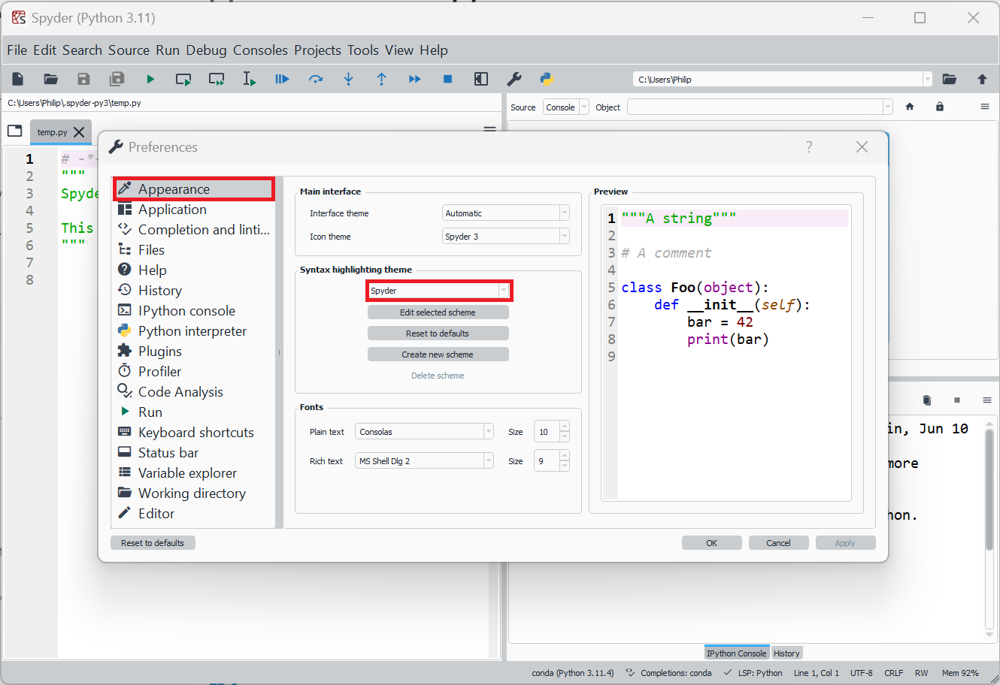

Spyder will restart to make the changes.

## Variable Explorer

Spyder has a very powerful Variable Explorer supporting most of builtins and the commonly used data structures in the data science libraries:

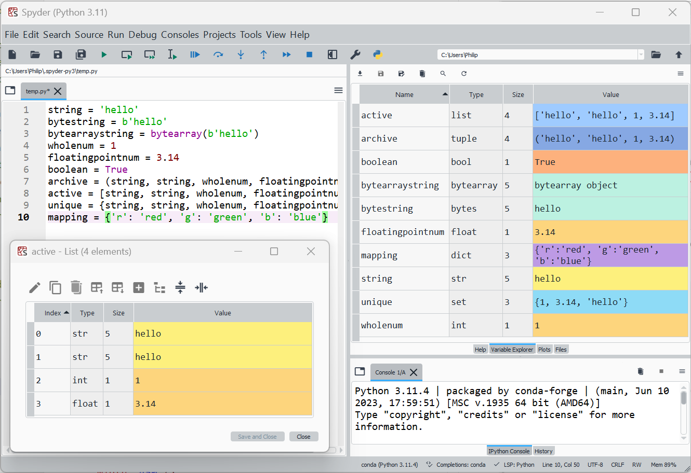

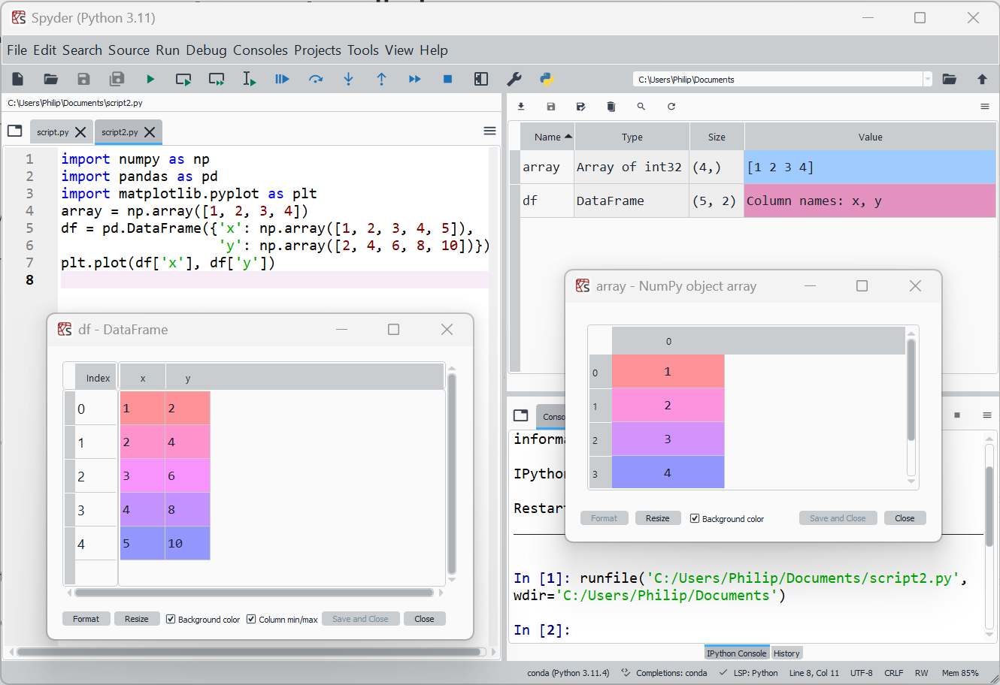

## Files

The FIle Panes shows the current working directory:

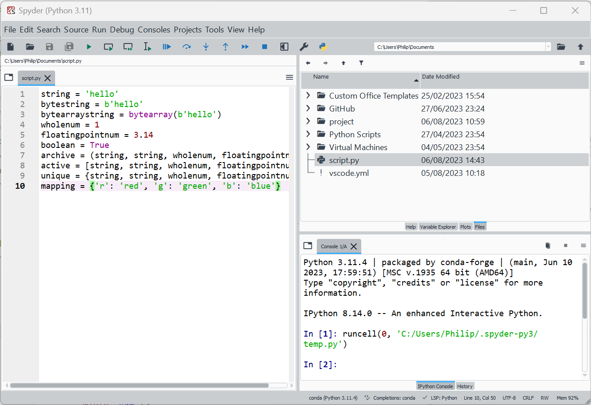

## Plots

Plots are shown as static images in the plots pane by default:

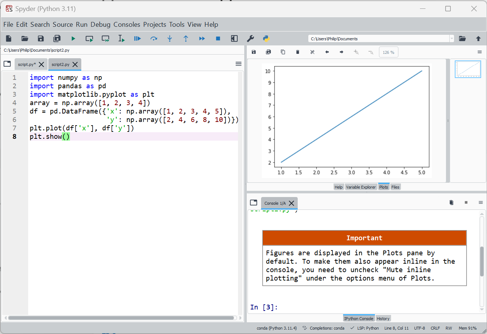

The backend for matplotlib can be changed for example to the gui library pyqt5 using tools → preferences, then IPyhon console, graphics and then changing the backend:

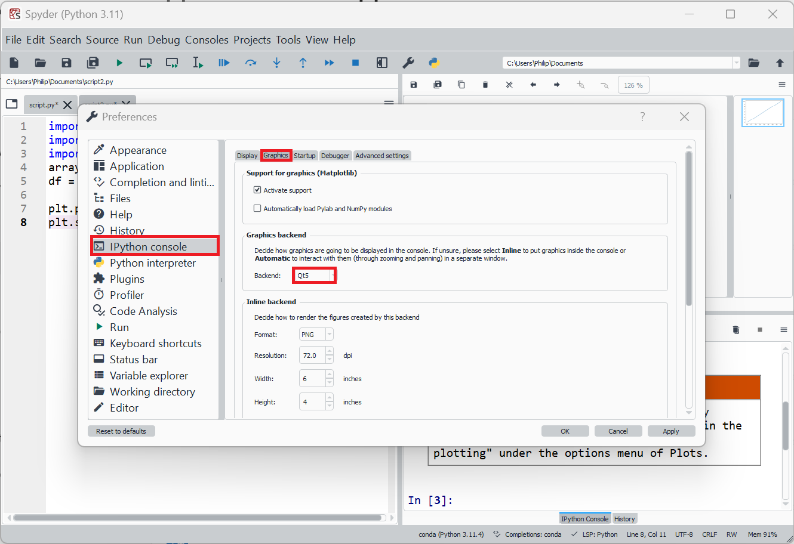

The Kernel needs to be restarted by going to Console → Restart Kernel:

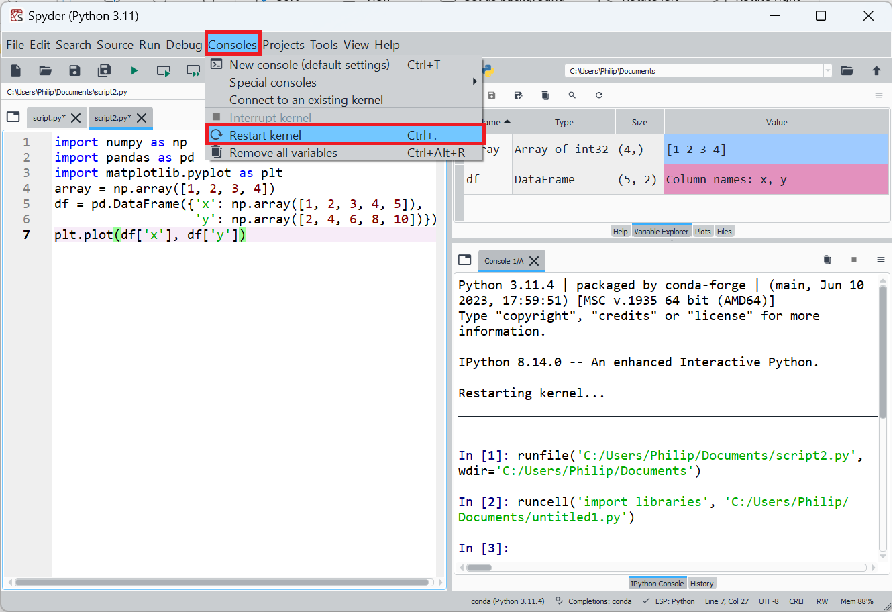

The plot now displays in a seperate window as an interactive plot:

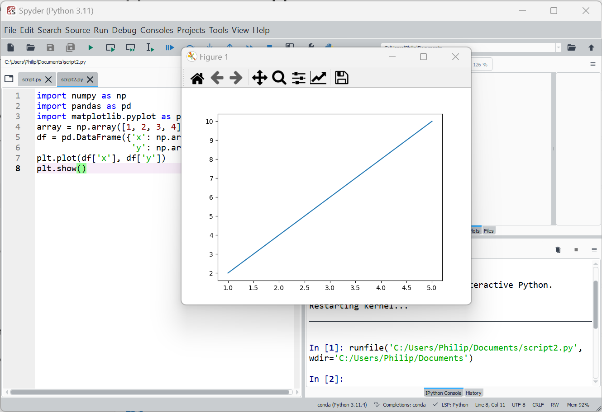

Support for using ipython magics in the ipython console to change the plot backend is added in Spyder 6 which is currently in the alpha stage.

## Help and Code Completions

Spyder displays code completions and docstrings for Python builtins and standard libraries:

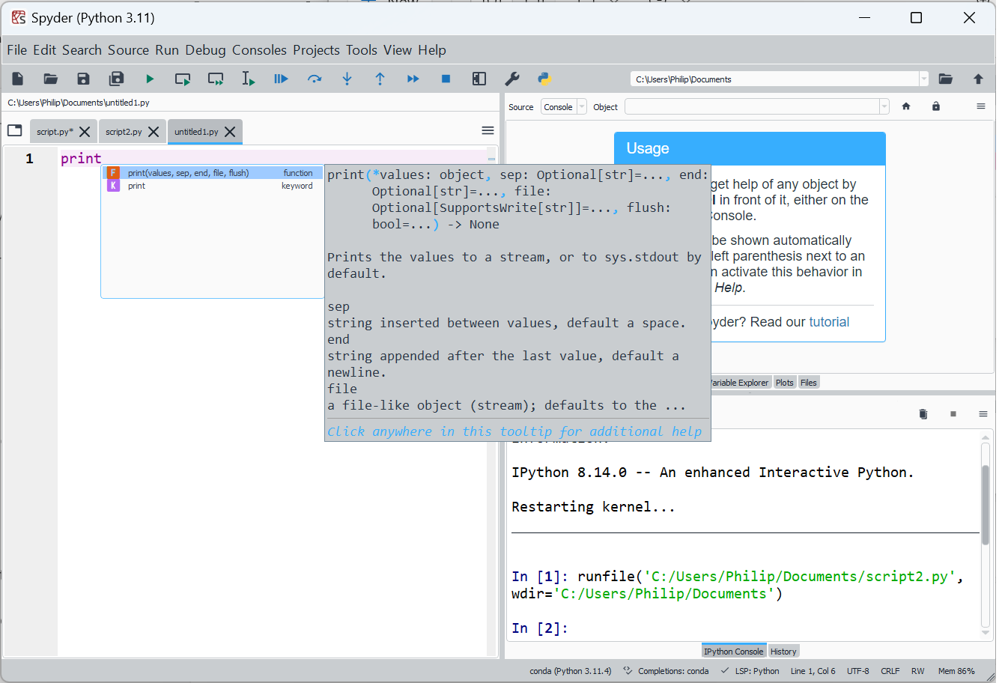

If completions from third-party libraries are required, they need to be imported in the script and the imports need to be run in the IPython console. In Python a line beginning with ```#``` is a comment. In Spyder ```#%%``` changes a comment into a cell which can be ran seperately in the console. These cells can be ran seperately in the console using the appropriate run command e.g. run cell or run cell and advance. There is also an option to run a selection. When the entire script file is ran, the ```#%%``` are instead recognised as comments:

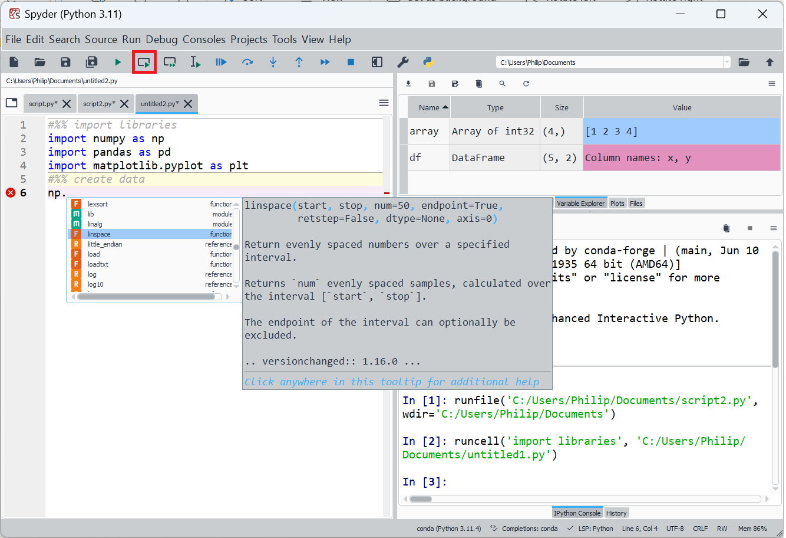

Pressing ```Ctrl```+```i``` will inspect an object opening its help in the help pane. This works better at present for builtins functions:

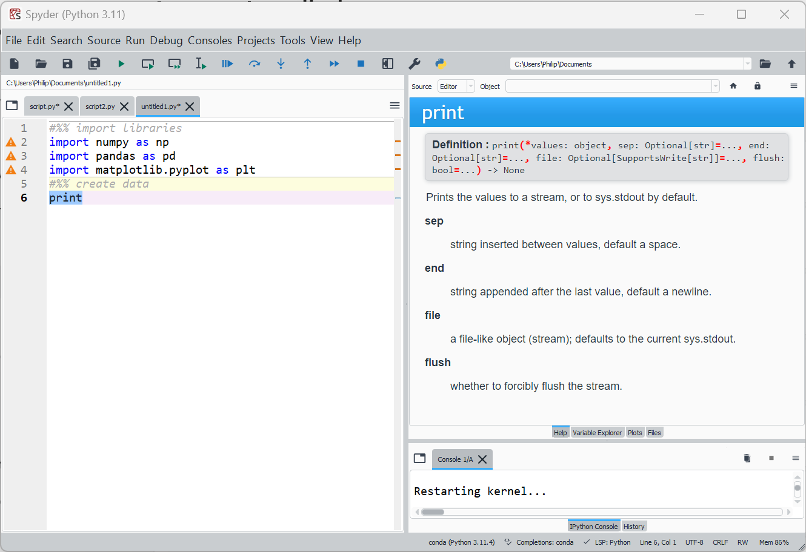

For third-party libraries it gives the home page fo the libraries documentation and doesn't focus on the specific function:

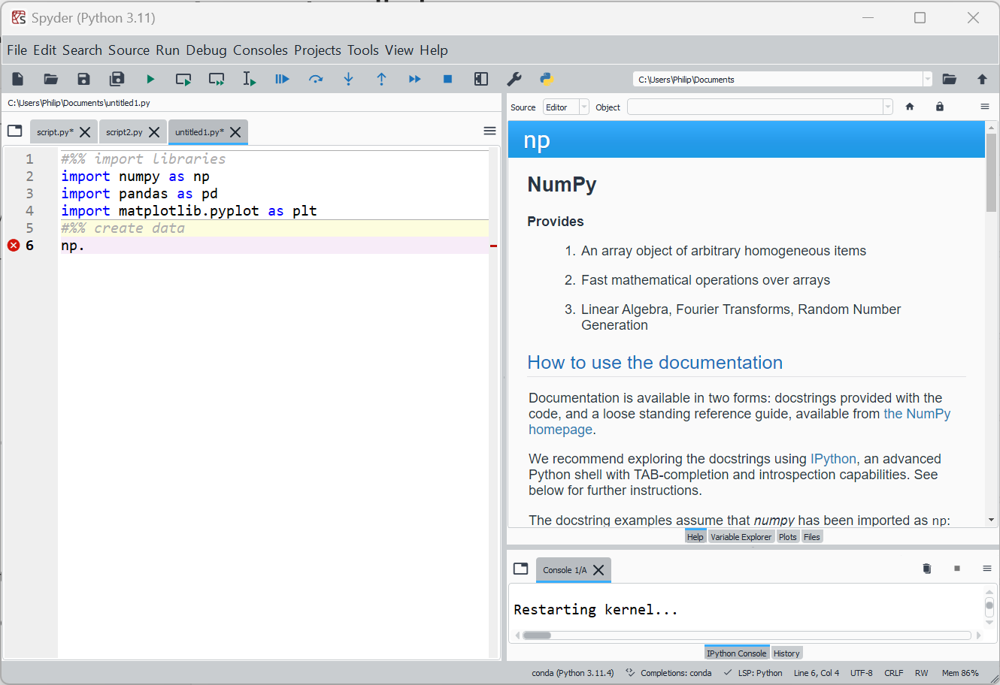

[Return to Miniconda Installation](./readme.md)
